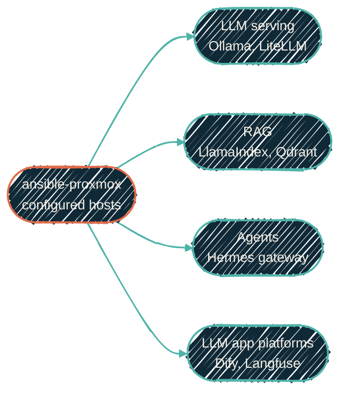

{/* projected from the authoring site; do not edit here */}
import { RepoMeta, RepoFit } from "/snippets/repo-summary.mdx";

> Everything with a model in the loop, in one repo. Extracted out of the general apps repo once the AI stack outgrew being one more app among many.

<RepoMeta language="Python" status="active" lastActive="today" repoUrl="https://github.com/dryvist/ansible-proxmox-ai" />

{/*Shape: four capability groups feeding downstream consumers. 5 nodes. Aspect ~3:1 LR.*/}

`ansible-proxmox-ai` deploys the homelab's AI/LLM stack onto VMs and LXC containers that
[tofu-proxmox](/infrastructure/repos/tofu-proxmox) provisioned and
[ansible-proxmox](/infrastructure/repos/ansible-proxmox) configured. The AI-specific roles grew
large enough to warrant their own repo and release cadence, so this repo split out of
`ansible-proxmox-apps`. Pre-split commit history for each role lives in `ansible-proxmox-apps`'s
git log.

## What it does

- **LLM serving.** Ollama, llama.cpp + llama-swap (GPU-tier serving), the LiteLLM router that fronts the large/light tiers, and Open WebUI
- **RAG.** A LlamaIndex embeddings pipeline and the Qdrant vector database
- **Agents.** The Hermes agent gateway, sandboxed agent execution, an agent gateway, and an isolated Codex command-line tool execution user
- **LLM app platforms.** Dify, LangFlow, LangGraph, Langfuse, and [Arize Phoenix](/observability/phoenix), each Docker-in-LXC

## How it fits

| Upstream | Downstream |
| --- | --- |
| [Proxmox config](/infrastructure/repos/ansible-proxmox) hands off ready hosts | The [self-hosted ChatGPT](/local-llm/overview) fabric, the [AI orchestration stack](/ai-development/ai-orchestration-stack), and [LLM observability](/observability/llm-observability) all run roles from here |

<RepoFit>
The AI-specific deploy tier. General app payloads (n8n, Cribl, Vikunja, Zammad, and the rest) stay
in `ansible-proxmox-apps`. This repo owns only what has a model, an embedding, or an agent loop in
it.
</RepoFit>

## Getting started

<Steps>
<Step title="Confirm the hosts are configured">
Run `ansible-proxmox` first. Hosts need their ZFS, networking, and monitoring agents in place before the AI stack lands on them.
</Step>
<Step title="Clone and enter the dev shell">
`git clone <repo-url> ansible-proxmox-ai && cd ansible-proxmox-ai && direnv allow`
</Step>
<Step title="Install Galaxy dependencies">
`ansible-galaxy install -r requirements.yml`
</Step>
</Steps>

<Note>
This repository currently ships **roles only**. It has no site playbook or dynamic tofu-inventory loader yet. Deploy orchestration is a tracked follow-up.
</Note>

## Related repos

<CardGroup cols={2}>
<Card
  title="ansible-proxmox"
  icon="screwdriver-wrench"
  href="/infrastructure/repos/ansible-proxmox">
  Host config. Must run first.
</Card>
<Card
  title="ansible-proxmox-apps"
  icon="boxes-stacked"
  href="/infrastructure/repos/ansible-proxmox-apps">
  The general-app deploy tier this repo was extracted from.
</Card>
<Card
  title="Self-hosted ChatGPT"
  icon="microchip"
  href="/local-llm/overview">
  The serving fabric this repo's LLM-serving roles stand up.
</Card>
<Card
  title="Source on GitHub"
  icon="github"
  href="https://github.com/dryvist/ansible-proxmox-ai">
  Roles, molecule scenarios, full README.
</Card>
</CardGroup>
