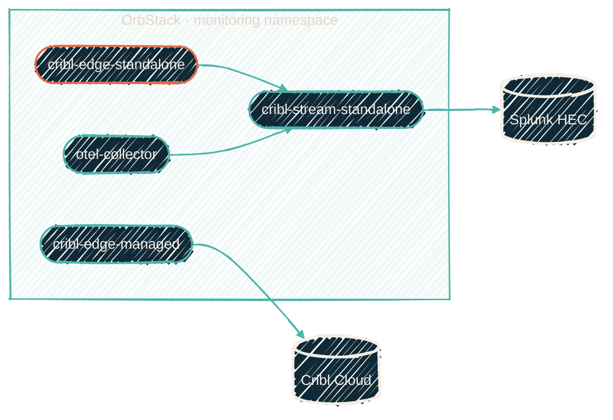

{/* projected from the authoring site; do not edit here */}
import { RepoMeta, RepoFit } from "/snippets/repo-summary.mdx";

> The Mac control plane for the local AI stack: OTEL, two Cribl Edges, and a Cribl Stream, all in one OrbStack cluster.

<RepoMeta language="Shell" status="active" lastActive="this week" repoUrl="https://github.com/JacobPEvans/orbstack-kubernetes" />

`orbstack-kubernetes` is the Kustomize-based manifest set for a local Kubernetes cluster on
[OrbStack](https://orbstack.dev/). It runs the AI-development monitoring stack in a single
`monitoring` namespace, as five StatefulSets: an OTEL Collector, two Cribl Edges (one cloud-managed,
one standalone), a local Cribl Stream, and a Cribl MCP server.

{/*Shape: component/hub, two egresses. 5 nodes. Aspect ~3:1 LR.*/}

## Architecture invariant

**Edge → Stream → Splunk is the only allowed data path.** The standalone Cribl Edge talks to the
standalone Cribl Stream over HEC port 8088. It never talks directly to Splunk. Stream is the only
component with Splunk egress. Network policies in the manifest set enforce this. No one can
shortcut it.

## What runs in the cluster

| StatefulSet | Role | UI |
| --- | --- | --- |
| `otel-collector` | OTLP receiver, forwards to local Cribl Stream | — |
| `cribl-edge-managed` | Cloud-managed Edge, forwards to Cribl Cloud | — |
| `cribl-edge-standalone` | Local Edge with three packs ([claude-code-otel](https://github.com/JacobPEvans/cc-edge-claude-code-otel), [gemini-antigravity-io](https://github.com/JacobPEvans/cc-edge-gemini-antigravity-io), [vscode-io](https://github.com/JacobPEvans/cc-edge-vscode-io)), forwards to local Stream | :30910 |
| `cribl-stream-standalone` | Local Stream leader, [Copilot REST collector](https://github.com/JacobPEvans/cc-stream-github-copilot-rest-io) pack, outputs to Splunk HEC | :30900 |
| `cribl-mcp-server` | Cribl Cloud MCP API surface for Claude Code | :30030 |

Four `healthchecks.io` CronJobs ping every 5 minutes as dead-man switches: `pipeline-heartbeat`, `heartbeat-splunk`, `heartbeat-edge`, `heartbeat-otel`.

## How it fits

| Upstream | Downstream |
| --- | --- |
| AI coding tools (Claude Code, Gemini, VS Code, Copilot) emit OTLP to the cluster | Local Stream forwards over HEC to the [homelab Splunk](/observability/repos/ansible-splunk); Edge-managed also reports to Cribl Cloud |

<RepoFit>
The macOS development counterpart to the homelab Cribl Edge tier. Same data shape, different host.
The design makes a session on the laptop produce the same telemetry as one on a workstation behind
the homelab Edge.
</RepoFit>

## Secrets and overlays

Nix and direnv pre-inject secrets into the Claude Code session (SOPS-decrypted env vars).
`secrets.enc.yaml` is the source of truth. `secrets.enc.yaml.example` is the template. Base
manifests in `k8s/monitoring/` use the literal string `PLACEHOLDER_HOME_DIR` for hostPath volumes;
the base never replaces it. `scripts/generate-overlay.sh` produces the gitignored
`k8s/overlays/local/` at deploy time.

## Getting started

<Steps>
<Step title="Activate the dev shell">
`cd ~/git/orbstack-kubernetes/main && direnv allow`. Provides kubectl, kubectx, helm, kustomize, kubeconform, kube-linter, conftest, pluto, k9s, stern, kind, jq, yq.
</Step>
<Step title="Seed the secrets file">
`cp secrets.enc.yaml.example secrets.enc.yaml && sops secrets.enc.yaml`. Encrypt-on-save; never commit a plaintext copy.
</Step>
<Step title="Deploy">
`make deploy-doppler`. Generates the overlay, creates secrets, applies the kustomize bundle. Verify with `make status`.
</Step>
<Step title="Run the tests">
`make test-all` chains unit → smoke → pipeline → forwarding → sourcetypes. CI enforces the same chain on every PR.
</Step>
</Steps>

## CI and the self-hosted runner

E2E tests run on a self-hosted ARM64 runner **on the laptop** while it is
powered on. The runner is a stock `myoung34/github-runner:ubuntu-jammy` container with
`EPHEMERAL=1`, managed by `docker/actions-runner/docker-compose.yml`. A macOS
LaunchAgent invokes `make runner-foreground` for boot persistence.
`make runner-doctor` is the deep health check. The runner requires OrbStack
running and Doppler authenticated.

That laptop runner is **not** the always-on Mac Studio fleet (**mac-fleet**,
GitHub group still named `llm-runners`). Studio jobs are Linux ARM64 inside
an Apple container. Pin them with `apple-container` so they cannot land here.
See [CI/CD overview](/infrastructure/cicd/overview).

## Related repos

<CardGroup cols={2}>
<Card
  title="cc-edge-the-mac-pack"
  icon="apple"
  href="/observability/repos/cc-edge-the-mac-pack">
  The macOS-native Cribl Edge pack — captures host telemetry that this cluster does not.
</Card>
<Card
  title="Monitoring agents"
  icon="chart-line"
  href="/observability/monitoring-agents">
  Cross-stack view of every collector and where it runs.
</Card>
<Card
  title="LXC vs Docker decision tree"
  icon="cube"
  href="/infrastructure/lxc-vs-docker">
  Why the homelab Edge is LXC and this one is K8s/OrbStack.
</Card>
<Card
  title="Source on GitHub"
  icon="github"
  href="https://github.com/JacobPEvans/orbstack-kubernetes">
  Full manifest set, Makefile, deployment scripts.
</Card>
</CardGroup>
