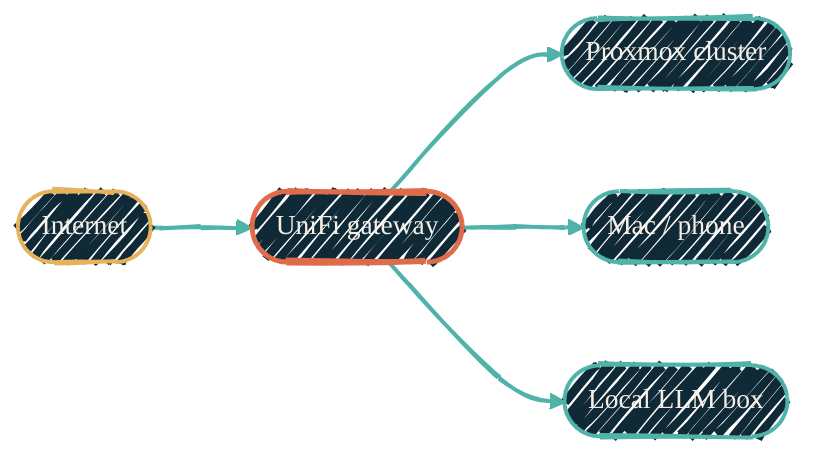

import { RepoMeta, RepoFit } from "/snippets/repo-summary.mdx";

> The homelab network is described in HCL. Every VLAN, every port profile, every firewall rule is a Terraform resource.

<RepoMeta language="HCL" status="active" lastActive="this week" repoUrl="https://github.com/dryvist/terraform-unifi" />

`terraform-unifi` puts the UniFi controller's data plane behind the same provisioning workflow that builds the rest of the homelab. The [`ubiquiti-community/unifi`](https://registry.terraform.io/providers/ubiquiti-community/unifi/latest) provider drives the controller API; Terragrunt resolves environment-specific subnets from a single source.

## What it does

- Defines every infrastructure VLAN as `unifi-network` resources
- Builds port profiles per role
- Encodes firewall rules and fixed-IP reservations alongside the network they apply to
- Subnet values stay in the secret store and are consumed by both `terraform-unifi` and `terraform-proxmox` — single source, no drift

## How it fits

| | Upstream | Downstream |
| --- | --- | --- |
| Trigger | `terragrunt apply` from the operator | UniFi controller pushes config to gateway, switches, APs |
| Talks to | UniFi controller API (read/write) | The L2/L3 fabric every other repo's hosts live on |

<RepoFit>
Network plumbing only. VM/LXC placement on top of these VLANs is `terraform-proxmox`'s job; host config inside those VMs is Ansible's.
</RepoFit>

## Why per-service VLANs

The homelab uses VLAN-as-service-tier: a guest's VLAN encodes what kind of workload it is, and therefore which policies apply to it. That keeps the inventory comprehensible at a glance and lets firewall policy attach to a tier rather than to individual hosts.

## Network topology

{/* Shape: hub-and-spokes. UniFi is the hub. 5 nodes. Boundary crossings: 0. */}

Solid green edges are physical / network. WireGuard tunnels traverse the Internet → UniFi edge. The UniFi gateway is the centre of the LAN; Proxmox, personal devices, and the bare-metal LLM box all hang off it.

## Related repos

<CardGroup cols={2}>
  <Card title="terraform-proxmox" icon="server" href="/infrastructure/repos/terraform-proxmox">
    The provisioner that lands VMs/LXCs on these VLANs.
  </Card>
  <Card title="Self-hosted Netflix" icon="film" href="/infrastructure/media-stack">
    Self-hosted Netflix — its own VLAN.
  </Card>
  <Card title="LXC vs Docker" icon="boxes-stacked" href="/infrastructure/lxc-vs-docker">
    Why most workloads on these VLANs are LXC, not Docker.
  </Card>
  <Card title="Source on GitHub" icon="github" href="https://github.com/dryvist/terraform-unifi">
    Provider config, networks, port profiles, firewall rules.
  </Card>
</CardGroup>
