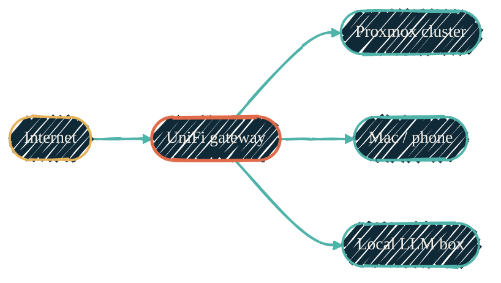

import { RepoMeta, RepoFit } from "/snippets/repo-summary.mdx";

> The homelab network is described in HCL. Every VLAN, WLAN, port profile, WAN uplink, and the VPN server is a Terraform resource — adopted from the live controller, not built from scratch.

<RepoMeta language="HCL" status="active" lastActive="this week" repoUrl="https://github.com/dryvist/terraform-unifi" />

`terraform-unifi` puts the UniFi controller's data plane behind the same provisioning workflow that builds the rest of the homelab. The [`ubiquiti-community/unifi`](https://registry.terraform.io/providers/ubiquiti-community/unifi/latest) provider drives the controller API; Terragrunt resolves environment-specific subnets from a single source.

## What it does

One generic module per resource type covers the controller's data plane:

- Infrastructure VLANs / networks, WLANs, and per-role port profiles
- MAC-pinned fixed-IP reservations
- Firewall groups (the port/address sets); firewall *rules* are written but deferred — see [provider notes](#provider-notes-unifi-network-9)
- WAN uplinks (primary, secondary, LTE failover), the WireGuard VPN server, RADIUS, and the controller's dynamic-DNS record
- Subnet values stay in the secret store and are consumed by both `terraform-unifi` and `terraform-proxmox` — single source, no drift. Passphrases, VPN keys, and shared secrets live in SOPS, never in plaintext config.

## How it fits

| | Upstream | Downstream |
| --- | --- | --- |
| Trigger | `terragrunt apply` from the operator | UniFi controller pushes config to gateway, switches, APs |
| Talks to | UniFi controller API (read/write) | The L2/L3 fabric every other repo's hosts live on |

<RepoFit>
Network plumbing only. VM/LXC placement on top of these VLANs is `terraform-proxmox`'s job; host config inside those VMs is Ansible's.
</RepoFit>

## Adoption model

The controller came first; the code adopts it. Existing objects are pulled in with
`import` blocks (by controller ID, by MAC for clients, by name for WANs) and then
field-aligned so the committed config matches reality — a clean adoption plans to zero
change, not a re-create. Two safety rails are non-negotiable: a full controller snapshot
is committed to a companion read-side repo as the rollback reference **before every
apply**, and the plan is reviewed for any destroy/replace **before** it runs. New firewall
rules ship disabled and are flipped on one at a time in later changes.

## Why per-service VLANs

The homelab uses VLAN-as-service-tier: a guest's VLAN encodes what kind of workload it is, and therefore which policies apply to it. That keeps the inventory comprehensible at a glance and lets firewall policy attach to a tier rather than to individual hosts.

## Provider notes (UniFi Network 9)

The `ubiquiti-community/unifi` provider is current and capable, but it lags UniFi
**Network 9** in a few spots worth knowing before you adopt a controller. These are
provider/controller version gaps, not configuration mistakes:

- **Legacy firewall rules vs the new index range.** Network 9 renumbered gateway
  firewall-rule indices; the provider still validates the old range. New rules can't be
  created in either band until the provider catches up, so rule config is written but
  parked (disabled) for now. Firewall *groups* are unaffected.
- **No zone-based firewall resources yet.** Network 9's zone-based firewall has no
  provider resource; that policy stays UI-managed.
- **Failover-only WAN.** A failover-only uplink stores a sentinel priority the provider's
  validation rejects — omit the priority and let the load-balance type imply it.
- **No static-WAN-IP attribute.** A static WAN's address is read-only from the provider's
  side; it stays controller-managed and imports cleanly.
- **Benign per-plan churn.** The provider re-proposes a handful of computed fields on
  every plan (WLAN, port-profile, RADIUS defaults). These aren't real changes — they
  apply idempotently and don't mutate the controller.

The rule of thumb when the provider rejects a controller-correct value: pin what you can,
defer what you can't, and document it — don't fight the provider.

## Authentication

UniFi services use API-key authentication. Credential management details are documented in internal documentation.

## Network topology

{/* Shape: hub-and-spokes. UniFi is the hub. 5 nodes. Boundary crossings: 0. */}

Solid green edges are physical / network. WireGuard tunnels traverse the Internet → UniFi edge. The UniFi gateway is the centre of the LAN; Proxmox, personal devices, and the bare-metal LLM box all hang off it.

## Related repos

<CardGroup cols={2}>
  <Card title="terraform-proxmox" icon="server" href="/infrastructure/repos/terraform-proxmox">
    The provisioner that lands VMs/LXCs on these VLANs.
  </Card>
  <Card title="Self-hosted Netflix" icon="film" href="/infrastructure/media-stack">
    Self-hosted Netflix — its own VLAN.
  </Card>
  <Card title="LXC vs Docker" icon="boxes-stacked" href="/infrastructure/lxc-vs-docker">
    Why most workloads on these VLANs are LXC, not Docker.
  </Card>
  <Card title="Source on GitHub" icon="github" href="https://github.com/dryvist/terraform-unifi">
    Provider config, networks, port profiles, firewall rules.
  </Card>
</CardGroup>
