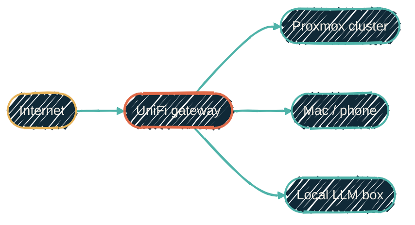

{/* projected from the authoring site; do not edit here */}
import { RepoFit } from "/snippets/repo-summary.mdx";

> The homelab network is described in HCL. Every VLAN, WLAN, port profile, WAN uplink, and the VPN server is an OpenTofu resource, adopted from the live controller, not built from scratch.

<Note>
  Language: <b>HCL</b> &nbsp;·&nbsp; Status: <b>active</b> &nbsp;·&nbsp; Private infrastructure. No public source.
</Note>

`tofu-unifi` puts the UniFi controller's data plane behind the same Terrakube provisioning workflow
as the rest of the homelab. The
[`ubiquiti-community/unifi`](https://registry.terraform.io/providers/ubiquiti-community/unifi/latest)
provider drives the controller API. Typed HCL inputs and locals resolve subnets.

## What it does

One generic module per resource type covers the controller's data plane:

- Infrastructure VLANs / networks, WLANs, and per-role port profiles
- MAC-pinned fixed-IP reservations
- Firewall groups (the port/address sets). Firewall *rules* (including a generic established/related
  stateful-return rule) are written but deferred. See [provider
  notes](#provider-notes-unifi-network-9)
- WAN uplinks (primary, secondary, LTE failover), the WireGuard VPN server, RADIUS, and the controller's dynamic-DNS record
- Subnet values are non-secret desired state shared by both repos. Passphrases, VPN keys, and shared secrets come ephemerally from native OpenBao paths.

## How it fits

| | Upstream | Downstream |
| --- | --- | --- |
| Trigger | Explicitly approved `tofu apply` in Terrakube | UniFi controller pushes config to gateway, switches, APs |
| Talks to | UniFi controller API (read/write) | The L2/L3 fabric every other repo's hosts live on |

<RepoFit>
Network plumbing only. VM/LXC placement on top of these VLANs is `tofu-proxmox`'s job; host config inside those VMs is Ansible's.
</RepoFit>

## Adoption model

The controller came first. The code adopts it. `import` blocks pull in existing objects (by
controller ID, by MAC for clients, by name for WANs). Then the code field-aligns them so the
committed config matches reality. A clean adoption plans to zero change, not a re-create. Two
safety rails are non-negotiable. A full controller snapshot lands in a companion read-side repo as
the rollback reference **before every apply**. The reviewer checks the plan for any destroy or
replace **before** it runs. New firewall rules ship disabled, and later changes flip them on one at
a time.

## Why per-service VLANs

The homelab uses VLAN-as-service-tier: a guest's VLAN encodes what kind of workload it is, and
therefore which policies apply to it. That keeps the inventory comprehensible at a glance and lets
firewall policy attach to a tier rather than to individual hosts.

## Two enforcement layers, one default-deny model

Two layers enforce firewall policy for inter-VLAN traffic, both built to
the same default-deny model. That model denies everything, then explicitly allows the service
flows that need to cross a VLAN boundary (plus DNS, NTP, and management
baselines). The **guest-level layer** (each Proxmox VM/LXC's own firewall,
provisioned by `tofu-proxmox`) is live today. Every guest's default input and
output policy is deny, with per-service allow rules opened only for the ports
that guest actually needs. The **network-level layer** (the deferred UniFi inter-VLAN and local
rules described earlier) follows the same model but isn't enforced yet. It activates once the
provider/controller rule-index gap closes.

## Provider notes (UniFi Network 9)

The `ubiquiti-community/unifi` provider is current and capable, but it lags UniFi
**Network 9** in a few spots worth knowing before you adopt a controller. These are
provider/controller version gaps, not configuration mistakes:

- **Legacy firewall rules vs the new index range.** Network 9 renumbered gateway
  firewall-rule indices; the provider still validates the old range. New rules can't be
  created in either band until the provider catches up, so rule config is written but
  parked (disabled) for now. Firewall *groups* are unaffected.
- **No zone-based firewall resources yet.** Network 9's zone-based firewall has no
  provider resource; that policy stays UI-managed.
- **No IPS / threat-management / suppression resource.** Source-direction IDS/IPS
  suppression (for example, exempting a known-opaque VPN tunnel's source host from
  inspection; see [VPN-locked egress reliability](/infrastructure/vpn-egress-failover))
  has no OpenTofu resource either. It stays a live-console setting.
- **Failover-only WAN.** A failover-only uplink stores a sentinel priority the provider's
  validation rejects. Omit the priority and let the load-balance type imply it.
- **No static-WAN-IP attribute.** A static WAN's address is read-only from the provider's
  side. It stays controller-managed and imports cleanly.
- **Benign per-plan churn.** The provider re-proposes a handful of computed fields on
  every plan (WLAN, port-profile, RADIUS defaults). These aren't real changes. They
  apply idempotently and don't mutate the controller.

The rule of thumb when the provider rejects a controller-correct value: pin what you can,
defer what you can't, and document it. Don't fight the provider.

## Authentication

UniFi services use API-key authentication. Credential management details are documented in internal documentation.

## Network topology

{/*Shape: hub-and-spokes. UniFi is the hub. 5 nodes. Boundary crossings: 0.*/}

Solid green edges are physical / network. WireGuard tunnels traverse the Internet → UniFi edge. The
UniFi gateway is the centre of the LAN. Proxmox, personal devices, and the bare-metal LLM box all
hang off it.

## Related repos

<CardGroup cols={2}>
<Card
  title="tofu-proxmox"
  icon="server"
  href="/infrastructure/repos/tofu-proxmox">
  The provisioner that lands VMs/LXCs on these VLANs.
</Card>
<Card
  title="Self-hosted Netflix"
  icon="film"
  href="/infrastructure/media-stack">
  Self-hosted Netflix — its own VLAN.
</Card>
<Card
  title="LXC vs Docker"
  icon="boxes-stacked"
  href="/infrastructure/lxc-vs-docker">
  Why most workloads on these VLANs are LXC, not Docker.
</Card>
<Card
  title="VPN-locked egress reliability"
  icon="shield-halved"
  href="/infrastructure/vpn-egress-failover">
  Sticky VPN-endpoint failover, and an IDS/IPS false-positive lesson.
</Card>
  <Card title="tofu-unifi (private)" icon="github">
    Provider config, networks, port profiles, firewall rules. Private infrastructure. No public source.
  </Card>
</CardGroup>
