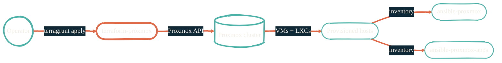

import { RepoMeta, RepoFit } from "/snippets/repo-summary.mdx";

> Provision VMs and LXCs from a single `terragrunt apply`. The first thing that runs.

<RepoMeta language="HCL" status="active" lastActive="this week" repoUrl="https://github.com/JacobPEvans/terraform-proxmox" />

`terraform-proxmox` defines every VM and LXC in the homelab as Terraform resources. Terragrunt provides DRY config across environments. The Proxmox provider talks to the cluster API; nothing here touches a host directly.

## What it does

- Defines compute, network, and storage for every homelab guest
- Wraps the [`bpg/proxmox`](https://registry.terraform.io/providers/bpg/proxmox/latest) provider
- Uses Terragrunt to share variables across `prod`, `staging`, and one-off environments
- Outputs a list of provisioned hosts that Ansible inventories consume directly

## How it fits

<RepoFit>
Provisioning only. Anything that runs *inside* a host belongs in `ansible-proxmox` or `ansible-proxmox-apps`.
</RepoFit>

## Getting started

<Steps>
  <Step title="Clone and enter the dev shell">
    `git clone https://github.com/JacobPEvans/terraform-proxmox && cd terraform-proxmox && nix develop`
  </Step>
  <Step title="Provide Proxmox API credentials">
    Doppler resolves `PROXMOX_VE_USERNAME`, `PROXMOX_VE_PASSWORD`, and `PROXMOX_VE_ENDPOINT` at run time. The `README.md` covers the exact var names.
  </Step>
  <Step title="Apply">
    `terragrunt run-all apply` from the env folder. Review the plan; nothing destructive runs without confirmation.
  </Step>
  <Step title="Hand off to Ansible">
    Outputs are written to the file Ansible reads as its inventory. Run `ansible-proxmox` next.
  </Step>
</Steps>

## Related repos

<CardGroup cols={2}>
  <Card title="ansible-proxmox" icon="screwdriver-wrench" href="/infrastructure/ansible-proxmox">
    Configures the host once Terraform has provisioned it.
  </Card>
  <Card title="ansible-proxmox-apps" icon="boxes-stacked" href="/infrastructure/ansible-proxmox-apps">
    Deploys HAProxy, Cribl Edge, Cribl Stream on top.
  </Card>
  <Card title="tf-splunk-aws" icon="chart-line" href="/observability/tf-splunk-aws">
    The AWS-side equivalent for Splunk's DR footprint.
  </Card>
  <Card title="Source on GitHub" icon="github" href="https://github.com/JacobPEvans/terraform-proxmox">
    Modules, examples, full README.
  </Card>
</CardGroup>
