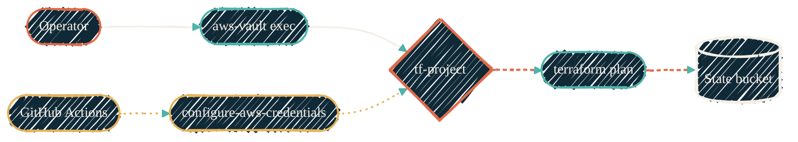

{/* TIER-GUARD: reference page — file layout, backend config, local dev, and CI workflow belong together. */}

> Drop these files into the new repo. The role and bucket from the [AWS bootstrap](/infrastructure/terraform/aws-bootstrap) supply everything the backend block needs.

The four outputs from the bootstrap (`state_bucket`, `tf_role_arn`, `aws_region`, `state_key_prefix`) feed straight into this page. Once the files below are in place, the repo's first `terraform plan` runs in under a minute — locally and in CI — with no static credentials anywhere.

## Repo file layout

```text
<repo>/
├── backend.tf
├── providers.tf
├── main.tf
└── .github/workflows/terraform.yml
```

`main.tf` is whatever the repo actually manages — VPC, Bedrock agents, Proxmox guests, anything. The three files below set up the surrounding plumbing.

## `backend.tf`

```hcl
terraform {
  required_version = ">= 1.10"

  required_providers {
    aws = {
      source  = "hashicorp/aws"
      version = "~> 5.0"
    }
  }

  backend "s3" {
    bucket       = "tfstate-<project>-<account-id>"
    key          = "<project>/terraform.tfstate"
    region       = "us-east-1"
    use_lockfile = true
    encrypt      = true
  }
}
```

`use_lockfile = true` enables S3-native locking via conditional writes (Terraform ≥ 1.10, OpenTofu ≥ 1.10). No DynamoDB table, no separate lock service. `encrypt = true` instructs the client to send the SSE header on every PutObject; the bucket's default SSE-S3 encryption already configured by the bootstrap handles the actual cipher.

There is no `assume_role` block here. The aws-vault profile (locally) and `aws-actions/configure-aws-credentials@v4` (in CI) perform the AssumeRole before Terraform runs, exporting the role's STS credentials into the subprocess environment. Terraform consumes those credentials directly.

## `providers.tf`

```hcl
provider "aws" {
  region = "us-east-1"

  default_tags {
    tags = {
      Project     = "<project>"
      ManagedBy   = "Terraform"
      Repo        = "<github-org>/<github-repo>"
      Environment = "prod"
    }
  }
}
```

Every resource the AWS provider creates inherits the four tags. Setting `default_tags` at the provider level keeps individual resource declarations clean and prevents per-resource tag drift.

## Local development

<Steps>
  <Step title="Add two profiles to `~/.aws/config`">
    The base profile holds your IAM user identity. The per-project profile chains off it and assumes the role:

    ```ini
    [profile mfa-base]
    region      = us-east-1
    mfa_serial  = arn:aws:iam::<account-id>:mfa/<operator>
    session_ttl = 1h

    [profile tf-<project>]
    source_profile = mfa-base
    role_arn       = arn:aws:iam::<account-id>:role/tf-<project>
    region         = us-east-1
    ```

    `mfa-base` is added once per operator (same block in every repo's docs). The `tf-<project>` block is repo-specific — copy it into `~/.aws/config` the first time you clone the repo.
  </Step>
  <Step title="Store the IAM user's access key in aws-vault">
    One time per operator. aws-vault writes the access key into its dedicated macOS keychain — nothing lands in `~/.aws/credentials`:

    ```bash
    aws-vault add mfa-base
    ```
  </Step>
  <Step title="Run Terraform through the per-project profile">
    aws-vault prompts for your MFA token on the first invocation per cached session (`session_ttl = 1h`), assumes the per-project role via the chained `source_profile`, and exports the role's STS credentials into the subprocess:

    ```bash
    aws-vault exec tf-<project> -- terraform init
    aws-vault exec tf-<project> -- terraform plan
    ```

    Subsequent commands inside the `session_ttl` window do not re-prompt for MFA.
  </Step>
  <Step title="Need more depth on profile mechanics?">
    See the [aws-vault page](/security/tools/aws-vault) for keychain backends, `session_ttl` tuning, the canonical `aws-vault exec ... -- doppler run -- terragrunt plan` envelope, and the anti-patterns the tool exists to prevent.
  </Step>
</Steps>

## CI/CD — GitHub Actions with OIDC

`.github/workflows/terraform.yml`:

```yaml
name: terraform
on:
  pull_request:
    branches: [main]
  push:
    branches: [main]

permissions:
  id-token: write   # required for OIDC token exchange
  contents: read

jobs:
  plan:
    runs-on: ubuntu-latest
    steps:
      - uses: actions/checkout@v4

      - uses: hashicorp/setup-terraform@v3
        with:
          terraform_version: 1.10.x

      - uses: aws-actions/configure-aws-credentials@v4
        with:
          role-to-assume: arn:aws:iam::<account-id>:role/tf-<project>
          aws-region: us-east-1

      - run: terraform init
      - run: terraform plan -no-color

  apply:
    if: github.event_name == 'push' && github.ref == 'refs/heads/main'
    needs: plan
    runs-on: ubuntu-latest
    environment: prod   # require manual reviewer approval via GitHub Environment
    steps:
      - uses: actions/checkout@v4

      - uses: hashicorp/setup-terraform@v3
        with:
          terraform_version: 1.10.x

      - uses: aws-actions/configure-aws-credentials@v4
        with:
          role-to-assume: arn:aws:iam::<account-id>:role/tf-<project>
          aws-region: us-east-1

      - run: terraform init
      - run: terraform apply -auto-approve
```

The `environment: prod` line ties the apply job to a GitHub Environment with required reviewers — apply pauses until a maintainer approves. Configure reviewers in the repo's *Settings → Environments → prod*.

The same `tf-<project>` role used locally is the role CI assumes. The OIDC trust statements in the bootstrap (`refs/heads/<branch_pattern>` for push, `pull_request` for PR runs) gate which workflow events are allowed.

<Note>
For the [self-hosted RunsOn-on-AWS-spot](/infrastructure/cicd/tofu-runs-on) runner alternative, the workflow shape is identical — `runs-on: ubuntu-latest` swaps for a self-hosted runner label, and everything else stays the same. OIDC works the same way on self-hosted runners.
</Note>

## Terragrunt variant

Terragrunt repos generate the same `backend.tf` shape at runtime instead of hand-writing it. Drop a `root.hcl` (or `terragrunt.hcl` at the repo root) with:

```hcl
remote_state {
  backend = "s3"
  generate = {
    path      = "backend.tf"
    if_exists = "overwrite_terragrunt"
  }
  config = {
    bucket       = "tfstate-${local.project}-${local.account_id}"
    key          = "${path_relative_to_include()}/terraform.tfstate"
    region       = "us-east-1"
    use_lockfile = true
    encrypt      = true
  }
}

locals {
  project    = "<project>"
  account_id = get_aws_account_id()
}
```

Per-leaf `terragrunt.hcl` files at each environment include the parent and do not repeat backend config:

```hcl
include "root" {
  path = find_in_parent_folders()
}
```

Local invocation pairs aws-vault with [Doppler](/security/tools/doppler) for runtime secret injection — the canonical chain from the [OpenTofu check-placement page](/infrastructure/tofu-check-placement):

```bash
aws-vault exec tf-<project> -- doppler run -- terragrunt plan
```

In CI, `aws-actions/configure-aws-credentials@v4` replaces `aws-vault exec`, and `doppler run` replaces with whatever secret-injection path the workflow uses (Doppler CLI inside the runner, or repo secrets).

{/* Shape: parallel convergence (operator chain and CI chain join at AssumeRole, continue to bucket via plan). Ranks: 2x2x1x1x1. Boundary crossings: 0. Aspect: ~3:1 LR. Pass. */}



## Where to go next

<CardGroup cols={2}>
  <Card title="Terraform on AWS overview" icon="diagram-project" href="/infrastructure/terraform/overview">
    The isolation model and naming conventions this repo implements.
  </Card>
  <Card title="AWS bootstrap" icon="hammer" href="/infrastructure/terraform/aws-bootstrap">
    The admin-side module that created the bucket and role this repo points at.
  </Card>
  <Card title="OpenTofu check placement" icon="list-check" href="/infrastructure/tofu-check-placement">
    Static checks in pre-commit, credentialed plan/apply in CI only.
  </Card>
  <Card title="CI/CD policy" icon="scale-balanced" href="/infrastructure/cicd/policy">
    The wider CI/CD shape — marketplace actions, runner choice, version pinning.
  </Card>
</CardGroup>
