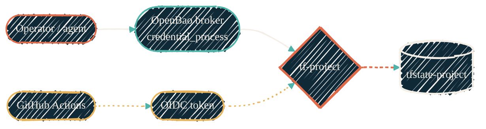

{/* TIER-GUARD: reference page — the isolation model, naming, encryption policy, and tagging belong together. */}

> One IAM role per workspace. OpenBao mints short-lived STS credentials for Terrakube jobs; nothing holds direct AWS resource access. Terrakube owns remote state and workspace locking.

The pattern below documents the IAM isolation retained by AWS workspaces. New and migrated workloads run as Terrakube-managed OpenTofu workspaces and receive AWS credentials dynamically from OpenBao. The legacy S3 backend material remains only for migration and rollback until the Terrakube state cutover has soaked.

## The isolation model

The per-project IAM role is the security boundary. Its trust policy lists GitHub OIDC for the matching repo, named operator IAM users, and the dedicated OpenBao broker identity described below. Its permissions policy grants S3 access to exactly one bucket — its own.

Local and AI-agent access goes through [OpenBao](/security/tools/openbao)'s AWS secrets engine, not a static key. A dedicated broker identity can only `sts:AssumeRole` into broker-managed roles named `tf-*` (plus the broader, permissions-boundary-capped `openbao-iac-admin` for general IaC use); its own base key is seeded into OpenBao once (write-once; rotation is a deliberate, separate operator action, not routine automation) so no long-lived AWS key sits anywhere routine automation can reach it. A local `credential_process` AWS profile resolves the per-project role on demand, backed by an OpenBao AppRole held in a dedicated, auto-locking keychain whose lock state is the access boundary — see [aws-vault](/security/tools/aws-vault) for the mechanics that replaced the old MFA-session model.

CI uses no static credentials at all. GitHub Actions exchanges its short-lived OIDC token for STS credentials directly via the role's trust policy. There is no `AWS_ACCESS_KEY_ID` secret in any repo. The same role that a human or agent assumes via OpenBao is the role CI assumes via OIDC — one trust policy, one permissions policy, audited the same way.

{/* Shape: parallel convergence (two source chains join at the per-project role, continue to bucket). Ranks: 2x2x1x1. Boundary crossings: 0. Aspect: ~2:1 LR. Pass. */}

## Naming conventions

Every project uses the same naming shape so that an account-wide audit (`aws s3 ls`, `aws iam list-roles --query "Roles[?starts_with(RoleName, \`tf-\`)]"`) is trivial.

| Resource | Pattern | Example |
| --- | --- | --- |
| S3 state bucket | `tfstate-<project>-<account-id>` | `tfstate-proxmox-111122223333` |
| IAM role | `tf-<project>` | `tf-proxmox` |
| State object key | `<project>/terraform.tfstate` | `proxmox/terraform.tfstate` |
| Bootstrap state key | `_bootstrap/terraform.tfstate` | (same key in every project's bucket) |

`<project>` is a short kebab-case identifier matching the consuming repo's last path segment (e.g. `proxmox` for `terraform-proxmox`, `unifi` for `terraform-unifi`). `<account-id>` is the 12-digit AWS account number — its inclusion in the bucket name makes the name globally unique across the S3 namespace without requiring a random suffix.

## Encryption — why SSE-S3, not SSE-KMS

Every state bucket has bucket-default SSE-S3 (`AES256`) applied; the consuming repo's backend block sets `encrypt = true` so each PutObject carries the SSE header explicitly.

SSE-KMS uses the same AES-256 cipher under the hood. The difference is who owns the key material. SSE-KMS costs about $1 per month per project key plus a KMS API call on every state read and write — a real number in pipelines that re-plan on every PR. See [AWS KMS pricing](https://aws.amazon.com/kms/pricing/). Since access to the state bucket is already gated by the per-project IAM role's trust policy (MFA-required for humans, OIDC-bound for CI), the KMS layer adds operational cost without changing who can read the state.

Application-layer secrets that genuinely need MFA-gated or cross-account key control belong in [Bitwarden](/security/tools/bitwarden) for cold human secrets or [Doppler](/security/tools/doppler) for warm runtime injection — never inside the state file.

## Where the long-lived AWS key actually lives

It doesn't — not outside OpenBao. The broker identity's base key is seeded into OpenBao's AWS engine root config once, write-once; no long-lived AWS credential is ever held on a laptop, in `~/.aws/credentials`, in a `.env` file, or in shell history.

Every local Terraform invocation runs under a short-lived STS session minted on demand by a `credential_process` AWS profile, which reads the per-project OpenBao AppRole from a dedicated, auto-locking keychain. See [aws-vault](/security/tools/aws-vault) for the mechanics that replaced the old MFA-session model.

## Tagging

Every resource carries four tags, applied via the AWS provider's `default_tags` block so individual resource declarations stay clean:

| Tag | Value |
| --- | --- |
| `Project` | `<project>` (same as in the naming table above) |
| `ManagedBy` | `Terraform` |
| `Repo` | `<github-org>/<github-repo>` |
| `Environment` | `bootstrap` for the bootstrap module; per-environment (`prod`, `staging`) for the consuming repo |

The `Project` tag should be activated as an AWS cost allocation tag (Billing → Cost allocation tags) so per-project spend appears in Cost Explorer.

## Tool versions

| Tool | Minimum version | Why |
| --- | --- | --- |
| Terraform | 1.10 | S3 native locking (`use_lockfile`) released in Nov 2024 |
| OpenTofu | 1.10 | S3 native locking released in 1.10 (conditional writes via `If-None-Match`) |
| AWS CLI | v2 | `aws sts assume-role` behavior matches what the IAM trust policy expects; required by any `credential_process` profile |

<Note>
Active AWS workspaces run in Terrakube. OpenBao mints a short-lived, workspace-scoped STS session for the AWS provider; no local profile is part of the normal plan or apply path.
</Note>

## Where to go next

<CardGroup cols={2}>
  <Card title="Bootstrap the AWS foundation" icon="hammer" href="/infrastructure/tofu-aws/aws-bootstrap">
    The admin-runnable Terraform that creates every per-project resource named on this page.
  </Card>
  <Card title="Set up the consuming repo" icon="folder-tree" href="/infrastructure/tofu-aws/consuming-repo">
    What goes inside the new repo so `terraform plan` runs immediately.
  </Card>
  <Card title="aws-vault (legacy) and the OpenBao broker" icon="key" href="/security/tools/aws-vault">
    Why aws-vault is retired and how the credential_process broker replaced it.
  </Card>
  <Card title="OpenTofu check placement" icon="list-check" href="/infrastructure/tofu-check-placement">
    Static checks in pre-commit, credentialed ops in CI. The placement rule every repo follows.
  </Card>
</CardGroup>
