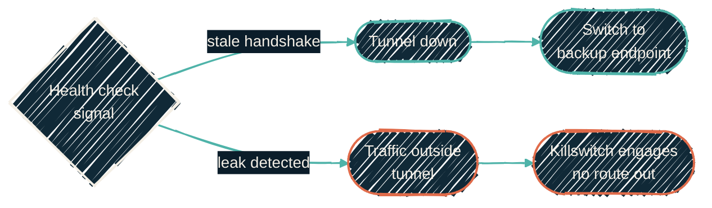

{/* projected from the authoring site; do not edit here */}
> A signature-based IDS/IPS can only match what it can see. An encrypted tunnel gives it nothing to see, and "nothing to see" occasionally looks a lot like an attack.

{/*Shape: decision tree. 6 nodes. Aspect ~3:1 LR.*/}

A tunnel-down signal is failover-eligible. A leak signal is never a failover trigger; it's a hard
stop.

Some homelab workloads need their egress locked to a specific upstream. Everything they send leaves
through a WireGuard tunnel to a VPN provider, enforced by a fail-closed `nftables` killswitch. If
the tunnel is down, the workload has no route out. There is no silent fallback to the LAN uplink.

## Sticky automatic endpoint failover

The VPN-locked egress path now supports an optional second upstream VPN endpoint. Both endpoints
share the same point-to-point tunnel address. So switching between them is a single `wg set` call:
swap the private key, the peer key, and the endpoint address on the same interface. No new
interface, no route table changes.

The killswitch permits every *configured* endpoint, not just the currently active one. So a
failover can never be blocked by the same rule that's supposed to protect the tunnel.

A systemd-timer validator runs the health check and classifies every breach before acting on it:

| Signal | Classification | Response |
| --- | --- | --- |
| Tunnel handshake stale or unreachable | Tunnel-down | Failover-eligible |
| Traffic observed outside the tunnel | Leak | Hard stop: killswitch engages, never fails over |

A leak is never treated as a failover trigger. Switching endpoints in response to a leak would just
relocate the leak, not fix it. Only a run of consecutive tunnel-down cycles triggers a switch to the
backup endpoint.

The switch is **sticky**: once failed over, the path stays on the backup endpoint. There is no
automatic failback. Bouncing between two endpoints that are each intermittently unhealthy is worse
than picking one and staying put. Failback happens on the next deliberate configuration converge,
not automatically.

## The IDS/IPS false positive

The primary VPN tunnel started dropping outright, and it wasn't the VPN provider, the ISP, or a
misconfiguration. The gateway's IDS/IPS was running in prevention mode. It matched the encrypted
tunnel's traffic against an unrelated signature: a well-known CVE's UDP-outbound rule, log4j-style.
It silently blocked the traffic.

The root cause is structural, not a tuning mistake. Encrypted WireGuard payload is high-entropy,
effectively random-looking bytes. A signature engine matches byte patterns. A sustained,
high-volume flow of random bytes eventually contains a sequence that coincidentally matches *some*
signature in the ruleset. A short, low-volume flow is far less likely to trip the same coincidence.
That is exactly why the symptom looked intermittent rather than a hard, reproducible failure.

The IDS/IPS fundamentally cannot inspect *inside* an encrypted tunnel. It only ever sees outer
ciphertext, so any signature match against that ciphertext is inherently a false positive for
whatever the tunnel is actually carrying.

**The fix**: whitelist the VPN-egress source host from IDS/IPS inspection. This is a source-direction
suppression, not a per-signature one. Since the IDS/IPS was never able to see inside the tunnel in
the first place, this costs zero real detection. Two things this fix deliberately avoids:

- **Disabling IDS/IPS globally.** The rest of the network still benefits from inspection; only the known-opaque tunnel traffic is exempted.
- **Suppressing a single signature.** A random-byte match against one signature is a coincidence
  that recurs against *other* signatures over time. Source-based suppression is the fix that doesn't
  need to be repeated every time a new signature happens to collide.

## Codification gap

This exception is currently console-only. The
[`ubiquiti-community/unifi`](https://registry.terraform.io/providers/ubiquiti-community/unifi/latest)
Terraform/OpenTofu provider (the same provider [`tofu-unifi`](/infrastructure/repos/tofu-unifi)
uses for every other network resource) has no IPS / threat-management / suppression resource yet.
So this rule can't be expressed as code alongside the rest of the network config. It joins the
provider's other known gaps (see [Provider
notes](/infrastructure/repos/tofu-unifi#provider-notes-unifi-network-9)). It stays a
live-console setting to re-apply if the controller is ever rebuilt from scratch.

## Related

<CardGroup cols={2}>
<Card
  title="Self-hosted Netflix"
  icon="film"
  href="/infrastructure/media-stack">
  The stack this egress path protects.
</Card>
<Card
  title="UniFi networking"
  icon="network-wired"
  href="/infrastructure/repos/tofu-unifi">
  Where the killswitch's network policy and the provider gap live.
</Card>
</CardGroup>
