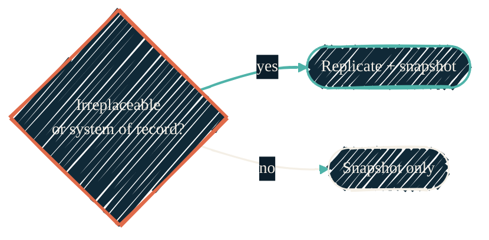
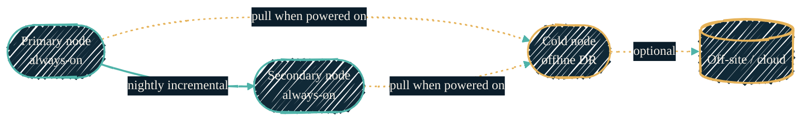

> RAID is not a backup. A mirror survives a dead disk and nothing else — not a fat-fingered `rm`, not a bad upgrade, not a fire. Real protection is layered.

The homelab follows the **3-2-1 rule** — three copies of the data, on two kinds of media, with one copy off-site — built up as four layers that each survive a bigger failure than the last. ZFS makes this cheap: snapshots are near-free until data changes, and `zfs send` ships only the blocks that moved.

## Four layers of defense

Each layer is strictly stronger than the one before it. The first one barely counts as a backup at all — it is in the table to make the point.

| Layer | What it is | Survives | Does **not** survive |
| --- | --- | --- | --- |
| 0 | In-pool redundancy (mirror / raidz) | A failed disk | Deletion, corruption, node loss |
| 1 | Local snapshots | A bad change, an accidental delete | Pool or node death |
| 2 | Cross-node replication | Loss of a whole node | Site loss (fire, theft, flood) |
| 3 | Off-site / offline copy | Site loss, ransomware | — the last line |

{/* Shape: linear chain. 4 nodes, escalating strength. Boundary crossings: 0. */}
{/* Layer 0 is `auto` (paper, thin) on purpose — it is not really a backup. */}

## What replicates, and what doesn't

Not everything earns a second copy. Replication costs bandwidth, disk, and snapshot retention on the far side, so it is reserved for data that is irreplaceable or is the system of record. Everything else gets local snapshots only — enough to undo a mistake, but never shipped across the wire.

| Tier | What it covers | Policy |
| --- | --- | --- |
| **Replicate aggressively** | Configs, databases, secrets stores, irreplaceable media, system-of-record telemetry | Snapshot **and** replicate to a second node, then reach the offline copy |
| **Snapshot-only** | Scratch, transient downloads, re-downloadable model weights, queue buffers | Local snapshots only; flagged so replication skips them |

The rule that decides which bucket a dataset lands in is simple:

{/* Shape: decision gate. 3 nodes. Boundary crossings: 0. */}

## How replication flows

Two always-on nodes replicate to each other on a nightly incremental schedule — only changed blocks move, so even large datasets sync in seconds once seeded. A third node stays **powered down most of the time**. When it wakes, it **pulls** the latest snapshots from both always-on nodes, then shuts back off.

{/* Shape: parallel convergence. 4 nodes; two sources land on the cold node. Boundary crossings: 0. */}

That offline window is a feature, not a gap. A node that is powered off is **air-gapped** — ransomware and a bad `zfs destroy` can't reach it. And because the cold node **pulls** rather than being pushed to, a compromised primary has no standing credentials to corrupt the archive. The powered-down copy is the "1" in 3-2-1.

## The toolchain

Each concern maps to one well-worn open-source tool. None of it is bespoke.

| Concern | Tool | Role |
| --- | --- | --- |
| Snapshot scheduling & retention | **sanoid** | Takes time-based snapshots and prunes them on an hourly / daily / monthly ladder |
| Incremental replication | **syncoid** | Wraps `zfs send \| zfs receive` to ship only changed blocks between nodes |
| App-consistent VM/LXC backup | **Proxmox Backup Server** | Deduplicated, verifiable guest backups — complements raw ZFS send for things mid-write |
| Capacity alerting | **ntfy** | Pushes a notification when a pool crosses 50% / 75% / 90% |

Snapshots and replication protect the filesystem; Proxmox Backup Server protects the *guests* (a database mid-transaction needs an application-consistent backup, not just a block snapshot). The two are complementary, not redundant.

## What this connects to

<CardGroup cols={2}>
  <Card title="Homelab" icon="server" href="/about/homelab">
    The hardware the pools run on.
  </Card>
  <Card title="ansible-proxmox" icon="screwdriver-wrench" href="/infrastructure/repos/ansible-proxmox">
    Where sanoid, syncoid, and the ZFS roles are defined.
  </Card>
  <Card title="tofu-proxmox" icon="cubes" href="/infrastructure/repos/tofu-proxmox">
    Declares the nodes, pools, and the backup-server guest.
  </Card>
  <Card title="Infrastructure overview" icon="sitemap" href="/infrastructure/overview">
    How the Proxmox stack fits the rest of the homelab.
  </Card>
</CardGroup>
