> Splunk and Cribl architect by day. Building the AI dev pipeline by night. Reef tank in the living room, homelab in the basement, both fully monitored.

This is the central reference for the public repositories that together form a single ecosystem: AI development pipeline, observability stack, Nix ecosystem, homelab infrastructure, secrets and security posture. Per-repo READMEs cover install and usage. **This site covers how everything fits together.**

## The six surfaces

```mermaid
%%{init: {'theme':'base','look':'handDrawn','themeVariables':{'primaryColor':'#4FB3A9','primaryTextColor':'#F4EFE6','primaryBorderColor':'#2F7E78','lineColor':'#E06B4A','secondaryColor':'#102937','tertiaryColor':'#0B1D2A','clusterBkg':'transparent','clusterBorder':'#4FB3A9','fontFamily':'Geist','fontSize':'15px'}}}%%
flowchart LR
  subgraph Eco["The ecosystem · ~40 public repos"]
    direction LR
    Inf(["Infrastructure<br/>Terraform · Ansible"])
    Nix(["Nix Ecosystem<br/>nix-darwin · nix-ai<br/>nix-home · nix-devenv"])
    AI(["AI Development<br/>Claude · Gemini<br/>Copilot · MLX"])
    Obs(["Observability<br/>Cribl · Splunk<br/>OTEL · MCP"])
    Sec(["Security<br/>Doppler · SOPS<br/>Keychain · BWS"])
    Tools(["Dev Tools<br/>Raycast · MLX bench<br/>K8s · scripts"])
    Inf ~~~ Nix ~~~ AI ~~~ Obs ~~~ Sec ~~~ Tools
  end

  style Inf fill:transparent,stroke:#4FB3A9,stroke-width:2px,color:#F4EFE6
  style Nix fill:transparent,stroke:#4FB3A9,stroke-width:2px,color:#F4EFE6
  style AI fill:transparent,stroke:#4FB3A9,stroke-width:2px,color:#F4EFE6
  style Obs fill:transparent,stroke:#4FB3A9,stroke-width:2px,color:#F4EFE6
  style Sec fill:transparent,stroke:#4FB3A9,stroke-width:2px,color:#F4EFE6
  style Tools fill:transparent,stroke:#4FB3A9,stroke-width:2px,color:#F4EFE6

  linkStyle default stroke:#E06B4A,stroke-width:3px
```

## Where to start

<CardGroup cols={2}>
  <Card title="How it fits together" icon="diagram-project" href="/how-it-fits-together">
    The full architecture diagram and narrative — how every public repo relates to the others.
  </Card>
  <Card title="Architecture" icon="sitemap" href="/architecture/overview">
    Data pipelines, AI development pipeline, system overviews.
  </Card>
  <Card title="Infrastructure" icon="server" href="/infrastructure/overview">
    Terraform modules and the homelab provisioning flow.
  </Card>
  <Card title="AI Development" icon="robot" href="/ai-development/overview">
    Claude, Gemini, Copilot, MLX — a multi-model AI pipeline.
  </Card>
  <Card title="Observability" icon="chart-line" href="/observability/overview">
    Cribl packs, Splunk apps, OTEL telemetry for every AI tool.
  </Card>
  <Card title="Security" icon="shield-halved" href="/security/overview">
    Doppler, SOPS, Keychain, Bitwarden — and why AI cannot view tokens.
  </Card>
  <Card title="About Jacob" icon="person" href="/about/jacob">
    Splunk consulting by day, homelab and reef tank by night.
  </Card>
</CardGroup>

## What this site is — and isn't

- **Is**: architecture, philosophy, and cross-repo context.
- **Isn't**: install walkthroughs or API references — those live in each repo's `README.md`.

Every page that mentions a repo links to the source. Treat this site as a map, not a manual.
