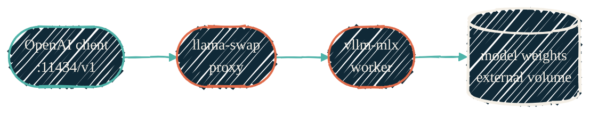

> One resident model, behind a swapping proxy, tuned so the GPU serves tokens
> without starving the machine you're actually using.

The workstation serves its local model through two processes: `llama-swap`, a
thin model-multiplexing proxy on `localhost:11434`, and one `vllm-mlx` worker
that does the MLX inference. Every caller speaks the OpenAI API; the proxy
routes to the resident worker and manages its lifecycle.

The hard part on a laptop isn't raw speed — it's **coexistence**. A large model
wires gigabytes of GPU memory that the kernel can't cheaply reclaim, and a
desktop full of real work is competing for the same RAM. Most of the tuning
below exists to keep inference from quietly pushing the whole machine into swap.

## The stack

{/* Shape: linear chain. 4 nodes, one direction. Aspect ~3:1 LR. Role via classDef. */}

`llama-swap` is launched by a macOS LaunchAgent and watches its own config, so a
`nix-darwin` rebuild can add or repoint models without a restart. The worker
spawns on an ephemeral port; the proxy is the only stable surface. Weights are
memory-mapped from an external volume so the multi-GB files don't live on the
boot disk. The whole thing is packaged by [`nix-ai`](/nix/nix-ai) — nothing here
is configured by hand.

## The tuning playbook

These are the knobs that matter and the reasoning behind each. The values are
the module defaults, calibrated for a single 128 GB M4 Max; they are *not*
portable to a smaller machine without re-measuring.

| Knob | Setting | Why |
| --- | --- | --- |
| KV-cache reservation | small, fixed (single-digit GB) | The single most dangerous knob. Over-reserving cache (tens of GB per worker) drove this host into double-digit-GB swap and ~1 tok/s decode. Reserve for the realistic batch, not the theoretical max. |
| GPU memory utilization | ~0.5 | A per-worker Metal ceiling. Leaves headroom for the compositor and the desktop's own GPU work instead of claiming the whole device. |
| Paged KV cache | on | Pages the cache like vLLM's paged attention. Prerequisite for prefix sharing. |
| Prefix cache | on | Reuses already-prefilled conversation prefixes across turns. The biggest single win for multi-turn and agentic tool loops — no re-prefill of unchanged context. |
| Continuous batching | on | Folds parallel sequences into one GPU forward pass. |
| Max sequences / concurrency | small (single digits) | Bounds peak memory under batching. Set too high and a burst of callers saturates the worker; set to 1 and you lose batching entirely. |
| Idle TTL | short (minutes) | Idle dwell is the dominant memory cost — a resident model holds wired GPU memory whether or not it's working. A 4-bit MoE reloads from a fast volume in seconds, so evicting aggressively is cheap insurance against pressure building overnight. |
| Generation cap | bounded | A default ceiling on output tokens so a runaway or oversized request can't dominate the queue for minutes. |
| `ProcessType` | `Interactive` | **Not** `Background`. Background QoS clamps Metal throughput by roughly an order of magnitude — the worker runs, just many times slower. This one line is the difference between "usable" and "why is it so slow." |
| Frequency / presence penalty | small, non-zero | Greedy decoding on long inputs can fall into token-repetition loops; a light penalty breaks the cycle without hurting quality. |
| Tool-call parser | matches the resident model's tool-call format — this stack's Qwen-family models use the `hermes` parser, which reads their `<tool_call>` XML | A mismatched parser makes tool calls silently break. See [Backends & tool calling](/local-llm/backends). |

<Note>
  The **resident model id is not a tuning knob** — it lives in the AI-stack
  registry, not in these flags. Picking and quantizing that model is its own
  topic: [Models & quantization](/local-llm/models-and-quantization).
</Note>

## Speculative decoding is off — on purpose

Speculative decoding and multi-token prediction (MTP) are marketed as free
speedups. On Apple Metal, for the sparse-MoE models this stack runs, they are a
**net loss**: the draft-evaluation overhead doesn't amortize, and for a
small-active-parameter MoE the regression is severe (a documented case collapses
from tens of tok/s to under 2). Upstream `llama.cpp` reports the same on Metal
([#23752](https://github.com/ggml-org/llama.cpp/issues/23752),
[#23011](https://github.com/ggml-org/llama.cpp/issues/23011)). Draft flags are
banned from this stack until a measured win on this hardware says otherwise.
Apple's own recurrent-drafter research shows speculative methods *can* help in
other settings — so this is "off because measured slower here," not dogma.

## Why the laptop slows down under sustained use

Even when no single layer is broken, a laptop running inference for days gets
sluggish — because the kernel never gets an idle window to drain its memory
compressor and swap. The ingredients are generic: a wired model weight pool,
other heavy apps holding most of RAM, and background processes preventing idle
sleep. The highest-leverage fixes are structural:

- **Hold one resident model and evict it aggressively** (short idle TTL) so the
  wired pool doesn't sit for days.
- **Right-size the cache reservation** so the worker's footprint matches its real
  batch, not a worst case.
- **Give the machine idle-sleep windows** so the compressor can drain.

The host-specific incident history — real memory numbers, the exact failure
fingerprints, and the diagnostic playbook — lives in the gated
[operational reference](https://docs.dryvist.com); it stays private because it
quotes real paths and process state.

## Operate it

<Steps>
  <Step title="Check health">
    `mlx-status` shows the resident model, memory, and uptime; `mlx-models`
    lists what's downloaded and whether it fits in memory.
  </Step>
  <Step title="Send a request">
    Any OpenAI client against `http://localhost:11434/v1` works. `mlx` is a
    one-shot prompt; `mlx-chat` is interactive.
  </Step>
  <Step title="Reset the proxy">
    `mlx-default` restarts `llama-swap` and preloads the resident model — the
    fix when a worker has been evicted under pressure.
  </Step>
</Steps>

## Related

<CardGroup cols={2}>
  <Card title="Models & quantization" icon="layer-group" href="/local-llm/models-and-quantization">
    What model is resident, at what precision, and why.
  </Card>
  <Card title="Backends & tool calling" icon="server" href="/local-llm/backends">
    Why `vllm-mlx`, and the tool-calling reliability problem.
  </Card>
  <Card title="nix-ai" icon="bot" href="/nix/nix-ai">
    The module that generates the LaunchAgent and the `llama-swap` config.
  </Card>
  <Card title="Operational reference (private)" icon="lock" href="https://docs.dryvist.com">
    Real values, failure fingerprints, and the `/perf-snapshot` playbook.
  </Card>
</CardGroup>
