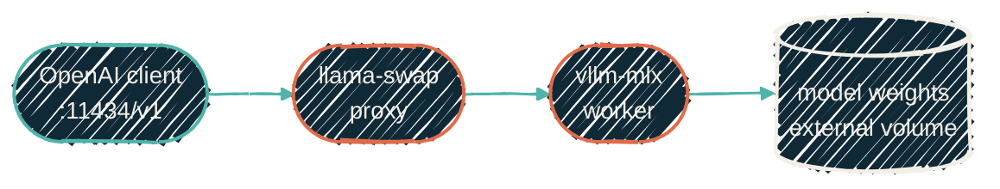

{/* projected from the authoring site; do not edit here */}
> One resident model, behind a swapping proxy, tuned so the GPU serves tokens
> without starving the machine you're actually using.

The workstation serves its local model through two processes: `llama-swap`, a
thin model-multiplexing proxy on `localhost:11434`, and one `vllm-mlx` worker
that does the MLX inference. Every caller speaks the OpenAI API; the proxy
routes to the resident worker and manages its lifecycle.

The hard part on a laptop isn't raw speed. It's **coexistence**. A large model
wires gigabytes of GPU memory that the kernel can't cheaply reclaim. A desktop
full of real work is competing for the same RAM. Most of the tuning below
exists to keep inference from quietly pushing the whole machine into swap.

## The stack

{/*Shape: linear chain. 4 nodes, one direction. Aspect ~3:1 LR. Role via classDef.*/}

```mermaid
%%{init:
  {'theme':'base','look':'handDrawn','themeVariables':{'fontFamily':'Geist','fontSize':'14px','primaryColor':'#102937','primaryTextColor':'#F4EFE6','primaryBorderColor':'#4FB3A9','lineColor':'#4FB3A9','secondaryColor':'#0B1D2A','tertiaryColor':'#1A2A38','clusterBkg':'rgba(79,179,169,0.08)','clusterBorder':'#4FB3A9'}}}%%
  flowchart LR
  Caller([OpenAI client<br/>:11434/v1])
  Swap([llama-swap<br/>proxy])
  Worker([vllm-mlx<br/>worker])
  Weights[(model weights<br/>external volume)]

  Caller --> Swap --> Worker --> Weights

  classDef host fill:#102937,stroke:#4FB3A9,stroke-width:2px,color:#F4EFE6;
  classDef ai   fill:#102937,stroke:#E06B4A,stroke-width:2px,color:#F4EFE6;
  classDef sink fill:#102937,stroke:#F4EFE6,stroke-width:2px,color:#F4EFE6;

  class Caller host
  class Swap,Worker ai
  class Weights sink

  linkStyle default stroke:#4FB3A9,stroke-width:1.5px;
```

`llama-swap` is launched by a macOS LaunchAgent and watches its own config, so a
`nix-darwin` rebuild can add or repoint models without a restart. The worker
spawns on an ephemeral port; the proxy is the only stable surface. Weights are
memory-mapped from an external volume so the multi-GB files don't live on the
boot disk. The whole thing is packaged by [`nix-ai`](/nix/nix-ai). Nothing here
is configured by hand.

## The tuning playbook

These are the knobs that matter and the reasoning behind each. The values are
the module defaults, calibrated for a single 128 GB M4 Max; they are *not*
portable to a smaller machine without re-measuring.

| Knob | Setting | Why |
| --- | --- | --- |
| KV-cache reservation | small, fixed (single-digit GB) | The single most dangerous knob. Over-reserving cache (tens of GB per worker) drove this host into double-digit-GB swap and ~1 tok/s decode. Reserve for the realistic batch, not the theoretical max. |
| GPU memory utilization | ~0.5 | A per-worker Metal ceiling. Leaves headroom for the compositor and the desktop's own GPU work instead of claiming the whole device. It is a cap, not a reservation, and it is coupled to the OS wired-memory ceiling. See [Memory ceilings on Apple Silicon](/local-llm/memory-ceilings) before changing either. |
| Paged KV cache | on | Pages the cache like vLLM's paged attention. Prerequisite for prefix sharing. |
| Prefix cache | on | Reuses already-prefilled conversation prefixes across turns. The biggest single win for multi-turn and agentic tool loops: no re-prefill of unchanged context. |
| Continuous batching | on | Folds parallel sequences into one GPU forward pass. |
| Max sequences / concurrency | small: one decode slot for large MoE models | **Not a "more is better" knob.** It bounds peak memory under batching, but on a large MoE two streams give no reliable gain and four are *worse* than one. Measure it per model. See "Concurrency is measured, not assumed" below. |
| Idle TTL | short (minutes) | Idle dwell is the dominant memory cost. A resident model holds wired GPU memory whether or not it's working. A 4-bit MoE reloads from a fast volume in seconds, so evicting aggressively is cheap insurance against pressure building overnight. |
| Generation cap | bounded | A default ceiling on output tokens so a runaway or oversized request can't dominate the queue for minutes. |
| `ProcessType` | `Interactive` | **Not** `Background`. Background QoS clamps Metal throughput by roughly an order of magnitude. The worker runs, just many times slower. This one line is the difference between "usable" and "why is it so slow." |
| Frequency / presence penalty | small, non-zero | Greedy decoding on long inputs can fall into token-repetition loops; a light penalty breaks the cycle without hurting quality. |
| Tool-call parser | matches the resident model's tool-call format; this stack's Qwen-family models use the `hermes` parser, which reads their `<tool_call>` XML | A mismatched parser makes tool calls silently break. See [Backends & tool calling](/local-llm/backends). |

<Note>
  The **resident model id is not a tuning knob**. It lives in the AI-stack
  registry, not in these flags. Picking and quantizing that model is its own
  topic: [Models & quantization](/local-llm/models-and-quantization).
</Note>

## Concurrency is measured, not assumed

Raising concurrency on this stack ranges from useless to actively harmful.
Measured on a large MoE model served with a single decode slot, weights proven
by process inspection (verified 2026-07-26/27):

| Concurrent streams | Aggregate decode | Worst time-to-first-token |
| --- | --- | --- |
| 1 | 7.27–11.05 tok/s | under 1 s |
| 2 | 8.46–13.77 tok/s, no reliable gain | n/a |
| 4 | **4.42 tok/s, worse than a single stream** | **148 s** |

With one decode slot the server serializes rather than batches, so extra load
buys queueing, not throughput. For large mixture-of-experts models, concurrency
greater than 1 is a regression, not a missed opportunity. Whatever the right number is
for a small model, **measure it per model**. It does not scale from one model
to the next.

<Note>
  **Single-slot is the current setting, not a permanent verdict.** It is what
  holds while single-stream stability is being settled. The intended direction is
  to raise concurrency once concurrency-1 is solid, per model, on measured
  evidence, never as a global flip.
</Note>

### The proxy rejects; the server serializes

Two layers behave differently under load, and a client has to know which one it
is talking to.

- **The swapping proxy rejects.** A second simultaneous request gets an
  immediate HTTP 429 with a "too many requests" body. No queue, no partial
  service. **Every client must treat 429 as a normal condition and back off**,
  not raise an alert.
- **The model server serializes.** Behind the proxy, with a single decode slot,
  requests wait their turn instead of being refused. That is where the
  preceding table comes from.

One caution on reading a 429: it does not by itself prove a slot is busy. It can
also fall out of a config-reload window in which the requested model is
momentarily absent.

### One definition, and it is derived

Express the concurrency limit as **one definition consumed everywhere**, never
as a literal repeated in two places. A derived `1` and a hardcoded `1` are
textually identical. Only the source line tells them apart, which is exactly
why two copies drift without anyone noticing. That happened here before the
limit became a single derived value with a build-time assert that the emitted
serve flags equal the declared one.

## Speculative decoding is off — on purpose

Speculative decoding and multi-token prediction (MTP) are marketed as free
speedups. On Apple Metal, for the sparse-MoE models this stack runs, they are a
**net loss**. The draft-evaluation overhead doesn't amortize. For a
small-active-parameter MoE, the regression is severe (a documented case collapses
from tens of tok/s to under 2). Upstream `llama.cpp` reports the same on Metal
([#23752](https://github.com/ggml-org/llama.cpp/issues/23752),
[#23011](https://github.com/ggml-org/llama.cpp/issues/23011)). Draft flags are
banned from this stack until a measured win on this hardware says otherwise.
Apple's own recurrent-drafter research shows speculative methods *can* help in
other settings. So this is "off because measured slower here," not dogma.

## Why the laptop slows down under sustained use

Even when no single layer is broken, a laptop running inference for days gets
sluggish. The kernel never gets an idle window to drain its memory
compressor and swap. The ingredients are generic: a wired model weight pool,
other heavy apps holding most of RAM, and background processes preventing idle
sleep. The most effective fixes are structural:

- **Hold one resident model and evict it aggressively** (short idle TTL) so the
  wired pool doesn't sit for days.
- **Right-size the cache reservation** so the worker's footprint matches its real
  batch, not a worst case.
- **Give the machine idle-sleep windows** so the compressor can drain.

The host-specific incident history (real memory numbers, the exact failure
fingerprints, and the diagnostic playbook) lives in the gated
[operational reference](https://docs.dryvist.com). It stays private because it
quotes real paths and process state.

## Operate it

<Steps>
<Step title="Check health">
`mlx-status` shows the resident model, memory, and uptime; `mlx-models`
lists what's downloaded and whether it fits in memory.
</Step>
<Step title="Send a request">
Any OpenAI client against `http://localhost:11434/v1` works. `mlx` is a
one-shot prompt; `mlx-chat` is interactive.
</Step>
<Step title="Reset the proxy">
`mlx-default` restarts `llama-swap` and preloads the resident model. It's the
fix when a worker has been evicted under pressure.
</Step>
</Steps>

## Related

<CardGroup cols={2}>
<Card
  title="Models & quantization"
  icon="layer-group"
  href="/local-llm/models-and-quantization">
  What model is resident, at what precision, and why.
</Card>
<Card
  title="Backends & tool calling"
  icon="server"
  href="/local-llm/backends">
  Why `vllm-mlx`, and the tool-calling reliability problem.
</Card>
<Card
  title="nix-ai"
  icon="bot"
  href="/nix/nix-ai">
  The module that generates the LaunchAgent and the `llama-swap` config.
</Card>
<Card
  title="Operational reference (private)"
  icon="lock"
  href="https://docs.dryvist.com">
  Real values, failure fingerprints, and the `/perf-snapshot` playbook.
</Card>
</CardGroup>
