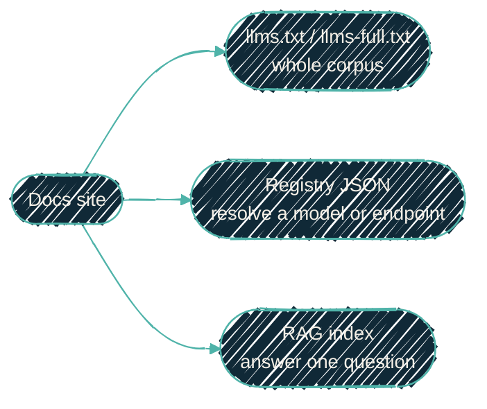

{/* projected from the authoring site; do not edit here */}
> An agent has three ways to load context, in rising order of specificity: read
> the whole site as one file, resolve a model or endpoint from a registry, or
> ask a retrieval index a single question. They compose. The same docs feed all
> three.

{/*Shape: one source, three consumption paths.*/}

Docs written for humans are also the raw material an agent runs on. Three small,
boring conventions make that work without bespoke scraping, and none of them
needs a human in the loop.

## llms.txt — read the whole thing

This site emits the [llmstxt.org](https://llmstxt.org) files at build time:

- `/llms.txt`: a curated link index of the site.
- `/llms-full.txt`: every page concatenated into one document.

An agent fetches `llms-full.txt` when it wants the entire corpus in context, and
`llms.txt` when it wants to pick pages to fetch. Both are plain text at stable
URLs, so consuming them is a single HTTP GET. No crawler and no sitemap parsing
are needed.

## The registry — resolve a model or an endpoint

Hard-coding a model id or an endpoint into an agent is how it breaks the next
time either changes. The pattern instead is a small machine-readable registry.
It is a flat JSON object keyed by **capability role** rather than physical name:

- `models`: role → model id (`default`, `quickest`, `tool-calling`, `coding`,
  `large-context`, …). The role is the stable contract; the model behind it can
  change without touching the agent.
- `endpoints`: name → OpenAI-compatible base URL.
- `nodeports` / versions: well-known ports and pinned tool versions.

In this project that file is generated by [`nix-ai`](/nix/nix-ai) on every
rebuild and lands at a stable path the agent reads. An agent resolves
`models["tool-calling"]` and `endpoints[...]` at startup instead of embedding
literals. See [backends and tool calling](/local-llm/backends) for why the
tool-calling role is the one that actually matters.

## RAG — ask one question

For a targeted question, whole-site context is wasteful. The retrieval pattern
embeds the docs into a vector store and answers by similarity:

1. Ingest `llms-full.txt` (already the whole corpus in one file) as the source.
2. Embed each chunk with an OpenAI-compatible embeddings endpoint. It's the same
   endpoint the registry already names, so there is no second embedding path to
   keep in sync.
3. Store vectors in a vector database (Qdrant is a common choice) and query by
   similarity at agent time.

Because the ingestion source is the same `llms-full.txt`, the retrieval index
stays in step with the docs by rebuilding from the published site.

### In practice (verified)

This project runs that pattern end to end. A scheduled job fetches
`llms-full.txt` plus the generated registry document, and splits them into
~256-token chunks. It embeds each chunk through the router's `embeddings` role.
It also rebuilds one Qdrant collection per run (drop-and-recreate, so re-runs
replace rather than duplicate). Two implementation lessons worth stealing:

- **Size the embedding server's physical batch to its context window.**
  llama.cpp's default `--ubatch-size` (512 tokens) silently caps embedding
  inputs far below the advertised context, and it returns a 500 for anything
  larger. Set `--batch-size`/`--ubatch-size` to the context size for
  embedding models.
- **Budget for tokenizer skew.** Chunkers that count tokens with tiktoken
  under-count for wordpiece embedding models (nomic runs 1.6–2.4× on dense
  technical text), so keep chunks well under the server ceiling.

The rebuild is scheduled (daily), not merge-triggered. A docs change lands in
the index at the next run, not instantly.

## How they fit

| Need | Use | Cost |
| --- | --- | --- |
| Full corpus in context | `llms-full.txt` | One GET; largest token load |
| Resolve a model/endpoint | registry JSON | One read; tiny |
| Answer a specific question | RAG query | One similarity search; small |

Start with the registry to wire up the model and endpoint. Reach for
`llms-full.txt` when the whole corpus is worth the tokens. Stand up RAG when
questions are frequent and specific enough that re-reading everything is waste.
See [the local-LLM overview](/local-llm/overview) for how the serving side of
this fits together.
