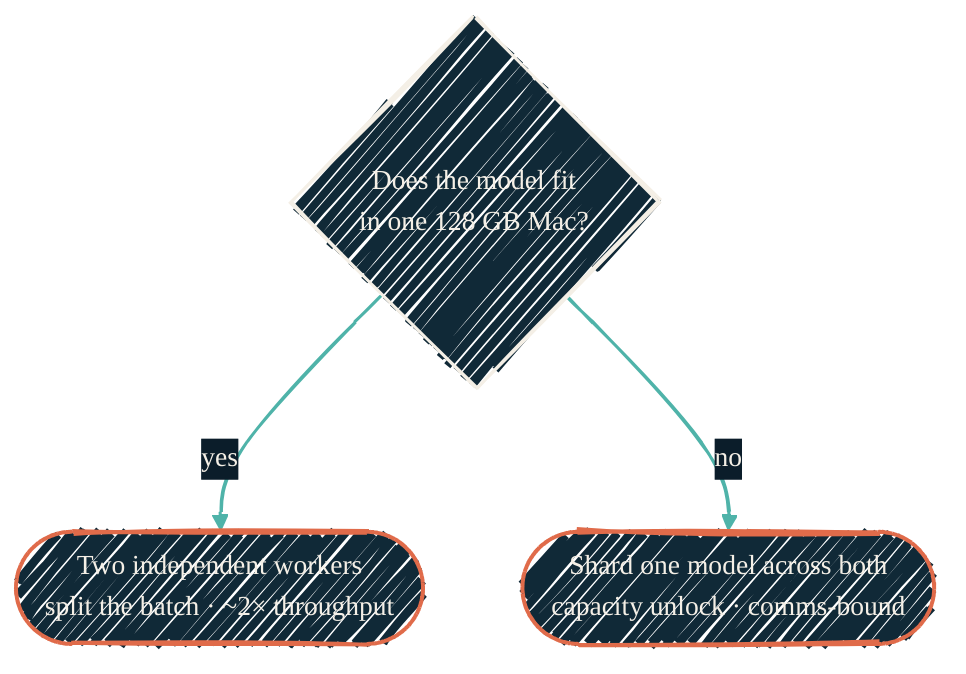

> Two Macs can *cooperate*; they can't *merge*. The win from a second machine is
> capacity — running a model too big for one box — not a faster version of one
> that already fits.

A second 128 GB Mac has arrived — it's already live as the always-on large-tier
serving host (see [Homelab GPU](/local-llm/homelab-gpu)). What hasn't landed yet
is using its Thunderbolt link to *shard* a model across both machines for
overnight, latency-tolerant batch work bigger than either can do alone. This
page is the honest version of how that would work — because the obvious mental
model is wrong in a way that changes the whole design.

## The one thing to get right

There is **no combined 256 GB unified-memory pool**. Apple Silicon unified memory
is a property of one chip; it can't be extended across a cable. What two Macs can
do is **shard a model** — each holds part of it — and exchange activations over a
fast interconnect. "Combined capacity" is real; "combined unified memory" is not.

The fast interconnect is the real, recent enabler. `mlx.distributed` moves data
between the Macs over Thunderbolt 5 two ways: the original **TCP ring** backend,
and a newer low-latency **RDMA backend (JACCL)** merged into MLX in late 2025
([ml-explore/mlx#2808](https://github.com/ml-explore/mlx/pull/2808)). Either way
the link moves bytes between two separate memory pools — it does not fuse them
into one.

| Path | Rough bandwidth | vs on-chip |
| --- | --- | --- |
| One M4 Max, unified memory (on-chip) | hundreds of GB/s | 1× |
| Thunderbolt 5 interconnect (RDMA/JACCL, measured) | a few GB/s | ~1/100–1/150 |

That ratio is the whole story. The link between the machines is two orders of
magnitude slower than memory inside one. Sharding pays its way only when the
alternative is *not running the model at all*.

## The decision: two workers, or one sharded model?

- **Fits in 128 GB → run two independent workers.** Put the model on each Mac,
  split the night's job list between them, and you get roughly double the
  aggregate throughput with none of the complexity. Simpler, and fault-isolated —
  if one node hiccups overnight, the other keeps going. This is the default for
  almost everything.
- **Doesn't fit → shard it.** Use `mlx.distributed` (or [EXO](https://github.com/exo-explore/exo),
  the friendlier wrapper over the same Apple primitives) to run one model across
  both machines. This is the only way to touch the aspirational tier — and it's a
  capacity unlock, accepted as slow.

## The honest fit math

"256 GB" is a ceiling, not a usable target. Sharding has per-node overhead, and
the KV cache needs room too. A tensor-parallel split of a trillion-parameter
4-bit model can need well over 128 GB *per node* — which won't fit on two 128 GB
Macs at all. The realistic sweet spot is a **pipeline-parallel split of a model
in the ~200–230 GB-weights range**, leaving each node under its 128 GB with cache
headroom. Push toward a true 256 GB and you starve the cache and fall into swap.

## Capacity, not speed — and why overnight makes that fine

Sharded cross-Mac inference is communication-bound, so expect modest
tokens-per-second, not a multiplier. Community measurements on higher-bandwidth
Apple hardware land in the single-digit-to-low-teens tok/s range for large
sharded models; **the M4 Max pairing is unmeasured** and will be confirmed, not
assumed. For interactive use that's painful. For *overnight batch* it's the right
trade: a few hundred completions from a model that simply won't load on one
machine, done by morning, is a capability you otherwise don't have.

## Honest gotchas for unattended runs

Cross-machine inference is newer and more fragile than the single-Mac path. The
real risks for an overnight, unattended job:

- The Thunderbolt interconnect needs explicit one-time setup, and the bridge can
  reset across reboots and OS updates — a job that ran last week may need
  re-enabling.
- Long many-iteration runs have hit transport-resource exhaustion and GPU
  command-buffer timeouts in the wild.

So the rule is: **prove an overnight job survives end-to-end before relying on
it.** That proof is a measurement task, not an assumption.

## Where this is gated

This is a near-term direction, not shipped fact. Before it becomes a documented
production capability it has to clear a measurement spike: confirm the
Thunderbolt distributed path (RDMA/JACCL) works on *this* M4 Max hardware (the
public benchmarks are all higher-end Macs), baseline a single Mac, compare
two-independent-workers against a sharded run on a real overnight workload, and
find the break-even model size. The numbers — and the decision — come from that,
tracked in the roadmap, not from this page.

The further horizon is moving the non-latency-sensitive work off the laptop
entirely onto a dedicated always-on inference server, so the workstation stays
responsive and the heavy batch runs elsewhere.

## Related

<CardGroup cols={2}>
  <Card title="Models & quantization" icon="layer-group" href="/local-llm/models-and-quantization">
    The aspirational tier — models too big for one Mac — that justifies sharding.
  </Card>
  <Card title="Apple Silicon stack" icon="microchip" href="/local-llm/apple-silicon">
    The single-Mac stack each worker runs.
  </Card>
  <Card title="Benchmarking" icon="gauge-high" href="/tools/mlx-benchmarks">
    Where the shard-vs-two-workers question gets settled with numbers.
  </Card>
  <Card title="Operational reference (private)" icon="lock" href="https://docs.dryvist.com">
    Host-specific setup and the measurement spike's real results.
  </Card>
</CardGroup>
