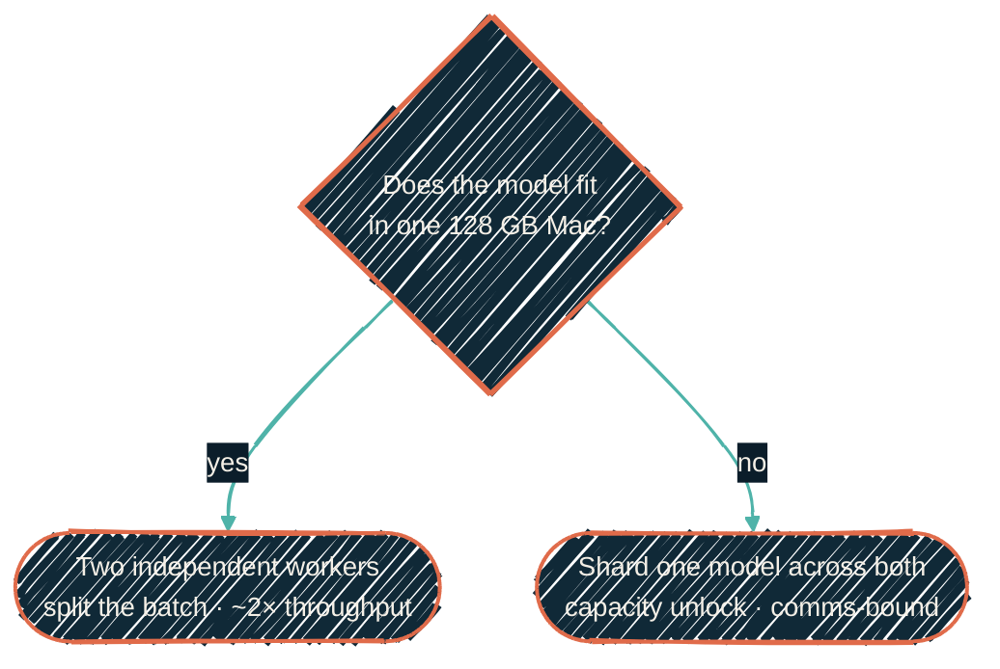

{/* projected from the authoring site; do not edit here */}
> Two Macs can *cooperate*; they can't *merge*. The win from a second machine
> is capacity: running a model too big for one box, not a faster version of
> one that already fits.

TB5 MLX clustering is **the point of running two 128 GB Macs**. It turns two
separate boxes into one serving fabric that can hold a model neither can hold
alone. JACCL RDMA over Thunderbolt 5 forms reliably on current hardware and
macOS 26.2+, and plenty of setups run it. This fleet's own cluster is
nix-managed, live, and survives a reboot. This page covers the architecture
and the re-enable procedure. The fixes that got it there are a root-cause
table, not a warning label.

## Re-enable, if the link is down

Cluster mode is a nix-darwin module (`programs.mlx.clusterMode.enable`) on
both hosts. Bring-up is automatic once the module is enabled. A link watcher
detects the cable, quiesces each host's normal single-node serving, and starts
the pipeline. No manual commands are needed. If the cluster isn't forming:

1. **Confirm both hosts have the module enabled and have rebuilt.** Cluster
   mode is declared per-host, so a host that missed a rebuild after the module
   landed won't participate.
2. **Confirm the cable has carrier and the link IP applied.** The link IP is
   reapplied by root activation on every boot and rebuild. A fresh `sudo
   darwin-rebuild switch` re-runs it. If the port was recently removed from
   the Thunderbolt Bridge network service, bring the interface back up first;
   see the root-cause table below (bridge0 row).
3. **Watch the link watcher's own log**, not just "is a process running":
   a launchd job showing as loaded is not proof the rank actually joined.
   Confirm with a real completion request against the cluster's serving port.

The full config reference (file-by-file module map, rank/host assignment, and
memory-sizing math) lives in the private operational reference (see
**Related** below). This page stays the public-safe architecture and mechanism
explanation.

## The one thing to get right

There is **no combined 256 GB unified-memory pool**. Apple Silicon unified memory
is a property of one chip; it can't be extended across a cable. What two Macs can
do is **shard a model**: each holds part of it and exchanges activations over a
fast interconnect. "Combined capacity" is real; "combined unified memory" is not.

The fast interconnect is the enabler. `mlx.distributed` moves data
between the Macs over Thunderbolt 5 in two ways: the original **TCP ring**
backend, and a low-latency **RDMA backend (JACCL)**. JACCL merged into MLX in
late 2025 ([ml-explore/mlx#2808](https://github.com/ml-explore/mlx/pull/2808)).
Either way, the link moves bytes between two separate memory pools. It does
not fuse them into one.

| Path | Rough bandwidth | vs on-chip |
| --- | --- | --- |
| One M4 Max, unified memory (on-chip) | hundreds of GB/s | 1× |
| Thunderbolt 5 interconnect (RDMA/JACCL, measured) | a few GB/s | ~1/100–1/150 |

That ratio is the whole story. The link between the machines is two orders of
magnitude slower than memory inside one. Sharding pays its way when the
alternative is *not running the model at all*. That's exactly the case this
fleet's cluster serves.

Measure residency with `vm_stat`'s wired-memory figure (multiply "Pages wired down" by the 16 KB page size on Apple Silicon), never a process's RSS.
Metal and unified-memory allocations don't show up in RSS at all. A
per-process memory reading can look fine while the host is actually pinned
against its wired-memory ceiling.

## The decision: two workers, or one sharded model?

```mermaid
%%{init:
  {'theme':'base','look':'handDrawn','themeVariables':{'fontFamily':'Geist','fontSize':'14px','primaryColor':'#102937','primaryTextColor':'#F4EFE6','primaryBorderColor':'#4FB3A9','lineColor':'#4FB3A9','secondaryColor':'#0B1D2A','tertiaryColor':'#1A2A38','clusterBkg':'rgba(79,179,169,0.08)','clusterBorder':'#4FB3A9'}}}%%
  flowchart TB
  Q{Does the model fit<br/>in one 128 GB Mac?}
  Two([Two independent workers<br/>split the batch · ~2× throughput])
  Shard([Shard one model across both<br/>capacity unlock · comms-bound])

  Q -->|yes| Two
  Q -->|no| Shard

  classDef gate fill:#102937,stroke:#E06B4A,stroke-width:2.5px,color:#F4EFE6;
  classDef ai   fill:#102937,stroke:#E06B4A,stroke-width:2px,color:#F4EFE6;
  class Q gate
  class Two,Shard ai

  linkStyle 0,1 stroke:#4FB3A9,stroke-width:1.5px;
```

- **Fits in 128 GB → run two independent workers.** Put the model on each Mac,
  split the job list between them, and get roughly double the aggregate
  throughput with none of the sharding complexity. Fault-isolated too: if one
  node hiccups, the other keeps going.
- **Doesn't fit → shard it.** Use `mlx.distributed` (or [EXO](https://github.com/exo-explore/exo),
  a friendlier wrapper over the same Apple primitives) to run one model across
  both machines. This is the capacity unlock that reaches the aspirational
  tier: the reason the cluster exists.

## The fit math

"256 GB" is a ceiling, not a usable target. Sharding has per-node overhead, and
the KV cache needs room too.

Which parallelism mode a model gets depends on its architecture. MLX can only
split an architecture that supports pipeline or tensor parallelism. Not every
model qualifies. Which mode a given clusterable model actually runs in is
a deployment choice, not a given. Tensor parallelism shards every layer's
weights and crosses the link on every layer. Pipeline parallelism gives each
node whole layers and crosses the link once per stage. The two have different
sizing math. Tensor-parallel pays the link cost more often, so target a model
whose weights leave each node with cache headroom. Don't push toward the
notional 256 GB ceiling.

## Capacity, and where the throughput lands

Sharded cross-Mac inference is communication-bound, so the win is capacity:
running a model that fits nowhere else, not raw speed. This fleet's cluster
runs GLM-4.7-Flash (`glm4_moe`, pipeline-parallel, hand-run bring-up on the
pre-nix-managed path). Measured, it reaches **60.3 tok/s single-stream**. It
scales to **232 tok/s at 8-way concurrency** (3.9× single-stream). The
clustered pipeline batches well. This contradicts an earlier single-node
finding that MLX "doesn't batch"; that finding was single-node only.

| Concurrency | Aggregate tok/s | Per-stream tok/s | Scaling |
| --- | --- | --- | --- |
| 1 | 59.4 | 59.4 | 1.00× |
| 2 | 109.7 | 54.8 | 1.85× |
| 4 | 175.8 | 44.0 | 2.96× |
| 8 | 232.1 | 29.0 | 3.91× |

The production model running today is a pruned derivative of a larger family.
It's chosen because it fits comfortably under each rank's memory ceiling with
headroom. Its numbers describe that derivative, not the full unpruned model,
which hasn't been run on this cluster. A full benchmark battery (thermal soak,
context-length cells, a rank-stop degradation drill) is still open. It's
tracked as follow-up work, not a blocker to daily use.

## Root causes: fixed and in progress

Every blocker below was found, diagnosed, and either landed or has an open
fix in flight. None of them is "clustering doesn't work." They're the normal
shakeout of running RDMA on consumer hardware across reboots and OS updates.

| Failure mode | Status | Where |
| --- | --- | --- |
| Thunderbolt carrier loss drove an uncapped standdown retry loop | **Fixed**: halts on peer-absent instead of retrying forever | landed |
| RDMA protection-domain leak was reboot-only to clear | **Fixed**: self-reboot recovery | [dryvist/nix-ai#1478](https://github.com/dryvist/nix-ai/issues/1478); preflight check in progress at [dryvist/nix-ai#1442](https://github.com/dryvist/nix-ai/issues/1442) |
| Warmup slot starvation caused hourly HTTP 429 responses under load | **Fixed**: repair caps and halt bounds | landed |
| macOS re-enslaves the Thunderbolt port into `bridge0` after a reboot, starving RDMA | **Fixed**: boot daemon; verified at converge-time, reboot-time verification pending the next natural reboot | [dryvist/nix-darwin#2073](https://github.com/dryvist/nix-darwin/pull/2073) ([dryvist/nix-darwin#1768](https://github.com/dryvist/nix-darwin/issues/1768)) |
| Local Network privacy grants die whenever a content-addressed binary's signing identity changes | **Fixed** for cluster agents (stable-signing-identity interpreter convention); **in progress** for the gate proxy | [dryvist/nix-darwin#1940](https://github.com/dryvist/nix-darwin/issues/1940) |
| Loopback rendezvous dial mismatch (`[::1]` vs IPv4) | **Fixed**: deployed | [dryvist/nix-ai#1330](https://github.com/dryvist/nix-ai/issues/1330) |
| Silent no-shard wedge: `shardingMode` must match model architecture. `glm4_moe` implements pipeline parallelism only: the tensor-parallel default silently skips the split, every rank loads the full model, and generation wedges at the memory ceiling | **Fixed**: `shardingMode=pipeline` set per-model; an eval-time assertion to catch the mismatch generically is tracked | [dryvist/nix-darwin#2090](https://github.com/dryvist/nix-darwin/pull/2090) |

The protection-domain and Local Network mechanisms behind two of those rows
are worth understanding, even though they're fixed. They're the kind of
failure that looks like flaky hardware until you know the actual mechanism:

**RDMA protection domains are a small, reboot-only budget, and failure spends
them as fast as success.** Measured with `ibv_devinfo -v` on this fleet's
hardware: `max_pd: 11`. Not the ~60 sessions reported upstream in
[ml-explore/mlx#3207](https://github.com/ml-explore/mlx/issues/3207). That
figure describes different hardware, so run `ibv_devinfo -v` on your own
machines before designing around any number here. Every `mx.distributed.init()`
call and teardown leaks one domain, success or failure, and only a reboot
returns it. So a naive retry loop that keeps trying "peer isn't up yet" burns
the whole budget in minutes. The fix that landed: a reachability gate that
costs nothing before spending a domain. It also added a boot-scoped debt cap
that stops starting ranks well before the device limit, not right up against
it. A cap of 5 of 11 leaves both a working session and margin for failed
attempts. A cap of 10 would look "not yet exhausted" while leaving no room to
actually succeed.

**macOS 26 default-denies non-Apple-signed binaries from opening local-subnet
connections**, and a background `launchd` job never gets to answer the
permission prompt. The symptom is a worker `connect()` that times out
(`errno 60`). Every sanity check with an Apple-signed binary (`ping`,
`curl`, `ssh`) passes on the same link. This reads exactly like "the cable is
fine, the framework is broken." It isn't the framework: loopback and the
system `ssh` binary are exempt from the privacy gate. Tunnelling the
rendezvous port over `ssh -L`, or launching through the OS vendor's stable
system interpreter, sidesteps it entirely. The stable-interpreter fix is what
"fixed for cluster agents" means in the preceding table. The fleet's cluster
launch chain now runs through an interpreter whose signing identity doesn't
change on every dependency bump. So a Local Network grant, once made, holds.

## Related

<CardGroup cols={2}>
<Card
  title="Models & quantization"
  icon="layer-group"
  href="/local-llm/models-and-quantization">
  The aspirational tier: models too big for one Mac, that the cluster unlocks.
</Card>
<Card
  title="Apple Silicon stack"
  icon="microchip"
  href="/local-llm/apple-silicon">
  The single-Mac stack each rank falls back to outside a cluster session.
</Card>
<Card
  title="Benchmarking"
  icon="gauge-high"
  href="/tools/mlx-benchmarks">
  The measurement method behind the throughput tables above.
</Card>
<Card
  title="Operational reference (private)"
  icon="lock"
  href="https://docs.dryvist.com">
  Host-specific config, the full memory-sizing math, and current known limitations.
</Card>
</CardGroup>
