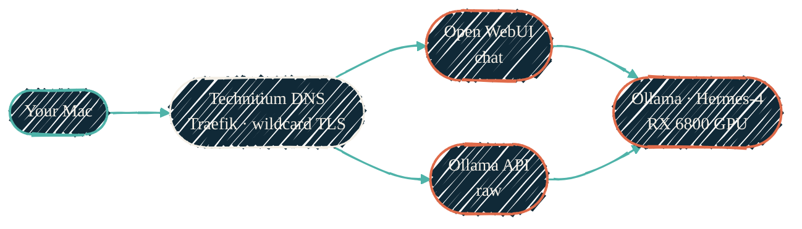

The homelab runs its own ChatGPT: a 14-billion-parameter model on a dedicated
GPU, reachable from anywhere on the LAN. No tokens, no metering, no prompt ever
leaving the network.

"Hermes" is **not an agent or a daemon** — it is the model plus the serving
stack. The model is NousResearch's Hermes-4-14B; the stack is Ollama doing GPU
inference, Open WebUI for chat, and a separate CPU Ollama + Qdrant for
retrieval. There are two Ollama instances, not one.

## How you reach it

{/* Shape: fan-in. 5 nodes. Two DNS entry paths converge on the GPU. Aspect ~3:1 LR. */}



Teal is your machine, ink is the DNS + reverse-proxy edge, coral is the LLM
stack. Both DNS names — the chat UI and the raw API — terminate at the same GPU
Ollama. Every name resolves through Technitium and is fronted by Traefik with a
wildcard certificate, so it is HTTPS end to end.

## What's in the stack

| Container | Does | Reached at |
| --- | --- | --- |
| `hermes-infer` | Ollama on the **RX 6800** (ROCm), serves `hermes4` | `https://ollama.<domain>` |
| `hermes-chat` | **Open WebUI** chat front-end | `https://llm.<domain>` |
| `llamaindex` | CPU Ollama (`nomic-embed-text`) for embeddings | internal (RAG) |
| `qdrant` | Vector store for retrieval | `https://qdrant.<domain>` |

All four sit on the `ai` VLAN. `hermes-infer` is a privileged LXC with the GPU
passed through (`/dev/kfd` + `/dev/dri`); the model lives on a 120 GB volume.
The LXCs and the Traefik ingress are provisioned by
[tofu-proxmox](/infrastructure/repos/tofu-proxmox); Ollama, ROCm, the
model pull, and Open WebUI are configured by
[ansible-proxmox-apps](/infrastructure/repos/ansible-proxmox-apps).

<Note>
  **This is not the same "local AI" as the
  [Apple Silicon stack](/local-llm/apple-silicon).** That one is the MLX
  server on *this MacBook* (also port 11434), tuned to hold one resident model.
  This page is the **homelab GPU** stack — a different machine, a bigger
  model, always on, shared across the LAN.
</Note>

## Use it from your Mac

Everything below is reachable by DNS name over HTTPS. Replace `example.net` with
your homelab's internal domain.

### 1 · Browser

Open **`https://llm.example.net`**, sign in, pick `hermes4`, and chat. This is
the full Open WebUI — conversation history, system prompts, file uploads.

### 2 · `ollama` CLI

Point the CLI at the remote GPU instead of running a model locally:

```bash
brew install ollama                       # CLI only — no local model needed
export OLLAMA_HOST=https://ollama.example.net
ollama list                               # -> hermes4
ollama run hermes4 "Explain ZFS ARC in two sentences."
```

### 3 · OpenAI-compatible API

Ollama speaks the OpenAI API, so any OpenAI client works — just change the base
URL. Drop this into editors, scripts, and SDKs:

```bash
curl https://ollama.example.net/v1/chat/completions \
  -H "Content-Type: application/json" \
  -d '{"model":"hermes4","messages":[{"role":"user","content":"hello"}]}'
```

```python
from openai import OpenAI

client = OpenAI(base_url="https://ollama.example.net/v1", api_key="ollama")  # key ignored
resp = client.chat.completions.create(
    model="hermes4",
    messages=[{"role": "user", "content": "hello"}],
)
print(resp.choices[0].message.content)
```

The raw `ollama.` endpoint is unauthenticated — it is LAN-internal, the same
posture as the other homelab dashboards. If you want an authenticated path,
Open WebUI also exposes `https://llm.example.net/v1`: generate an API key under
**Settings → Account** and send it as a bearer token.

## Related

<CardGroup cols={2}>
  <Card title="tofu-proxmox" icon="cubes" href="/infrastructure/repos/tofu-proxmox">
    Provisions the LXCs, GPU passthrough, and the Traefik ingress entries.
  </Card>
  <Card title="ansible-proxmox-apps" icon="screwdriver-wrench" href="/infrastructure/repos/ansible-proxmox-apps">
    Installs Ollama + ROCm, pulls Hermes-4, configures Open WebUI.
  </Card>
  <Card title="LXC vs Docker" icon="boxes-stacked" href="/infrastructure/lxc-vs-docker">
    Why the inference stack runs as native LXC, not Docker.
  </Card>
  <Card title="AI development pipeline" icon="diagram-project" href="/architecture/ai-pipeline">
    The other "local AI" — MLX on the workstation, via Bifrost.
  </Card>
</CardGroup>
