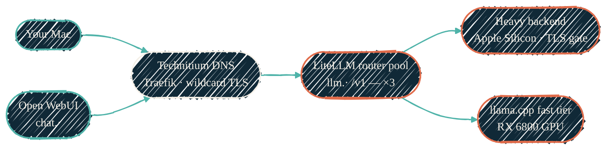

The homelab runs its own ChatGPT — and every other model size below it — behind
**one endpoint**: `https://llm.<domain>/v1`. No tokens metered by a vendor, no
prompt ever leaving the network, and no consumer ever needing to know which
machine actually served the request.

The name resolves to a load-balanced pool of three stateless
[LiteLLM](https://docs.litellm.ai/) routers. The routers hold the model table
and fan requests out by tier:

- **Large tier** — the biggest models (`gpt-oss-120b`, `qwen3-coder`) run on an
  Apple-Silicon machine behind an authenticated TLS gate; the router holds the
  bearer token, consumers never see it.
- **Fast tier** — small, quick models (`qwen3-4b` and the
  `embeddings` model) on a Radeon RX 6800 in a privileged LXC, served by
  [llama-swap](https://github.com/mostlygeek/llama-swap) fronting llama.cpp's
  `llama-server` (ROCm build, models co-resident).
- **CPU standby** — the same llama.cpp lineup, CPU-only, on a node that sleeps
  most of the day; cold capacity if the GPU host is out.

<Note>
  **Current state:** the fast tier's GPU serving is disabled in the
  configuration and the routers carry only the CPU standby for the small-model
  aliases — the degradation path above is what serves today. The endpoint,
  model list, and client usage below are unaffected; the GPU deployments can
  be restored by flipping the same configuration gates.
</Note>

## How you reach it

{/* Shape: fan-in then fan-out. Router pool is the waist. Aspect ~3:1 LR. */}



Teal is a client, ink is the DNS + reverse-proxy edge, coral is the serving
fabric. Traefik health-checks the router pool (`/health/liveliness`) and drops
a dead router without the endpoint changing — stopping one router live is a
non-event. Every name resolves through Technitium and carries the wildcard
certificate, so it is HTTPS end to end.

## What's in the stack

| Piece | Does | Reached at |
| --- | --- | --- |
| `llm-router-1/2/3` | Stateless LiteLLM proxies, one per cluster node — the model table, tier fallbacks, and the heavy-backend bearer live here | `https://llm.<domain>/v1` (pooled) |
| `llm-fast` | llama-swap + llama.cpp (ROCm) on the **RX 6800**; fast tier + `embeddings` | via the router |
| `llm-light` | Same lineup, CPU-only, on the sleeps-by-default node | via the router (fallback) |
| `open-webui` | Chat front-end, default model = the large tier | `https://chat.<domain>` |
| `qdrant` | Vector store for retrieval | `https://qdrant.<domain>` |
| `llamaindex` | RAG engine — takes `embeddings` **from the router**, stores in Qdrant | internal (RAG) |

All guests are DHCP-first LXCs on the `ai` VLAN with deterministic MAC
reservations, so every address is a DNS name. `llm-fast` is a privileged LXC
with the GPU passed through (`/dev/kfd` + `/dev/dri`); models live on a 120 GB
fast-pool volume. The LXCs, firewall groups, and the Traefik pool entries are
provisioned by [tofu-proxmox](/infrastructure/repos/tofu-proxmox); llama.cpp,
llama-swap, the routers, and Open WebUI are configured by
[ansible-proxmox-apps](/infrastructure/repos/ansible-proxmox-apps).

<Note>
  **This is not the same "local AI" as the
  [Apple Silicon stack](/local-llm/apple-silicon).** That one is the MLX
  server on *this MacBook*, tuned to hold one resident model for local-first
  work. This page is the **shared fabric** — always on, LAN-wide, and the
  MacBook falls back to it through the same router endpoint.
</Note>

## Use it from your Mac

Everything below is reachable by DNS name over HTTPS. Replace `example.net`
with your homelab's internal domain. The router requires a bearer key (issued
per consumer), unlike the old unauthenticated single-backend endpoint.

### 1 · Browser

Open **`https://chat.example.net`**, sign in, pick a model, and chat. This is
the full Open WebUI — conversation history, system prompts, file uploads —
talking to the router like every other consumer.

### 2 · OpenAI-compatible API

Any OpenAI client works — change the base URL and send the key:

```bash
curl https://llm.example.net/v1/chat/completions \
  -H "Authorization: Bearer $LLM_ROUTER_KEY" \
  -H "Content-Type: application/json" \
  -d '{"model":"qwen3-4b","messages":[{"role":"user","content":"hello"}]}'
```

```python
from openai import OpenAI

client = OpenAI(base_url="https://llm.example.net/v1", api_key=llm_router_key)
resp = client.chat.completions.create(
    model="gpt-oss-120b",  # or qwen3-coder, qwen3-4b, embeddings…
    messages=[{"role": "user", "content": "hello"}],
)
print(resp.choices[0].message.content)
```

`GET /v1/models` lists every alias the fabric serves; picking a model picks a
tier, and the router handles placement, fallbacks, and the heavy backend's
authentication for you.

## Related

<CardGroup cols={2}>
  <Card title="tofu-proxmox" icon="cubes" href="/infrastructure/repos/tofu-proxmox">
    Provisions the LXCs, GPU passthrough, firewall groups, and the Traefik router pool.
  </Card>
  <Card title="ansible-proxmox-apps" icon="screwdriver-wrench" href="/infrastructure/repos/ansible-proxmox-apps">
    Installs llama.cpp + llama-swap, the LiteLLM routers, and Open WebUI.
  </Card>
  <Card title="LXC vs Docker" icon="boxes-stacked" href="/infrastructure/lxc-vs-docker">
    Why the inference stack runs as native LXC, not Docker.
  </Card>
  <Card title="AI development pipeline" icon="diagram-project" href="/architecture/ai-pipeline">
    The other "local AI" — MLX on the workstation, local-first with fabric fallback.
  </Card>
</CardGroup>
