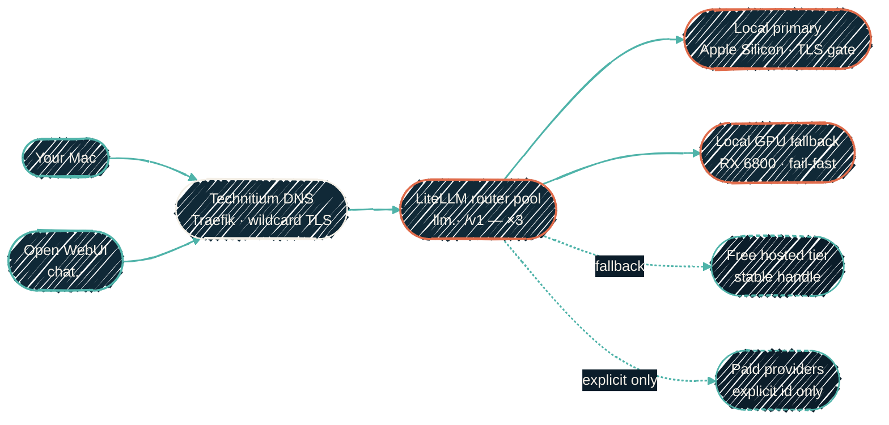

{/* projected from the authoring site; do not edit here */}
The homelab runs its own ChatGPT, and every other model size below it, behind
**one endpoint**: `https://llm.<domain>/v1`. No tokens are metered by a vendor
and no prompt ever leaves the network. No consumer ever needs to know which
machine actually served the request.

The name resolves to a load-balanced pool of three stateless
[LiteLLM](https://docs.litellm.ai/) routers. The routers hold the model table
and fan requests out by tier:

- **Large tier**: the biggest models run on an Apple-Silicon machine behind an
  authenticated TLS gate; the router holds the bearer token, consumers never
  see it. Which models are actually resident changes as the roster is
  re-evaluated. See [What is actually loaded](/local-llm/mac-studio#what-is-actually-loaded)
  for the current, dated roster rather than a name hard-coded here. This is
  the primary tier: the router prefers it whenever it's up.
- **Fast tier**: small, quick models (`qwen3-4b` and the
  `embeddings` model) on a Radeon RX 6800 in a privileged LXC, served by
  [llama-swap](https://github.com/mostlygeek/llama-swap) fronting llama.cpp's
  `llama-server` (ROCm build, models co-resident). It now also backs up the
  large tier as a fallback leg. It's **fail-fast, not retrying**: it accepts a
  request immediately if it has capacity or rejects immediately if it
  doesn't, so a busy fast tier can never stall a caller waiting on a retry or
  backoff.
- **CPU standby**: the same llama.cpp lineup, CPU-only, on a node that sleeps
  most of the day; cold capacity if both GPU tiers are out.
- **A free hosted tier**, reached through a stable handle whose underlying
  model lives in the provider's own configuration rather than in anything
  committed here. See
  [the stable-handle pattern](/ai-development/model-routing#the-stable-handle-pattern-for-a-tier-you-dont-control).
  It sits behind every local tier in the fallback order: local capacity is
  always tried first.
- **Paid providers**, reached only by explicit model identifier, never as an
  implicit fallback. See
  [Delegation: the cheapest capable tier](/ai-development/model-routing#delegation-the-cheapest-capable-tier).

The router chooses among the tiers it's allowed to reach for a given request.
It uses a learned quality-vs-cost tradeoff rather than a fixed order. See
[Cost as data](/ai-development/model-routing#cost-as-data-not-a-hardcoded-order).
Each tier still registers an honest cost. In practice the order preceding is
what falls out: local primary, then local GPU, then the free hosted tier,
then paid providers.

## How you reach it

{/*Shape: fan-in then fan-out. Router pool is the waist. Aspect ~3:1 LR.*/}


```mermaid
%%{init:
  {'theme':'base','look':'handDrawn','themeVariables':{'fontFamily':'Geist','fontSize':'14px','primaryColor':'#102937','primaryTextColor':'#F4EFE6','primaryBorderColor':'#4FB3A9','lineColor':'#4FB3A9','secondaryColor':'#0B1D2A','tertiaryColor':'#1A2A38','clusterBkg':'rgba(79,179,169,0.08)','clusterBorder':'#4FB3A9'}}}%%
  flowchart LR
  Mac([Your Mac])
  Chat([Open WebUI<br/>chat.·])
  Edge([Technitium DNS<br/>Traefik · wildcard TLS])
  Pool([LiteLLM router pool<br/>llm.· /v1 — ×3])
  Large([Local primary<br/>Apple Silicon · TLS gate])
  Fast([Local GPU fallback<br/>RX 6800 · fail-fast])
  Free([Free hosted tier<br/>stable handle])
  Paid([Paid providers<br/>explicit id only])

  Mac --> Edge
  Chat --> Edge
  Edge --> Pool
  Pool --> Large
  Pool --> Fast
  Pool -.fallback.-> Free
  Pool -.explicit only.-> Paid

  classDef host fill:#102937,stroke:#4FB3A9,stroke-width:2px,color:#F4EFE6;
  classDef edge fill:#102937,stroke:#F4EFE6,stroke-width:1.5px,color:#F4EFE6;
  classDef ai   fill:#102937,stroke:#E06B4A,stroke-width:2px,color:#F4EFE6;
  classDef cloud fill:#0B1D2A,stroke:#4FB3A9,stroke-width:1.5px,color:#F4EFE6,stroke-dasharray: 4 3;

  class Mac,Chat host
  class Edge edge
  class Pool,Large,Fast ai
  class Free,Paid cloud

  linkStyle default stroke:#4FB3A9,stroke-width:1.5px;
```

Teal is a client, ink is the DNS and reverse-proxy edge, and coral is the
local serving fabric. Dashed teal is a hosted tier reached only as fallback
or by explicit request. Traefik health-checks the router pool
(`/health/liveliness`) and drops a dead router without the endpoint changing.
Stopping one router live is a non-event. Every name resolves through
Technitium and carries the wildcard certificate, so it is HTTPS end to end.

## What's in the stack

| Piece | Does | Reached at |
| --- | --- | --- |
| `llm-router-1/2/3` | Stateless LiteLLM proxies, one per cluster node; the model table, tier fallbacks, and the heavy-backend bearer live here | `https://llm.<domain>/v1` (pooled) |
| `llm-fast` | llama-swap + llama.cpp (ROCm) on the **RX 6800**; fast tier + `embeddings`, and a fail-fast fallback leg for the large tier | via the router |
| `llm-light` | Same lineup, CPU-only, on the sleeps-by-default node | via the router (fallback) |
| free hosted tier | Reached through a stable handle; the model behind it lives in the provider's own configuration, not here | via the router (fallback, behind both local tiers) |
| paid providers | Reached only by explicit model identifier; never an implicit fallback | via the router (opt-in) |
| `open-webui` | Chat front-end, default model = the large tier | `https://chat.<domain>` |
| `qdrant` | Vector store for retrieval | `https://qdrant.<domain>` |
| `llamaindex` | RAG engine; takes `embeddings` **from the router**, stores in Qdrant | internal (RAG) |

All guests are DHCP-first LXCs on the `ai` VLAN with deterministic MAC
reservations, so every address is a DNS name. `llm-fast` is a privileged LXC
with the GPU passed through (`/dev/kfd` + `/dev/dri`); models live on a 120 GB
fast-pool volume. The LXCs, firewall groups, and the Traefik pool entries are
provisioned by [tofu-proxmox](/infrastructure/repos/tofu-proxmox). llama.cpp,
llama-swap, the routers, and Open WebUI are configured by
[ansible-proxmox-ai](/infrastructure/repos/ansible-proxmox-ai).

<Note>
  **This is not the same "local AI" as the
  [Apple Silicon stack](/local-llm/apple-silicon)**. That one is the MLX
  server on *this MacBook*, tuned to hold one resident model for local-first
  work. This page is the **shared fabric**: always on, LAN-wide, and the
  MacBook falls back to it through the same router endpoint.
</Note>

## Use it from your Mac

Everything below is reachable by DNS name over HTTPS. Replace `example.net`
with your homelab's internal domain. The router requires a bearer key (issued
per consumer), unlike the old unauthenticated single-backend endpoint.

### 1 · Browser

Open **`https://chat.example.net`**, sign in, pick a model, and chat. This is
the full Open WebUI: conversation history, system prompts, and file uploads,
all talking to the router like every other consumer.

### 2 · OpenAI-compatible API

Any OpenAI client works. Change the base URL and send the key:

```bash
curl https://llm.example.net/v1/chat/completions \
  -H "Authorization: Bearer $LLM_ROUTER_KEY" \
  -H "Content-Type: application/json" \
  -d '{"model":"qwen3-4b","messages":[{"role":"user","content":"hello"}]}'
```

```python
from openai import OpenAI

client = OpenAI(base_url="https://llm.example.net/v1", api_key=llm_router_key)
resp = client.chat.completions.create(
    model="qwen3-4b",  # or embeddings, or a large-tier alias — see /v1/models below
    messages=[{"role": "user", "content": "hello"}],
)
print(resp.choices[0].message.content)
```

`GET /v1/models` lists every alias the fabric serves. Picking a model picks a
tier, and the router handles placement, fallbacks, and the heavy backend's
authentication for you.

## Related

<CardGroup cols={2}>
<Card
  title="tofu-proxmox"
  icon="cubes"
  href="/infrastructure/repos/tofu-proxmox">
  Provisions the LXCs, GPU passthrough, firewall groups, and the Traefik router pool.
</Card>
<Card
  title="ansible-proxmox-ai"
  icon="screwdriver-wrench"
  href="/infrastructure/repos/ansible-proxmox-ai">
  Installs llama.cpp + llama-swap, the LiteLLM routers, and Open WebUI.
</Card>
<Card
  title="LXC vs Docker"
  icon="boxes-stacked"
  href="/infrastructure/lxc-vs-docker">
  Why the inference stack runs as native LXC, not Docker.
</Card>
<Card
  title="AI development pipeline"
  icon="diagram-project"
  href="/architecture/ai-pipeline">
  The other "local AI": MLX on the workstation, local-first with fabric fallback.
</Card>
</CardGroup>
