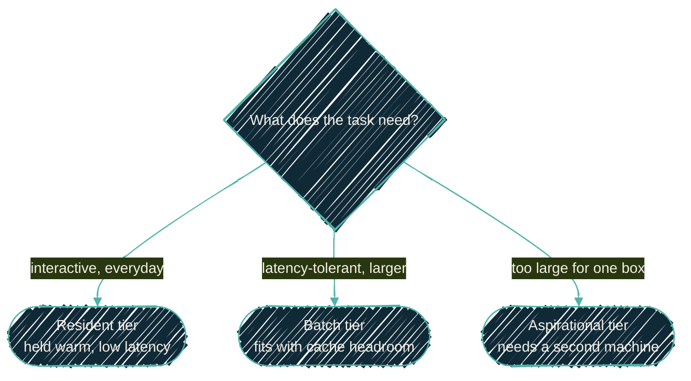

{/* projected from the authoring site; do not edit here */}
> Pick one model to keep resident, quantize it well, and let a registry, not a
> doc, name the exact id. Everything else is a tier you reach for on purpose.

{/*Shape: decision tree over three tiers.*/}

Model choice on a 128 GB laptop is a budgeting problem, not a leaderboard. The
constraint is memory pressure over time, and the lever is sparsity. The rule is
that nothing changes on a claimed score, only on a
[measured](/tools/mlx-benchmarks) one.

## One resident model, many roles

The workstation keeps a **single** physical model loaded. It exposes that model
under capability-role aliases: `default`, `coding`, `quickest`, `tool-calling`,
`large-context`, `most-capable`, `oss`. Today they all resolve to the same
resident model. The aliases are a stable contract for callers; the resident id
behind them is a value in the AI-stack registry
(`~/.config/ai-stack/registry.json`, written by [`nix-ai`](/nix/nix-ai) at
activation), so changing the model is a one-line registry edit, never a code
change and never an edit to this page.

This is why these docs name model **families**, not pinned versioned ids. The
moment a doc hard-codes "`<vendor>-<size>-<version>`" it starts rotting; the
registry is the only place that should know the exact string.

## MoE beats dense for throughput

A dense model runs every parameter for every token. A **mixture-of-experts
(MoE)** model routes each token through only a few experts. A model with tens
of billions of total parameters may activate only a few billion per step. On
this hardware that's the difference between comfortable and unusable. An MoE
with a few billion active parameters decodes several times faster than a dense
model of the same total size. It still brings the quality of the larger weight
set. The full tensor must stay resident for routing, so it costs memory like its
total size, but it *runs* like its active size.

Use dense models when single-stream quality on a hard, careful task matters more
than tokens-per-second. Reach for MoE for everything throughput-sensitive,
including agentic tool loops.

## Quantization: get the bits where they matter

Weights are stored at reduced precision to fit memory. The strategy:

| Approach | What it is | When |
| --- | --- | --- |
| Uniform 4-bit | Every layer at the same low precision | Safe default; broadly supported; the baseline everything else is measured against. |
| Sensitivity-aware mixed (for example, OptiQ) | Measures each layer's sensitivity and spends 8 bits where it matters, 4 where it doesn't, at a similar overall size | An **upgrade to evaluate**, not adopt on faith. Published accuracy gains are vendor-reported. It loads in a stock MLX runtime, so it's cheap to A/B. On this hardware, an OptiQ 35B-A3B build won an A/B round and served for a time as the resident agentic tool-calling brain. It held multi-turn tool calling clean where a uniform-4bit build degraded. That's real evidence the approach pays off, even though the registry has since moved the resident id on. |
| Distillation-aware (for example, DWQ) | Quantized with a calibration/distillation pass | Another measured-upgrade lane, especially for small models. |
| Microscaling FP4 (mxfp4) | 4-bit microscaling format | Use with care on Apple Metal. Some MoE matmuls are dramatically slower because dequant overhead dominates ([MLX #3402](https://github.com/ml-explore/mlx/issues/3402)). Verify throughput before standardizing on it, and avoid it for sharded/distributed runs. |

The honest position: keep a well-supported 4-bit quant as the default. Treat
the sensitivity-aware and distillation lanes as candidates to benchmark against
it. Promote one only when the dataset shows a real win.

### MTP is a separate axis from bit depth

Some builds of a model ship an extra **multi-token prediction** head (a draft
module trained alongside the model). It's published either as an MTP-bearing
target or as a standalone drafter artifact. That is a different axis from how
many bits the body is stored at, and the two combine freely. A 6-bit drafter
drives a 4-bit target, so adopting it does not mean re-downloading your weights.

It also inverts the usual quantization instinct. The drafter is a small fraction
of the parameters, so keeping it at *higher* precision than the body is cheap.
It's worth doing, because over-quantizing a draft head costs you draft
acceptance rather than answer quality. The model keeps answering correctly
while the speedup silently disappears, which is a hard failure to spot from
output alone.
See [Speculative decoding and MTP](/local-llm/speculative-decoding).

## Tiers: fast now, big overnight

128 GB comfortably fits far more than the interactive default. Think in tiers,
not a single pick:

- **Interactive default**: a fast MoE with a few billion active parameters,
  resident and low-latency. The everyday driver for edits, drafts, and routine
  tool calls.
- **Overnight / hard agentic**: a much larger 4-bit MoE (up to roughly the size
  that still leaves cache headroom on 128 GB). Latency-tolerant batch work can
  afford the bigger, stronger model.
- **Aspirational**: models too large for one 128 GB box. These are the case for
  [sharding across two Macs](/local-llm/distributed): capacity you can't reach
  on a single machine at any usable precision.

## The router's embedding model

The orchestration layer can route a request to a skill by embedding similarity
rather than paying an LLM call to decide. That needs a small, fast, **MLX-native**
embedding model. It's a current on-device embedding model (the EmbeddingGemma or
Qwen-Embedding families). It is not a legacy text-embedding model that ships
only as GGUF and has no native MLX build. The embedding id belongs in the
registry too.

## Measure before you change

Every choice on this page resolves to a benchmark question. The
[`mlx-benchmarks`](/tools/mlx-benchmarks) harness runs the candidate against the
resident default through the same envelope and publishes a comparable result.
Quant lane, model tier, even the default itself: they move when the dataset
says so.

## Related

<CardGroup cols={2}>
<Card
  title="Apple Silicon stack"
  icon="microchip"
  href="/local-llm/apple-silicon">
  The serving stack the resident model runs on.
</Card>
<Card
  title="Backends & tool calling"
  icon="server"
  href="/local-llm/backends">
  The runtime that loads these quants and parses their tool calls.
</Card>
<Card
  title="Benchmarking"
  icon="gauge-high"
  href="/tools/mlx-benchmarks">
  The envelope and public dataset every model decision is measured against.
</Card>
<Card
  title="Distributed & multi-Mac"
  icon="network-wired"
  href="/local-llm/distributed">
  Where the aspirational, doesn't-fit tier actually runs.
</Card>
</CardGroup>
