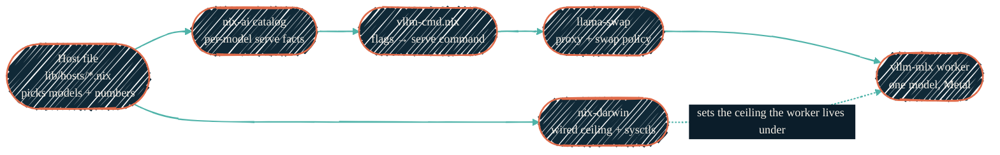

> One host file names a couple of numbers. Nix turns them into a sysctl, a set
> of serve flags, a swap policy, and a build-time safety check — then launches
> the worker. This page follows that path from top to bottom.

Two Apple Silicon Macs run the local models. Neither is an agent. Each is just a
model plus a serving stack — `vllm-mlx` workers behind a `llama-swap` proxy,
answering an OpenAI-shaped API on loopback. The agent layer calls in over HTTP.
See [Local LLM](/local-llm/overview) for the strategy; this page is the
mechanism.

## Two hosts, two roles

The split is by job, not by hardware. One host is headless; the other runs an
interactive desktop.

- **The headless host** is the always-on serving host for the whole LAN. It has
  no desktop working set to protect, so it reclaims that memory and holds two
  models warm at once, with more available on demand.
- **The interactive laptop** self-serves — localhost clients only, so serving
  never competes with the network host. It keeps one model resident, sized to
  coexist with an interactive desktop and the user's own work.

**The rule: heavy serving belongs on the headless host.** Anything large or
structured is delegated to it over the LAN, off the laptop's battery and memory.
The full model roster, verdicts, and performance numbers live in
[Mac Studio serving](/local-llm/mac-studio); the per-host memory numbers live in
the gated operational reference.

### Ports

Every serving host exposes the same shape on loopback; only the headless host
adds a LAN-facing gate.

| Endpoint | Where | Purpose |
| --- | --- | --- |
| `127.0.0.1:11434` | Both hosts | `llama-swap` OpenAI-compatible API — the one URL every local client speaks. |
| `127.0.0.1:11440` | Headless host (rank 0) | Clustered-mode `mlx-lm` endpoint, used only when the two Macs shard one model over Thunderbolt. |
| `llm-large.<base-domain>` (TLS, LAN) | Headless host | A Caddy gate terminates TLS and enforces a bearer token, then proxies to loopback `11434`. Consumers reach the large tier by capability name, not host name. |

## How the repos compose

Two repos meet to launch one worker. `nix-darwin` owns the **host** — the OS
memory ceiling and power knobs. `nix-ai` owns the **serving stack** — which
models exist, how each is served, and the command that starts it. A host file
picks values; the modules turn them into a running process.

{/* Shape: pipeline. LR, role via classDef. One direction, no branches. */}



### The nix-darwin side: the host ceiling

`modules/darwin/apple-silicon-tunables.nix` owns the machine's memory ceiling
and inference power knobs. Its main option is `wiredLimitMb` — the
`iogpu.wired_limit_mb` sysctl, the OS ceiling on wired GPU memory. The sysctl is
volatile (it resets on reboot), so the module re-applies it from a launchd
daemon at boot and again at every rebuild.

Each host's file sets the ceiling against that host's job: the headless host
carries a higher ceiling because it reclaims the desktop working set the laptop
must leave free. The value is not typed by hand — it is derived from the host's
memory budget, `wiredLimitMb = maxLocalLlmGb × 1024`. See
[the single-input derivation](/local-llm/memory-ceilings) for the whole scheme;
the per-host budgets live in the gated operational reference.

The module also handles power posture (Low Power Mode off, Power Nap off, App
Nap disabled for the inference daemon) and a Metal debug-env guard. None of that
picks a model; it shapes the box the model runs in.

### The nix-ai side: the serving stack

`nix-ai` holds four kinds of file under `modules/mlx/`:

<CardGroup cols={2}>
  <Card title="catalog-data.nix — the facts" icon="layer-group">
    One entry per known model: its Hugging Face id, 4-bit weight footprint
    (`weightGb`), the family serve args (parser stack, chat-template kwargs), and
    a validated flag profile per class — `resident` (preload-capable) or `swap`
    (on-demand, idle-unloaded). A host picks which entries to enable and their
    class; it never writes raw serve args.
  </Card>
  <Card title="options-*.nix — the knobs" icon="sliders">
    The typed option surface. `options-cache.nix` holds the KV-cache and
    prefix-cache knobs plus `gpuMemoryUtilization`; `options-batching.nix` holds
    concurrency (`maxNumSeqs`, continuous batching, request caps);
    `options-runtime.nix` holds idle-unload, the swap proxy, and the preload
    list. Every knob carries the rationale for its default in-line.
  </Card>
  <Card title="vllm-cmd.nix — the command" icon="terminal">
    Turns the merged option values into the actual `vllm-mlx serve …` command
    string. It reads a fixed list of `overridableFlags`; a per-model override
    that names a flag outside that list fails the build instead of being
    silently dropped.
  </Card>
  <Card title="lib/checks/mlx-catalog.nix — the guards" icon="shield-check">
    Build-time regression asserts: that a host's catalog picks compile to the
    expected resident/swap profiles, that host overrides beat catalog defaults,
    and that known-bad combinations (for example a hybrid-attention model on the
    wrong paged-cache block size) never ship.
  </Card>
</CardGroup>

### The launch path, end to end

1. A host file picks model entries, assigns each a class, and sets host-scoped
   posture — the preload list, the swap policy, the concurrency limit.
2. `catalog-data.nix` supplies each chosen model's family args and its
   class profile; the host's knob values merge on top.
3. `vllm-cmd.nix` renders one `vllm-mlx serve` command per resident model,
   folding in the merged flags.
4. `llama-swap` sits on the API port and manages the workers as children. The
   headless host keeps several resident at once (`groupSwap = false`); the
   laptop keeps exactly one, evicting the previous model on any switch.
5. A warmup agent faults the preload list into memory at boot, so the first
   request never pays a cold start.
6. `nix-darwin` has already set the wired ceiling the worker allocates under.

The registry that records which physical model is the current default is written
at activation and read as `~/.config/ai-stack/registry.json`. Docs describe the
strategy; the live id is always a registry value, never hard-coded.

For the packaging view of these repos, see [AI tooling](/nix/nix-ai) and
[macOS host](/nix/nix-darwin).

## The memory-safety derivation

Two memory behaviours ride on one flag, and a wired ceiling that must move with
it. Setting either by hand is the usual reason a well-sized host still pages.
The Nix build removes the hand-tuning: a host declares one number,
`maxLocalLlmGb`, and every dependent value is derived from it — the wired
ceiling, the emergency trip point, `--gpu-memory-utilization`, and the per-model
cache and concurrency caps.

A build-time assertion then proves the host is not oversubscribed:

```text
assert Σ(resident weights + kv) + buffer + prefix ≤ maxLocalLlmGb
```

If the resident set will not fit the budget, the build fails. The budget is
mode-aware — one value for standalone serving, a larger one for clustered mode.

The full derivation, the two-behaviour mechanism behind it, and why
`--max-cache-blocks` (not `--cache-memory-mb`) is the real footprint cap live in
[Memory ceilings on Apple Silicon](/local-llm/memory-ceilings). This page links
to that mechanism rather than restating it.

## Related

<CardGroup cols={2}>
  <Card title="Mac Studio serving" icon="desktop" href="/local-llm/mac-studio">
    The serving host in full: model verdicts, evaluation battery, and headline
    performance numbers.
  </Card>
  <Card title="Memory ceilings" icon="microchip" href="/local-llm/memory-ceilings">
    Why one flag drives two memory behaviours, and the single-input derivation
    that keeps a model from paging the host.
  </Card>
  <Card title="Apple Silicon stack" icon="sliders" href="/local-llm/apple-silicon">
    Every non-secret tuning knob on the `vllm-mlx` + `llama-swap` stack, and why
    each is set the way it is.
  </Card>
  <Card title="AI tooling (nix-ai)" icon="bot" href="/nix/nix-ai">
    The repo that packages the inference stack and the MLX modules.
  </Card>
</CardGroup>
