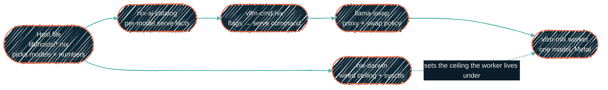

{/* projected from the authoring site; do not edit here */}
> One host file names a couple of numbers. Nix turns them into a sysctl, a set
> of serve flags, a swap policy, and a build-time safety check. It then launches
> the worker. This page follows that path from top to bottom.

Two Apple Silicon Macs run the local models. Neither is an agent. Each is just a
model plus a serving stack: `vllm-mlx` workers behind a `llama-swap` proxy,
answering an OpenAI-shaped API on loopback. The agent layer calls in over HTTP.
See [Local LLM](/local-llm/overview) for the strategy; this page is the
mechanism.

## Two hosts, two roles

The split is by job, not by hardware. One host is headless; the other runs an
interactive desktop.

- **The headless host** is the always-on serving host for the whole LAN. It has
  no desktop working set to protect, so it reclaims that memory and holds two
  models warm at once, with more available on demand.
- **The interactive laptop** self-serves: localhost clients only, so serving
  never competes with the network host. It keeps one model resident, sized to
  coexist with an interactive desktop and the user's own work.

**The rule: heavy serving belongs on the headless host.** Anything large or
structured is delegated to it over the LAN, off the laptop's battery and memory.
The full model roster, verdicts, and performance numbers live in
[Mac Studio serving](/local-llm/mac-studio); the per-host memory numbers live in
the gated operational reference.

### Ports

Every serving host exposes the same shape on loopback; only the headless host
adds a LAN-facing gate.

| Endpoint | Where | Purpose |
| --- | --- | --- |
| `127.0.0.1:11434` | Both hosts | `llama-swap` OpenAI-compatible API: the one URL every local client speaks. |
| `127.0.0.1:11440` | Headless host (rank 0) | Clustered-mode `mlx-lm` endpoint, used only when the two Macs shard one model over Thunderbolt. |
| `llm-large.<base-domain>` (TLS, LAN) | Headless host | A Caddy gate terminates TLS and enforces a bearer token, then proxies to loopback `11434`. Consumers reach the large tier by capability name, not host name. |

## How the repos compose

Two repos meet to launch one worker. `nix-darwin` owns the **host**: the OS
memory ceiling and power knobs. `nix-ai` owns the **serving stack**: which
models exist, how each is served, and the command that starts it. A host file
picks values; the modules turn them into a running process.

{/*Shape: pipeline. LR, role via classDef. One direction, no branches.*/}

```mermaid
%%{init:
  {'theme':'base','look':'handDrawn','themeVariables':{'fontFamily':'Geist','fontSize':'14px','primaryColor':'#102937','primaryTextColor':'#F4EFE6','primaryBorderColor':'#4FB3A9','lineColor':'#4FB3A9','secondaryColor':'#0B1D2A','tertiaryColor':'#1A2A38','clusterBkg':'rgba(79,179,169,0.08)','clusterBorder':'#4FB3A9'}}}%%
  flowchart LR
  Host([Host file<br/>lib/hosts/*.nix<br/>picks models + numbers])
  Darwin([nix-darwin<br/>wired ceiling + sysctls])
  Catalog([nix-ai catalog<br/>per-model serve facts])
  Cmd([vllm-cmd.nix<br/>flags → serve command])
  Swap([llama-swap<br/>proxy + swap policy])
  Worker([vllm-mlx worker<br/>one model, Metal])

  Host --> Darwin
  Host --> Catalog --> Cmd --> Swap --> Worker
  Darwin -.sets the ceiling the worker lives under.-> Worker

  classDef ai fill:#102937,stroke:#E06B4A,stroke-width:2px,color:#F4EFE6;
  class Host,Darwin,Catalog,Cmd,Swap,Worker ai
  linkStyle default stroke:#4FB3A9,stroke-width:1.5px;
```

### The nix-darwin side: the host ceiling

`modules/darwin/apple-silicon-tunables.nix` owns the machine's memory ceiling
and inference power knobs. Its main option is `wiredLimitMb`: the
`iogpu.wired_limit_mb` sysctl, the OS ceiling on wired GPU memory. The sysctl is
volatile (it resets on reboot), so the module re-applies it from a launchd
daemon at boot and again at every rebuild.

The ceiling is not static. A link watcher flips the sysctl to the current mode's
budget when the cluster cable is plugged or unplugged. The clustered budget
applies on plug, the standalone budget on unplug. That is a live sysctl write, not a
rebuild, so the mode's memory envelope moves without one. Each host declares two
budgets against its job. The headless host carries higher ones because it
reclaims the desktop working set the laptop must leave free. The values are not
typed by hand; each is derived from a memory budget, `wiredLimitMb =
maxLocalLlmGb × 1024`. See
[the runtime-dynamic derivation](/local-llm/memory-ceilings) for the whole
scheme; the per-host budgets live in the gated operational reference.

The module also handles power posture: Low Power Mode off, Power Nap off, and
App Nap off for the inference daemon. It also sets a Metal debug-env guard.
None of that picks a model; it shapes the box the model runs in.

### The nix-ai side: the serving stack

`nix-ai` holds four kinds of file under `modules/mlx/`:

<CardGroup cols={2}>
  <Card title="catalog-data.nix: the facts" icon="layer-group">
    One entry per known model. It holds the Hugging Face id, 4-bit weight
    footprint (`weightGb`), and the family serve args (parser stack,
    chat-template kwargs). It also carries a validated flag profile per class:
    `resident` (preload-capable) or `swap` (on-demand, idle-unloaded). A host
    picks which entries to enable and their class; it never writes raw serve
    args.
  </Card>
  <Card title="options-*.nix: the knobs" icon="sliders">
    The typed option surface. `options-cache.nix` holds the KV-cache and
    prefix-cache knobs plus `gpuMemoryUtilization`. `options-batching.nix` holds
    concurrency (`maxNumSeqs`, continuous batching, request caps).
    `options-runtime.nix` holds idle-unload, the swap proxy, and the preload
    list. Every knob carries the rationale for its default in-line.
  </Card>
  <Card title="vllm-cmd.nix: the command" icon="terminal">
    Turns the merged option values into the actual `vllm-mlx serve …` command
    string. It reads a fixed list of `overridableFlags`. A per-model override
    that names a flag outside that list fails the build instead of being
    silently dropped. A load-time admission wrapper extends it, computing
    `--max-cache-blocks` from the live wired ceiling and rejecting a model that
    does not fit.
  </Card>
  <Card title="lib/checks/mlx-catalog.nix: the guards" icon="shield-check">
    Build-time regression asserts three things: a host's catalog picks compile
    to the expected resident/swap profiles, host overrides beat catalog
    defaults, and known-bad combinations (for example a hybrid-attention model
    on the wrong paged-cache block size) never ship.
  </Card>
</CardGroup>

### The launch path, end to end

1. A host file picks model entries, assigns each a class, and sets host-scoped
   posture: the preload list, the swap policy, the concurrency limit.
2. `catalog-data.nix` supplies each chosen model's family args and its
   class profile; the host's knob values merge on top.
3. `vllm-cmd.nix` renders one `vllm-mlx serve` command per resident model,
   folding in the merged flags.
4. `llama-swap` sits on the API port and manages the workers as children. The
   headless host keeps several resident at once (`groupSwap = false`); the
   laptop keeps exactly one, evicting the previous model on any switch.
5. A warmup agent faults the preload list into memory at boot, so the first
   request never pays a cold start.
6. `nix-darwin` has already set the wired ceiling the worker allocates under.

The registry that records which physical model is the current default is written
at activation and read as `~/.config/ai-stack/registry.json`. Docs describe the
strategy; the live id is always a registry value, never hard-coded.

For the packaging view of these repos, see [AI tooling](/nix/nix-ai) and
[macOS host](/nix/nix-darwin).

## Why the launch agents run under the platform shell

Every shell payload in this stack is launched by the **operating system's own
`/bin/bash`**, not the newer shell the package manager provides. That looks like
a mistake and is not. It is the design, and it constrains how the scripts get
written.

macOS keys its privacy grants (Local Network access, in particular) to a
binary's **code-signing identity**. A package-manager binary's identity is
derived from its content hash, so it changes every time the package set moves
forward. Grant the permission today, bump the dependency tomorrow, and the OS
sees an unknown binary and silently revokes the grant. Every prior approval
evaporates on an unrelated upgrade. The platform shell's identity is stable
across every upgrade the machine ever takes, so a grant made once holds.

<Warning>
  The consequence is a hard authoring rule. **Every shipped shell script must
  parse under the platform shell**, which on macOS is bash 3.2. That's a release
  predating most of what modern shell tutorials assume. This is not a style
  preference. A script using a newer construct does not fail loudly at deploy
  time. It fails at runtime, in a background job, in a way that reads as a
  hardware or network problem.
</Warning>

Two real failures, both found and fixed on 2026-07-27, show the shape:

| Construct | What bash 3.2 does with it | How it surfaced |
| --- | --- | --- |
| `case` inside a `$( … )` command substitution | The parser ends the substitution at the first `)` in a case pattern | A link watcher's carrier detection silently returned garbage. The two-machine cluster could not self-form for **weeks**, and the symptom looked exactly like an unplugged cable. |
| `mapfile` (a bash 4 builtin) | Not a builtin: the call fails and the target array stays empty | An orphan-process reaper found nothing, every time. Stale workers held their ports, and requests came back as `HTTP 200` with a zero-byte body. |

Both failures had been chased down the wrong path for a long time, because
neither produced an error anyone saw. The durable fix is not the two patches.
It is the **mutation-tested compatibility check** now in the build. It parses
every shipped script under the platform shell, and the test suite proves the
check itself fails when a violating construct is introduced. A guard that has
never been shown to fail is not a guard.

One consequence is worth naming here, because this page is where the swapping
proxy is described. A response from any endpoint described earlier cannot
tell you which weights answered it. The `model` field is echoed from the request, and a
`/v1/models` listing enumerates the local cache rather than what is loaded. Read
the model argument off the listening process before trusting any number taken
through these ports. See
[Verifying the instrument](/local-llm/verifying-the-instrument).

## The memory-safety control plane

Two memory behaviours ride on one flag, over a wired ceiling that must move with
the serving mode. Setting either by hand is the usual reason a well-sized host
still pages. But the safety is not baked in at build time. Models and modes
change while the host runs, and rebuilding to swap a model is friction the stack
avoids. Nix ships the control plane; the plane enforces at runtime.

Nix's build-time job is narrow:

- **the mode-aware budgets**: one `maxLocalLlmGb` for standalone serving and a
  larger one for clustered mode, per host.
- **the sysctl mechanism and the mode-switch watcher**: the launchd daemon that
  applies `iogpu.wired_limit_mb`, and the link watcher that flips it to the
  current mode's budget on plug or unplug.
- **the admission-control wrapper and the model arch data**: the wrapper that
  computes the per-model caps, and the catalog fields it reads.

Runtime does the rest, with no rebuild:

- **the link watcher** raises or lowers the wired ceiling to the mode's budget
  when the cluster cable changes.
- **the admission wrapper** computes `--max-cache-blocks` and derived
  `--gpu-memory-utilization` at each model load from the live sysctl, the
  model's architecture, and the requested concurrency and context, and it
  **rejects or clamps** a load that does not fit. Swapping a model needs no nix
  change.

A build-time assert remains, demoted to a policy check. It verifies the declared
budgets are internally consistent and each leaves an OS floor, not that any one
model fits. The per-model guarantee is the runtime admission.

The full derivation and the two-behaviour mechanism behind it live in
[Memory ceilings on Apple Silicon](/local-llm/memory-ceilings). So does why
`--max-cache-blocks` (not `--cache-memory-mb`) is the real footprint cap, and
the seven invariants that make overload virtually impossible. This page links
to that mechanism rather than restating it.

## Related

<CardGroup cols={2}>
<Card
  title="Mac Studio serving"
  icon="desktop"
  href="/local-llm/mac-studio">
  The serving host in full: model verdicts, evaluation battery, and headline performance numbers.
</Card>
<Card
  title="Memory ceilings"
  icon="microchip"
  href="/local-llm/memory-ceilings">
  Why one flag drives two memory behaviours, and the single-input derivation that keeps a model from paging the host.
</Card>
<Card
  title="Apple Silicon stack"
  icon="sliders"
  href="/local-llm/apple-silicon">
  Every non-secret tuning knob on the `vllm-mlx` + `llama-swap` stack, and why each is set the way it is.
</Card>
<Card
  title="AI tooling (nix-ai)"
  icon="bot"
  href="/nix/nix-ai">
  The repo that packages the inference stack and the MLX modules.
</Card>
</CardGroup>
