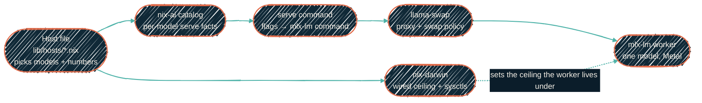
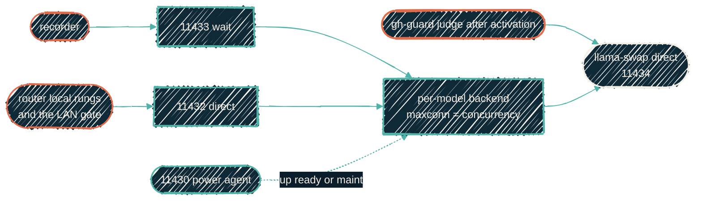

{/* projected from the authoring site; do not edit here */}
> One host file names a couple of numbers. Nix turns them into a sysctl, a set
> of serve flags, a swap policy, and a build-time safety check. It then launches
> the worker. This page follows that path from top to bottom.

Two Apple Silicon Macs run the local models. Neither is an agent. Each is just a
model plus a serving stack: `mlx-lm` workers behind a `llama-swap` proxy and a loopback queue front,
answering an OpenAI-shaped API on loopback. The agent layer calls in over HTTP.
See [Local LLM](/local-llm/overview) for the strategy; this page is the
mechanism.

## Two hosts, two roles

The split is by job, not by hardware. One host is headless; the other runs an
interactive desktop.

- **The headless host** provides large-memory capacity for serial service of
  models that only fit in 128 GB. The measured comparison used one request at a
  time; it does not establish live resident weights or multi-request saturation.
- **The interactive laptop** self-serves: localhost clients only, so serving
  never competes with the network host. It keeps one model resident, sized to
  coexist with an interactive desktop and the user's own work.

**The role: use the headless host for models that need its larger memory.** It
provides serial capacity without the laptop's battery and memory constraints.
The dated model roster, verdicts, and performance numbers live in
[Mac Studio serving](/local-llm/mac-studio); per-host memory numbers live in
the gated operational reference.

### Ports

Every serving host exposes the same shape on loopback; only the headless host
adds a LAN-facing gate.

| Endpoint | Where | Purpose |
| --- | --- | --- |
| `127.0.0.1:11434` | Both hosts | `llama-swap` OpenAI-compatible API: the one URL every local client speaks. |
| `127.0.0.1:11440` | Headless host (rank 0) | Clustered-mode `mlx-lm` endpoint, used only when the two Macs shard one model over Thunderbolt. |
| `llm-large.<base-domain>` (TLS, LAN) | Headless host | A Caddy gate terminates TLS and enforces a bearer token, then proxies to loopback `11434`. Consumers reach the large tier by capability name, not host name. |

## How the repos compose

Two repos meet to launch one worker. `nix-darwin` owns the **host**: the OS
memory ceiling and power knobs. `nix-ai` owns the **serving stack**: which
models exist, how each is served, and the command that starts it. A host file
picks values; the modules turn them into a running process.

{/*Shape: pipeline. LR, role via classDef. One direction, no branches.*/}

```mermaid
%%{init:
  {'theme':'base','look':'handDrawn','themeVariables':{'fontFamily':'Geist','fontSize':'14px','primaryColor':'#102937','primaryTextColor':'#F4EFE6','primaryBorderColor':'#4FB3A9','lineColor':'#4FB3A9','secondaryColor':'#0B1D2A','tertiaryColor':'#1A2A38','clusterBkg':'rgba(79,179,169,0.08)','clusterBorder':'#4FB3A9'}}}%%
  flowchart LR
  Host([Host file<br/>lib/hosts/*.nix<br/>picks models + numbers])
  Darwin([nix-darwin<br/>wired ceiling + sysctls])
  Catalog([nix-ai catalog<br/>per-model serve facts])
  Cmd([serve command<br/>flags → mlx-lm command])
  Swap([llama-swap<br/>proxy + swap policy])
  Worker([mlx-lm worker<br/>one model, Metal])

  Host --> Darwin
  Host --> Catalog --> Cmd --> Swap --> Worker
  Darwin -.sets the ceiling the worker lives under.-> Worker

  classDef ai fill:#102937,stroke:#E06B4A,stroke-width:2px,color:#F4EFE6;
  class Host,Darwin,Catalog,Cmd,Swap,Worker ai
  linkStyle default stroke:#4FB3A9,stroke-width:1.5px;
```

### The nix-darwin side: the host ceiling

`modules/darwin/apple-silicon-tunables.nix` owns the machine's memory ceiling
and inference power knobs. Its main option is `wiredLimitMb`: the
`iogpu.wired_limit_mb` sysctl, the OS ceiling on wired GPU memory. The sysctl is
volatile (it resets on reboot), so the module re-applies it from a launchd
daemon at boot and again at every rebuild.

The ceiling is not static. A link watcher flips the sysctl to the current mode's
budget when the cluster cable is plugged or unplugged. The clustered budget
applies on plug, the standalone budget on unplug. That is a live sysctl write, not a
rebuild, so the mode's memory envelope moves without one. Each host declares two
budgets against its job. The headless host carries higher ones because it
reclaims the desktop working set the laptop must leave free. The values are not
typed by hand; each is derived from a memory budget, `wiredLimitMb =
maxLocalLlmGb × 1024`. The
[historical memory-ceilings guide](/local-llm/memory-ceilings) covers retired
`vllm-mlx` controls; the current `mlx-lm` wrapper appears below.
The per-host budgets live in the gated operational reference.

The module also handles power posture: Low Power Mode off, Power Nap off, and
App Nap off for the inference daemon. It also sets a Metal debug-env guard.
None of that picks a model; it shapes the box the model runs in.

### The nix-ai side: the serving stack

`nix-ai` holds four kinds of file under `modules/mlx/`:

<CardGroup cols={2}>
  <Card title="catalog-data.nix: the facts" icon="layer-group">
    One entry per known model. It holds the Hugging Face id, 4-bit weight
    footprint (`weightGb`), and the family serve args (parser stack,
    chat-template kwargs). It also carries a validated flag profile per class:
    `resident` (preload-capable) or `swap` (on-demand, idle-unloaded). A host
    picks which entries to enable and their class; it never writes raw serve
    args.
  </Card>
  <Card title="options-*.nix: the knobs" icon="sliders">
    The typed option surface. `options-cache.nix` holds the KV-cache and
    prefix-cache knobs plus `gpuMemoryUtilization`. `options-batching.nix` holds
    concurrency (`maxNumSeqs`, continuous batching, request caps).
    `options-runtime.nix` holds idle-unload, the swap proxy, and the preload
    list. Every knob carries the rationale for its default in-line.
  </Card>
  <Card title="The serve command" icon="terminal">
    Turns the merged option values into the actual `mlx-lm` server command
    string. A per-model override that names a flag outside the fixed list of
    overridable flags fails the build instead of being silently dropped. A
    launch wrapper sets MLX's in-process memory and cache limits before the
    server starts.
  </Card>
  <Card title="lib/checks/mlx-catalog.nix: the guards" icon="shield-check">
    Build-time regression asserts three things: a host's catalog picks compile
    to the expected resident/swap profiles, host overrides beat catalog
    defaults, and known-bad combinations never ship.
  </Card>
</CardGroup>

### The launch path, end to end

1. A host file picks model entries, assigns each a class, and sets host-scoped
   posture: the preload list, the swap policy, the concurrency limit.
2. `catalog-data.nix` supplies each chosen model's family args and its
   class profile; the host's knob values merge on top.
3. The serve-command renderer builds one `mlx-lm` server command per resident model,
   folding in the merged flags.
4. `llama-swap` sits on the API port and manages the workers as children. The
   headless host keeps several resident at once (`groupSwap = false`); the
   laptop keeps exactly one, evicting the previous model on any switch.
5. A warmup agent faults the preload list into memory at boot, so the first
   request never pays a cold start.
6. `nix-darwin` has already set the wired ceiling the worker allocates under.

The registry that records which physical model is the current default is written
at activation and read as `~/.config/ai-stack/registry.json`. Docs describe the
strategy; the live id is always a registry value, never hard-coded.

For the packaging view of these repos, see [AI tooling](/nix/nix-ai) and
[macOS host](/nix/nix-darwin).

## Why the launch agents run under the platform shell

Every shell payload in this stack is launched by the **operating system's own
`/bin/bash`**, not the newer shell the package manager provides. That looks like
a mistake and is not. It is the design, and it constrains how the scripts get
written.

macOS keys its privacy grants (Local Network access, in particular) to a
binary's **code-signing identity**. A package-manager binary's identity is
derived from its content hash, so it changes every time the package set moves
forward. Grant the permission today, bump the dependency tomorrow, and the OS
sees an unknown binary and silently revokes the grant. Every prior approval
evaporates on an unrelated upgrade. The platform shell's identity is stable
across every upgrade the machine ever takes, so a grant made once holds.

<Warning>
  The consequence is a hard authoring rule. **Every shipped shell script must
  parse under the platform shell**, which on macOS is bash 3.2. That's a release
  predating most of what modern shell tutorials assume. This is not a style
  preference. A script using a newer construct does not fail loudly at deploy
  time. It fails at runtime, in a background job, in a way that reads as a
  hardware or network problem.
</Warning>

Two real failures, both found and fixed on 2026-07-27, show the shape:

| Construct | What bash 3.2 does with it | How it surfaced |
| --- | --- | --- |
| `case` inside a `$( … )` command substitution | The parser ends the substitution at the first `)` in a case pattern | A link watcher's carrier detection silently returned garbage. The two-machine cluster could not self-form for **weeks**, and the symptom looked exactly like an unplugged cable. |
| `mapfile` (a bash 4 builtin) | Not a builtin: the call fails and the target array stays empty | An orphan-process reaper found nothing, every time. Stale workers held their ports, and requests came back as `HTTP 200` with a zero-byte body. |

Both failures had been chased down the wrong path for a long time, because
neither produced an error anyone saw. The durable fix is not the two patches.
It is the **mutation-tested compatibility check** now in the build. It parses
every shipped script under the platform shell, and the test suite proves the
check itself fails when a violating construct is introduced. A guard that has
never been shown to fail is not a guard.

One consequence is worth naming here, because this page is where the swapping
proxy is described. A response from any endpoint described earlier cannot
tell you which weights answered it. The `model` field is echoed from the request, and a
`/v1/models` listing enumerates the local cache rather than what is loaded. Read
the model argument off the listening process before trusting any number taken
through these ports. See
[Verifying the instrument](/local-llm/verifying-the-instrument).

## The memory-safety control plane

Two memory behaviours ride on one flag, over a wired ceiling that must move with
the serving mode. Setting either by hand is the usual reason a well-sized host
still pages. But the safety is not baked in at build time. Models and modes
change while the host runs, and rebuilding to swap a model is friction the stack
avoids. Nix ships the control plane; the plane enforces at runtime.

Nix's build-time job is narrow:

- **the mode-aware budgets**: one `maxLocalLlmGb` for standalone serving and a
  larger one for clustered mode, per host.
- **the sysctl mechanism and the mode-switch watcher**: the launchd daemon that
  applies `iogpu.wired_limit_mb`, and the link watcher that flips it to the
  current mode's budget on plug or unplug.
- **the launch wrapper and the model data**: the wrapper that sets MLX's
  in-process memory and cache limits, and the catalog fields it reads.

Runtime does the rest, with no rebuild:

- **the link watcher** raises or lowers the wired ceiling to the mode's budget
  when the cluster cable changes.
- **the launch wrapper** sets the MLX memory and cache limits from the live
  ceiling at each worker start. Swapping a model needs no nix change.

A build-time assert remains, demoted to a policy check. It verifies the declared
budgets are internally consistent and each leaves an OS floor, not that any one
model fits.

## The loopback queue front

An HAProxy front sits between callers and `llama-swap`. It has one backend per
model, with `maxconn` equal to that model's concurrency from the role map. It
buffers each request body, reads the JSON `model` field, and picks the backend
by role name or physical id. A POST that names no known model goes to the
default role's backend, so nothing bypasses a queue. All listeners bind to
loopback only.

| Port | Class | Behavior when the model is busy |
| --- | --- | --- |
| 11433 | Wait | FIFO per backend, `maxconn 8`, `timeout queue 90s`, then a 503 |
| 11432 | Direct | Immediate 429 (or 503 when the backend is unavailable), so the router falls through to its next rung |
| 11431 | Metrics | Prometheus exporter at `/metrics`: queue depth, max queue, and 4xx/5xx counters |
| 11430 | Power agent | Answers `up ready` on AC power and `maint` on battery |

```mermaid
%%{init: {'theme':'base','look':'handDrawn','themeVariables':{'fontFamily':'Geist','fontSize':'14px','primaryColor':'#102937','primaryTextColor':'#F4EFE6','primaryBorderColor':'#4FB3A9','lineColor':'#4FB3A9','secondaryColor':'#0B1D2A','tertiaryColor':'#1A2A38','clusterBkg':'rgba(79,179,169,0.08)','clusterBorder':'#4FB3A9'}}}%%
flowchart LR
Guard([gh-guard judge after activation]):::gate --> Swap([llama-swap direct<br/>11434]):::sink
Recorder([recorder]):::src --> Wait[11433 wait]:::hop
Router([router local rungs<br/>and the LAN gate]):::src --> Direct[11432 direct]:::hop
Wait --> Back[per-model backend<br/>maxconn = concurrency]:::hop
Direct --> Back
Back --> Swap
Power([11430 power agent]):::host -.up ready or maint.-> Back
classDef src      fill:#102937,stroke:#E06B4A,stroke-width:2px,color:#F4EFE6;
classDef hop      fill:#102937,stroke:#4FB3A9,stroke-width:2px,color:#F4EFE6;
classDef sink     fill:#102937,stroke:#F4EFE6,stroke-width:2px,color:#F4EFE6;
classDef gate     fill:#102937,stroke:#E06B4A,stroke-width:2.5px,color:#F4EFE6;
classDef host     fill:#102937,stroke:#4FB3A9,stroke-width:2px,color:#F4EFE6;
```

- **Battery gating.** Each backend server runs an HAProxy `agent-check` against
  the power agent. On battery every server goes to maintenance, and both
  classes answer 503 at once. Back on AC the agent's `up ready` reply returns
  every server to service: `up` sets the state and `ready` lifts maintenance.
  The agent is a launchd socket agent that runs a one-line `pmset` check. On the
  always-on host the check always reports AC, so it has no effect.
- **Timeouts.** Client and server timeouts are 300 s. A request frozen across a
  sleep ends instead of finishing hours later.
- **Drift guard.** A build-time assertion requires llama-swap's concurrency for
  each kept model to equal the role map's value. The rendered `maxconn` and the
  proxy admission limit cannot disagree.
- **Checks.** One check proves every rendered `maxconn` matches the map, with a
  negative case. A second runs `haproxy -c` with warnings fatal on each host
  class, with a negative case for an unknown keyword. A third runs HAProxy
  against the shipped power-agent command through an AC, battery, AC cycle and
  requires every server to end in service, with a negative case for an agent
  that replies only `ready`.
- **Callers.** After Home Manager activation, `gh-guard` sends judge requests
  straight to llama-swap on `11434`, bypassing the queue and its battery gate.
  The recorder uses the `11433` wait port. The router's local rungs and the LAN
  gate use the `11432` direct port.
- **Metrics scrape.** Cribl Edge scrapes the metrics port with an
  `edge_prometheus` source; see
  [Mac pack](/observability/repos/cc-edge-the-mac-pack).

## The role map and host derivation

`model-roles.json` in `homelab-contracts` maps each role to a model, an egress
class, and a host class. Hosts and the router both read it; see
Fast-subagent tier for the roles and chains.
The shared [`model-catalog.json`](https://github.com/dryvist/homelab-contracts/blob/main/ansible/roles/llm_model_catalog/files/model-catalog.json)
owns per-model limits and backend profiles. A model's router limits can differ
from its MLX serving profile while remaining in the same catalog entry.
[`nix-ai` reads the locked catalog](https://github.com/dryvist/nix-ai/blob/main/modules/mlx/model-catalog.nix)
for MLX values; the router and serving roles project root or backend-profile
values from the same source. Their checks fail if rendered limits disagree.
The Nix hosts derive their serving from these shared inputs:

- the catalog is the `27B` dense model, `MiMo-9B`, and an OCR swap model on the
  server class;
- the preload list, resident-worker count, and role-to-id registry come from
  the map, not from per-host blocks; per-model concurrency comes from the
  shared catalog rather than a duplicate role-map number;
- the per-worker memory limit derives to 48 GiB on both Macs;
- `vllm-mlx` is removed, and its options now fail with a removal message.

<Warning>
**Deploy state, 2026-10-03**

Merged, but not yet deployed on the Macs. The queue front, the derived hosts,
and the metrics scrape take effect at the next host rebuild. The router has not
been converged to the new role map.
</Warning>

## Related

<CardGroup cols={2}>
<Card
  title="Mac Studio serving"
  icon="desktop"
  href="/local-llm/mac-studio">
  The serving host in full: model verdicts, evaluation battery, and headline performance numbers.
</Card>
<Card
  title="Historical vllm-mlx memory ceilings"
  icon="microchip"
  href="/local-llm/memory-ceilings">
  Retired vllm-mlx controls; see this page for current mlx-lm guidance.
</Card>
<Card
  title="Apple Silicon stack"
  icon="sliders"
  href="/local-llm/apple-silicon">
  Every non-secret tuning knob on the `mlx-lm` + `llama-swap` stack, and why each is set the way it is.
</Card>
<Card
  title="AI tooling (nix-ai)"
  icon="bot"
  href="/nix/nix-ai">
  The repo that packages the inference stack and the MLX modules.
</Card>
</CardGroup>
