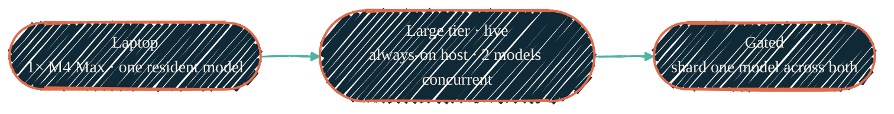

> Run the model where it makes sense. Fast and resident on the laptop, big and
> always-on for the LAN — served from a desktop-class Apple Silicon host the
> laptops call as clients.

"Local LLM" here means two distinct stacks that answer to the same OpenAI-shaped
API, plus the strategy that decides which one runs what. Neither is an agent.
Both are *just the model plus a serving stack* — the agent layer (Claude Code,
Gemini, the routines) lives above them and calls in over HTTP.

- **The client laptops** — `vllm-mlx` workers behind `llama-swap` on a
  laptop-class M4 Max, one resident model, tuned to coexist with a working
  desktop. This is a laptop's own private model for delegated edits, drafts, and
  "don't burn cloud tokens on this" tasks.
- **The always-on large tier** — a desktop-class Apple Silicon host, always on
  and reachable across the LAN, holds the big resident model the laptops call as
  clients. One place serves the large tier; everything else is a client of it.
  This supersedes the earlier dedicated-GPU approach — see
  [Homelab GPU](/local-llm/homelab-gpu) for the path it replaces.

The cloud frontier models still win on the hardest reasoning. The point of local
isn't to beat them — it's to own the routine, private, and high-volume work
without metering, and to keep a credible offline fallback.

## One gateway, one endpoint

A single self-hosted, OpenAI-compatible LLM gateway unifies both stacks — the
local models and the always-on workstation-hosted models — behind one endpoint.
Every client speaks the same OpenAI API to one URL and one key; the gateway
routes to whichever model answers. Model serving spans the always-on
workstation-class host for larger models and a separate GPU host for a
smaller, faster tier, with the gateway selecting between them automatically —
no client needs to know which one served the request. This GPU host is
distinct from the older dedicated-GPU approach for large models noted above,
which the second workstation superseded.

The homelab's self-hosted autonomous agents run continuously and connect to
that same endpoint as their model backend.

## Current shape, and what's still gated

{/* Shape: linear chain. 3 nodes, one timeline. Aspect ~3:1 LR. Role via classDef. */}

The always-on large-tier host (Mac Studio) is live, tuned, and benchmarked,
serving two models resident concurrently (see [Homelab GPU](/local-llm/homelab-gpu)).
Under the tuned stack, gpt-oss-120b achieves 28.6 tok/s decode (up from
13.6 tok/s), Qwen3-Coder achieves 128 tok/s decode (up from 64 tok/s),
and the 8-way concurrency aggregate throughput is 55.5 tok/s. A boot warmup
LaunchAgent (`mlx-warmup`) is deployed to fault model weights into memory
at boot and eliminate the 112s cold start (pending one host rebuild).
`Qwen3.6-35B-A3B-4bit` is the sole `ttl=900` swap-tier model; the dense
`Qwen3.6-27B` was evaluated and retired (2026-07-07). The full report is documented in `nix-darwin`
[MACOS-LLM-PERFORMANCE-TUNING-REPORT.md](https://github.com/dryvist/nix-darwin/blob/main/docs/MACOS-LLM-PERFORMANCE-TUNING-REPORT.md).

Note that this does **not** turn two machines into one 256 GB pool — Apple
Silicon unified memory can't be merged across a cable.
The separate, still-gated direction is **combined capacity by sharding**: a
model too big for either machine alone, run across both over a fast
interconnect, unattended, by morning. That's a capacity win, not a speed win,
and it remains measurement-gated — covered honestly in
[Distributed & multi-Mac](/local-llm/distributed).

## The principles that hold across both stacks

- **One resident model, not a rotation.** Swapping a multi-GB model evicts wired
  GPU memory and reloads another — the slowest thing you can do. The workstation
  holds a single resident model behind capability-role aliases
  (`default`, `coding`, `quickest`, `tool-calling`, …) that all resolve to it.
- **The registry is the source of truth.** Which physical model is resident
  lives in one place — the AI-stack registry that `nix-ai` writes at activation,
  read as `~/.config/ai-stack/registry.json`. Docs describe the *strategy*; the
  *current id* is a registry value, never hard-coded here. See
  [Models & quantization](/local-llm/models-and-quantization).
- **Measure, don't claim.** No tuning change ships on a marketing number — only a
  measured one. Throughput and quality come from the public
  [benchmark dataset](/tools/mlx-benchmarks), not vibes.
- **MoE for throughput.** A sparse mixture-of-experts model with a few billion
  active parameters decodes far faster than a dense model of the same total
  size — the lever that makes a big model usable on a laptop.
- **Capacity, not speed, across machines.** Sharding one model over two Macs is
  communication-bound; reserve it for models that don't fit, and run two
  independent workers for everything that does.

## In this section

<CardGroup cols={2}>
  <Card title="Apple Silicon stack" icon="microchip" href="/local-llm/apple-silicon">
    The M4 Max `vllm-mlx` + `llama-swap` stack and every non-secret tuning knob — and *why* each one is set the way it is.
  </Card>
  <Card title="Mac Studio serving" icon="desktop" href="/local-llm/mac-studio">
    The always-on LAN-shared large-tier model serving host: models, use cases, and headline performance outcomes.
  </Card>
  <Card title="Models & quantization" icon="layer-group" href="/local-llm/models-and-quantization">
    One-resident posture, MoE vs dense, OptiQ / DWQ / mxfp4, and the fast-vs-overnight model tiers.
  </Card>
  <Card title="Backends & tool calling" icon="server" href="/local-llm/backends">
    Why `vllm-mlx`, how it compares to Ollama / llama.cpp / mlx-lm / Rapid-MLX, and the tool-calling reliability problem.
  </Card>
  <Card title="Distributed & multi-Mac" icon="network-wired" href="/local-llm/distributed">
    The honest two-Mac story: combined capacity via sharding, two-workers-vs-shard, and what's measurement-gated.
  </Card>
  <Card title="Homelab GPU" icon="server" href="/local-llm/homelab-gpu">
    The always-on, LAN-shared model on a dedicated GPU — a different machine, a bigger model.
  </Card>
  <Card title="Benchmarking" icon="gauge-high" href="/tools/mlx-benchmarks">
    The reproducible harness and public dataset that every tuning decision is measured against.
  </Card>
</CardGroup>

## How it connects

<CardGroup cols={2}>
  <Card title="nix-ai" icon="bot" href="/nix/nix-ai">
    Packages the inference stack — the `vllm-mlx` LaunchAgent, `llama-swap`, the MLX modules, and the AI-stack registry.
  </Card>
  <Card title="AI development pipeline" icon="diagram-project" href="/architecture/ai-pipeline">
    Where local models sit in the bigger picture — routed alongside Claude, Gemini, and Copilot by task class.
  </Card>
  <Card title="Local AI isolation" icon="shield-halved" href="/security/local-ai-isolation">
    Why a local model and the agents calling it still can't read protected secrets.
  </Card>
  <Card title="Operational reference (private)" icon="lock" href="https://docs.dryvist.com">
    Host-specific values, real topology, and incident history live in the gated companion docs.
  </Card>
</CardGroup>
