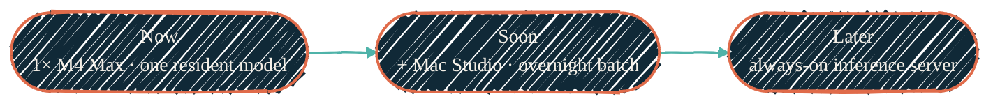

> Run the model where it makes sense. Fast and resident on the laptop, big and
> shared in the basement, and — soon — sharded across two Macs overnight.

"Local LLM" here means two distinct stacks that answer to the same OpenAI-shaped
API, plus the strategy that decides which one runs what. Neither is an agent.
Both are *just the model plus a serving stack* — the agent layer (Claude Code,
Gemini, the routines) lives above them and calls in over HTTP.

- **The Apple Silicon stack** — `vllm-mlx` workers behind `llama-swap` on the
  M4 Max, one resident model, tuned to coexist with a working desktop. This is
  the workstation's own private model for delegated edits, drafts, and
  "don't burn cloud tokens on this" tasks.
- **The homelab GPU stack** — a bigger model on a dedicated GPU, always on,
  reachable from the whole LAN. See [Homelab GPU](/local-llm/homelab-gpu).

The cloud frontier models still win on the hardest reasoning. The point of local
isn't to beat them — it's to own the routine, private, and high-volume work
without metering, and to keep a credible offline fallback.

## Where it's heading

{/* Shape: linear chain. 3 nodes, one timeline. Aspect ~3:1 LR. Role via classDef. */}

A second 128 GB Mac arrives next. It does **not** turn two machines into one
256 GB pool — Apple Silicon unified memory can't be merged across a cable. What
it *does* unlock is **combined capacity by sharding**: a model too big for one
128 GB box, run across both over a fast link, unattended, by morning. That's a
capacity win, not a speed win — covered honestly in
[Distributed & multi-Mac](/local-llm/distributed).

## The principles that hold across both stacks

- **One resident model, not a rotation.** Swapping a multi-GB model evicts wired
  GPU memory and reloads another — the slowest thing you can do. The workstation
  holds a single resident model behind capability-role aliases
  (`default`, `coding`, `quickest`, `tool-calling`, …) that all resolve to it.
- **The registry is the source of truth.** Which physical model is resident
  lives in one place — the AI-stack registry that `nix-ai` writes at activation,
  read as `~/.config/ai-stack/registry.json`. Docs describe the *strategy*; the
  *current id* is a registry value, never hard-coded here. See
  [Models & quantization](/local-llm/models-and-quantization).
- **Measure, don't claim.** No tuning change ships on a marketing number — only a
  measured one. Throughput and quality come from the public
  [benchmark dataset](/tools/mlx-benchmarks), not vibes.
- **MoE for throughput.** A sparse mixture-of-experts model with a few billion
  active parameters decodes far faster than a dense model of the same total
  size — the lever that makes a big model usable on a laptop.
- **Capacity, not speed, across machines.** Sharding one model over two Macs is
  communication-bound; reserve it for models that don't fit, and run two
  independent workers for everything that does.

## In this section

<CardGroup cols={2}>
  <Card title="Apple Silicon stack" icon="microchip" href="/local-llm/apple-silicon">
    The M4 Max `vllm-mlx` + `llama-swap` stack and every non-secret tuning knob — and *why* each one is set the way it is.
  </Card>
  <Card title="Models & quantization" icon="layer-group" href="/local-llm/models-and-quantization">
    One-resident posture, MoE vs dense, OptiQ / DWQ / mxfp4, and the fast-vs-overnight model tiers.
  </Card>
  <Card title="Backends & tool calling" icon="server" href="/local-llm/backends">
    Why `vllm-mlx`, how it compares to Ollama / llama.cpp / mlx-lm / Rapid-MLX, and the tool-calling reliability problem.
  </Card>
  <Card title="Distributed & multi-Mac" icon="network-wired" href="/local-llm/distributed">
    The honest two-Mac story: combined capacity via sharding, two-workers-vs-shard, and what's measurement-gated.
  </Card>
  <Card title="Homelab GPU" icon="server" href="/local-llm/homelab-gpu">
    The always-on, LAN-shared model on a dedicated GPU — a different machine, a bigger model.
  </Card>
  <Card title="Benchmarking" icon="gauge-high" href="/tools/mlx-benchmarks">
    The reproducible harness and public dataset that every tuning decision is measured against.
  </Card>
</CardGroup>

## How it connects

<CardGroup cols={2}>
  <Card title="nix-ai" icon="bot" href="/nix/nix-ai">
    Packages the inference stack — the `vllm-mlx` LaunchAgent, `llama-swap`, the MLX modules, and the AI-stack registry.
  </Card>
  <Card title="AI development pipeline" icon="diagram-project" href="/architecture/ai-pipeline">
    Where local models sit in the bigger picture — routed alongside Claude, Gemini, and Copilot by task class.
  </Card>
  <Card title="Local AI isolation" icon="shield-halved" href="/security/local-ai-isolation">
    Why a local model and the agents calling it still can't read protected secrets.
  </Card>
  <Card title="Operational reference (private)" icon="lock" href="https://docs.dryvist.com">
    Host-specific values, real topology, and incident history live in the gated companion docs.
  </Card>
</CardGroup>
