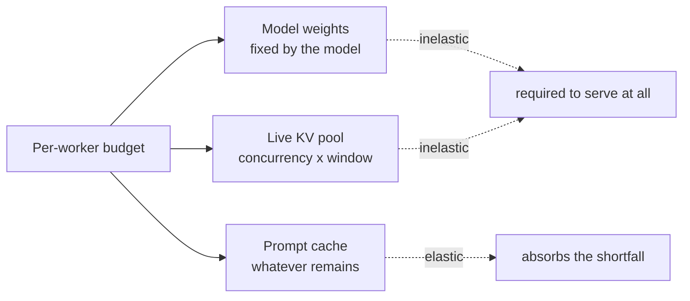

{/* projected from the authoring site; do not edit here */}
> Three consumers share one budget: model weights, the live KV pool, and the
> prompt cache. Weights and live KV are fixed by the shape you serve, so the
> prompt cache absorbs whatever is left. That's why the context window that
> "fits in memory" can still be the wrong one.

[Memory ceilings](/local-llm/memory-ceilings) covers the layered budget: the
wired ceiling, `--gpu-memory-utilization` as a cap rather than a reservation,
the `perTokenKvBytes` formula, and load-time admission control. This page picks
up where that one stops: at the **prompt cache**, and at what concurrency
actually costs once the cache is in the picture.

## The prompt cache is a third consumer, not a detail

A serving worker's memory divides three ways:

Weights and the live KV pool are **inelastic**. Both are required to serve the
declared shape at all. The prompt cache is the only elastic consumer, so it
takes the remainder. Size the first two without checking what is left, and the
cache silently shrinks to uselessness while every headline number still looks
healthy.

## What the prompt cache buys, and what it costs to lose

The prompt cache holds the KV state of prefixes already seen, so a follow-up
turn re-uses the prefill instead of recomputing it. Losing it converts every
turn into a cold prefill of the entire conversation.

The cost is superlinear in context. Re-prefilling a long conversation is far
more expensive than a short one. That cost is paid on **every** turn once the
cache can no longer hold the working set.

<Note>
Slot count matters as much as bytes. With a single cache slot, two callers
interleaving turns evict each other continuously. Each one's next turn finds
the other's prefix resident. One local observation put a warm turn at 0.22 s
against 8.34 s cold. That was after a single intervening conversation at 7k
tokens. Treat that ratio as **directional evidence that eviction is
expensive**, not as a coefficient. It is a single sample on one machine, and
the penalty grows with context.
</Note>

The rule that follows: give each concurrent stream at least its own slot. Size
the cache so a slot can hold the window it is caching for. A slot too small
to hold its own conversation evicts mid-conversation, which is the expensive
failure the cache exists to prevent.

## It is per model, never per caller

The cache is keyed on token prefixes and lives inside the worker. Nothing in it
is caller-aware, and a swapping proxy routes on model name alone. Every client
of a given model (interactive, agentic, batch) shares one cache.

The only way to give one caller class its own cache is a second worker, which
means **a second copy of the weights in memory**. That is almost never the right
trade.

<Tip>
Treat "this caller class needs isolation" as a **concurrency** question, not a
cache-partitioning one. Admission limits are cheap; a second resident copy of a
27B model is not.
</Tip>

## KV quantization cannot buy you headroom here

The obvious way to fit more cache is to quantize the KV cache. On the MLX
serving path, that option is closed. It's not merely because the flags are
missing from the server entry point.

A batched server can only batch caches that know how to merge. The batchability
test is, in effect, "does every cache object in this model expose a `merge`
method?" The standard cache types do. The **quantized** cache type does not.

| Cache type | Exposes `merge` | Batchable |
| --- | --- | --- |
| Standard KV cache | yes | yes |
| Rotating / arrays / list caches | yes | yes |
| **Quantized KV cache** | **no** | **no** |

So a worker that quantizes its KV cache disqualifies itself from the batched
path that all concurrency depends on. **KV quantization and serving concurrency
are mutually exclusive**, and adding the flags at the command line would not
change that.
Upstream would also have to teach the quantized cache to merge.

Plan sizing as though KV quantization does not exist, because on the serving
path it does not.

## Concurrency is capped in two places, and both must agree

Concurrency is not one setting. At minimum a serving stack has:

| Layer | Bounds | Symptom when it is the binding one |
| --- | --- | --- |
| **Proxy admission** | in-flight requests | 429 while worker is idle |
| **Engine batch width** | sequences decoded | refuses above its width |

The invariant is `batch width >= admission`. The failure mode worth naming is
the *reverse* mismatch: an engine configured for eight batch slots behind a
proxy admitting one request. Seven slots can never be used, yet every
memory-safety calculation still budgets for eight. So the worst case is
computed at eight times the reachable load, and the shape is sized far more
conservatively than reality requires.

Both numbers should derive from **one** input. Two independently set literals
kept in step by a comment is not a design; it is a pending drift.

## The other ceiling: buffer count, not bytes

A paged KV cache allocates in fixed-size blocks, and each block costs framework
buffers. Frameworks impose a **maximum buffer count**. Exceeding it fails
the allocation with a resource-limit error that is easy to misread as an
out-of-memory condition.

It is not one. The distinguishing test:

- **Byte OOM**: fails when the budget is exhausted. Lever: a smaller budget,
  fewer sequences, a shorter window.
- **Buffer-count limit**: can fire while plenty of memory is free, because the
  KV has been shattered into too many small blocks. Lever: a **larger block
  size**, which halves the block count each time you double it.

Buffer count scales roughly as
`(concurrency × window) / blockSize × kvBearingLayers`. Note what that means:
raising the block size is the only lever that reduces it without reducing what
you serve.

<Warning>
Do not respond to a buffer-count limit by shrinking the memory budget. That
treats it as an OOM, costs you capability, and leaves the block count unchanged.
</Warning>

## Worked example: why a longer window can be the wrong choice

Take a hybrid-attention model charging 64 KiB/token of KV (see
[Memory ceilings](/local-llm/memory-ceilings) for how to derive that from the
architecture). Assume 17 GiB of weights, two concurrent streams, and a 48 GiB
per-worker budget with ~10% held back for allocator overhead:

| Window | Weights + live KV | Prompt cache left | Verdict |
| --- | --- | --- | --- |
| 128k (131,072 tokens) | 33.000 GiB | 10.200 GiB | one full prefix stays warm |
| 200k (200,000 tokens) | 41.414 GiB | **1.786 GiB** | no prefix stays warm |

Both fit. The 200k shape is nonetheless the worse configuration. A single 200k
conversation's cached prefix is 12.207 GiB, larger than the entire remaining
cache budget. So no conversation can ever be served warm. Every turn re-prefills
from cold, and the longer window makes each of those re-prefills more expensive
than the shorter one would have been.

**The binding constraint on window size is usually prompt-cache starvation, not
memory exhaustion.** A sizing check that only asks "does it fit?" happily
recommends the slower configuration.

## Derive these, do not hand-tune them

Every quantity here is a function of a small number of inputs: the model's
architecture, the per-worker budget, and two choices. Those are concurrency
and window. Everything else follows.

Hand-calculating any of them once and pasting the result into a config is how
the numbers drift apart. The derived value and its inputs stop agreeing the
moment either input changes, and nothing detects it. Two patterns keep that
honest:

- **Derive** where the consumer can read the source value directly.
- **Assert parity in CI** where it cannot: a hermetic build system that refuses
  network access at evaluation time cannot read a value published elsewhere, so
  a check that fetches both and fails on disagreement is the mechanical
  substitute. It is weaker than derivation, and worth naming as such rather than
  describing as a single source of truth.

Empirical coefficients (allocator overhead fractions, buffers per block, safety
margins) should live in one named place and be **tuned there** when a
measurement disagrees. Scattering their consequences as literals across config
files is the failure this whole page describes.

## Related

- [Memory ceilings](/local-llm/memory-ceilings): the layered budget, the
  `perTokenKvBytes` formula, `kvLayers` on hybrid architectures, and load-time
  admission control.
- [Apple Silicon](/local-llm/apple-silicon): unified memory and the wired
  ceiling.
- [Choosing a model](/local-llm/choosing-a-model): picking the shape before
  sizing it.
