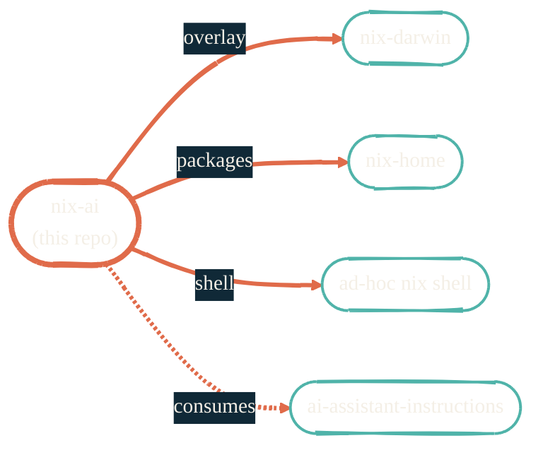

import { RepoMeta, RepoFit } from "/snippets/repo-summary.mdx";

> The whole AI toolkit, in one flake. `nix run` and go.

<RepoMeta language="Nix" status="active" lastActive="this week" repoUrl="https://github.com/JacobPEvans/nix-ai" />

`nix-ai` is the package and config layer for everything AI-coding-related. It packages CLIs that don't yet have first-party Nix derivations, pins MCP server versions, and exports overlays the rest of the Nix stack consumes.

## What it does

- Packages Claude Code, Gemini CLI, GitHub Copilot CLI, and assorted AI tooling
- Provides MLX module derivations for Apple Silicon
- Pins 15+ MCP servers and exposes them as reusable Nix attributes
- Exports an overlay so `nix-darwin` and `nix-home` can include AI tools without duplicating logic
- Includes a shell module (`devShells.default`) for "just give me an AI sandbox" workflows

## How it fits

<RepoFit>
Anything that's "an AI tool I want everywhere" belongs here. Single-project AI experiments go in a project-local `nix-devenv`-style flake.
</RepoFit>

## Getting started

<Steps>
  <Step title="Try a single tool">
    `nix run github:JacobPEvans/nix-ai#claude-code -- --help`. No clone needed.
  </Step>
  <Step title="Enter the sandbox shell">
    `nix develop github:JacobPEvans/nix-ai` drops you into a shell with every AI CLI on PATH.
  </Step>
  <Step title="Import into nix-darwin">
    Add `nix-ai` as a flake input, then include `nix-ai.overlays.default` in your nixpkgs config. The README has the boilerplate.
  </Step>
</Steps>

## Related repos

<CardGroup cols={2}>
  <Card title="ai-assistant-instructions" icon="book" href="/ai-development/ai-assistant-instructions">
    The rules layer. nix-ai packages the tools; this configures them.
  </Card>
  <Card title="claude-code-plugins" icon="plug" href="/ai-development/claude-code-plugins">
    Extension layer on top of the packaged Claude Code CLI.
  </Card>
  <Card title="nix-darwin" icon="apple" href="/nix/nix-darwin">
    The system-level consumer.
  </Card>
  <Card title="Source on GitHub" icon="github" href="https://github.com/JacobPEvans/nix-ai">
    Packages, overlays, full README.
  </Card>
</CardGroup>
