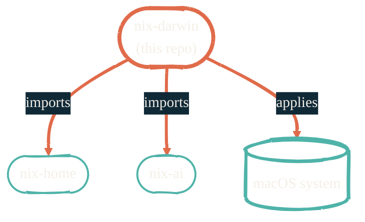

import { RepoMeta, RepoFit } from "/snippets/repo-summary.mdx";

> The macOS system layer. Everything below it is just `inputs`.

<RepoMeta language="Nix" status="active" lastActive="this week" repoUrl="https://github.com/JacobPEvans/nix-darwin" />

`nix-darwin` is the top-level entry point for the Mac. One `darwin-rebuild switch` updates packages, fonts, app preferences, shell, dock — anything that has a system-level reflection.

## What it does

- Manages `environment.systemPackages` — the global PATH baseline
- Owns macOS defaults: dock, finder, screenshots, keyboard, trackpad
- Imports [`nix-home`](/nix/nix-home) as `home-manager` input for user-level config
- Imports [`nix-ai`](/nix/nix-ai) for AI tooling that should live on the system PATH
- Pins the nixpkgs channel and applies overlays once for the whole machine

## How it fits

<RepoFit>
The orchestrator. If a tool needs to be on every shell session by default, it belongs here.
</RepoFit>

## Getting started

<Steps>
  <Step title="Install Nix and the Determinate installer">
    Use the Determinate Nix installer for flakes-enabled macOS. The README links the exact command.
  </Step>
  <Step title="Clone and run the bootstrap">
    `git clone https://github.com/JacobPEvans/nix-darwin && cd nix-darwin && darwin-rebuild switch --flake .#$(hostname -s)`
  </Step>
  <Step title="Iterate">
    Edit `flake.nix` or any module under `modules/`. Re-run `darwin-rebuild switch --flake .` — only what changed gets rebuilt.
  </Step>
</Steps>

## Related repos

<CardGroup cols={2}>
  <Card title="nix-home" icon="house" href="/nix/nix-home">
    The user-level layer imported here.
  </Card>
  <Card title="nix-ai" icon="bot" href="/nix/nix-ai">
    The AI tooling imported here.
  </Card>
  <Card title="nix-devenv" icon="cube" href="/nix/nix-devenv">
    Per-project dev shells — entered via direnv, not declared here.
  </Card>
  <Card title="Source on GitHub" icon="github" href="https://github.com/JacobPEvans/nix-darwin">
    Modules, host configs, full README.
  </Card>
</CardGroup>
