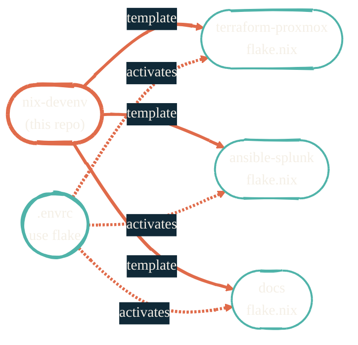

import { RepoMeta, RepoFit } from "/snippets/repo-summary.mdx";

> Don't put project deps in your system PATH. Don't put system deps in your project flake.

<RepoMeta language="Nix" status="active" lastActive="this week" repoUrl="https://github.com/JacobPEvans/nix-devenv" />

`nix-devenv` is a library of dev shells. Every project repo in the portfolio pulls its `flake.nix` from here. One source of truth for what "the Terraform dev shell" or "the ML dev shell" contains.

## What it does

- Exports `devShells.<stack>` for `terraform`, `ansible`, `kubernetes`, `python`, `ml`, and more
- Provides a `mkshell` template — `nix flake init -t github:JacobPEvans/nix-devenv#mkshell`
- Pins toolchain versions so every project on the same shell gets the same `terraform` / `kubectl` / `ansible`
- Activated per-project via direnv (`.envrc` is committed; `.direnv/` is gitignored)

## How it fits

<RepoFit>
Anything project-scoped belongs here. Anything machine-scoped belongs in [nix-darwin](/nix/nix-darwin) or [nix-home](/nix/nix-home).
</RepoFit>

## Getting started

<Steps>
  <Step title="Scaffold a flake in your project">
    `cd my-project && nix flake init -t github:JacobPEvans/nix-devenv#mkshell`. Edit `flake.nix` to pick the shell you need.
  </Step>
  <Step title="Commit `.envrc`">
    Add `use flake` to `.envrc`. Commit it; direnv activates the shell whenever you `cd` in.
  </Step>
  <Step title="Pull a pre-built shell">
    Skip the local flake and `nix develop github:JacobPEvans/nix-devenv?dir=shells/<lang>` for one-off work.
  </Step>
</Steps>

## Related repos

<CardGroup cols={2}>
  <Card title="nix-darwin" icon="apple" href="/nix/nix-darwin">
    The system layer. Tools belong there if every shell needs them.
  </Card>
  <Card title="nix-home" icon="house" href="/nix/nix-home">
    The user layer. Tools belong there if every project needs them but the system doesn't.
  </Card>
  <Card title="nix-ai" icon="bot" href="/nix/nix-ai">
    AI-specific dev shell module — composes with this repo's templates.
  </Card>
  <Card title="Source on GitHub" icon="github" href="https://github.com/JacobPEvans/nix-devenv">
    Templates, shells, full README.
  </Card>
</CardGroup>
