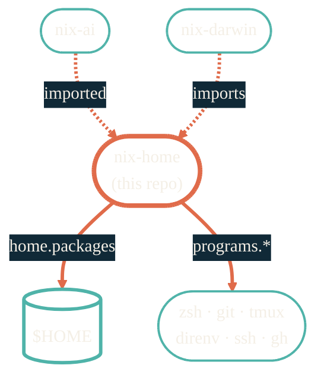

import { RepoMeta, RepoFit } from "/snippets/repo-summary.mdx";

> Same shell, same prompt, same editor on every Mac and every Linux VM.

<RepoMeta language="Nix" status="active" lastActive="this week" repoUrl="https://github.com/JacobPEvans/nix-home" />

`nix-home` is the home-manager layer. It owns `$HOME` — the user's shell, dotfiles, git config, tmux, VS Code, every CLI that should be there before any project touches a thing.

## What it does

- Declares `home.packages` — user-level CLIs that follow `$HOME`, not the system
- Owns `programs.*` config: git, zsh, tmux, vim, direnv, ssh, gh
- Cross-platform: imported by [`nix-darwin`](/nix/nix-darwin) on macOS, usable standalone on NixOS or Linux
- Pulls AI tooling from [`nix-ai`](/nix/nix-ai) when AI CLIs should live in the user PATH

## How it fits

<RepoFit>
If a config lives in `~/.config/` or `~/.<tool>rc`, it belongs here. System-wide stuff goes to `nix-darwin`; project-only stuff goes to `nix-devenv`.
</RepoFit>

## Getting started

<Steps>
  <Step title="As a nix-darwin import (macOS)">
    Already wired into [`nix-darwin`](/nix/nix-darwin). `darwin-rebuild switch` picks up both.
  </Step>
  <Step title="Standalone home-manager (Linux)">
    `nix run home-manager/master -- switch --flake github:JacobPEvans/nix-home`.
  </Step>
  <Step title="Iterate">
    Edit modules, re-run the rebuild. Generations let you roll back if something breaks.
  </Step>
</Steps>

## Related repos

<CardGroup cols={2}>
  <Card title="nix-darwin" icon="apple" href="/nix/nix-darwin">
    The system layer that imports this on macOS.
  </Card>
  <Card title="nix-ai" icon="bot" href="/nix/nix-ai">
    AI tooling that this layer composes into the user PATH.
  </Card>
  <Card title="nix-devenv" icon="cube" href="/nix/nix-devenv">
    Per-project dev shells, separate from $HOME.
  </Card>
  <Card title="Source on GitHub" icon="github" href="https://github.com/JacobPEvans/nix-home">
    Modules, full README.
  </Card>
</CardGroup>
