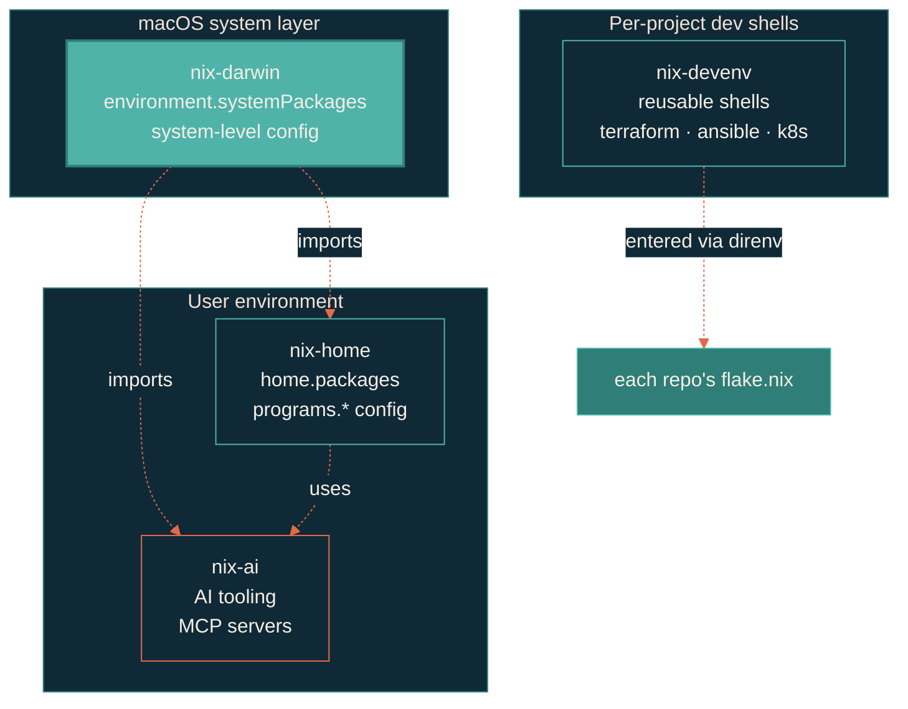

> Reproducible everything. `nix build` and walk away.

The four Nix repos are layered, not parallel. `nix-darwin` sits at the top and orchestrates the macOS system. `nix-home` defines the user environment via home-manager. `nix-ai` packages every AI coding tool — Claude, Gemini, Copilot, MLX, MCP servers. `nix-devenv` provides reusable project-level dev shells.

## Ecosystem

## Package placement

The boundary between system, user, and project is intentional:

- `environment.systemPackages` (nix-darwin) — core bootstrap, macOS-only tools, GUI apps
- `home.packages` (nix-home) — user dev tools, linters, CLIs that follow `$HOME`
- AI packages (nix-ai) — Claude, Gemini, Copilot, MLX, MCP servers
- Project dev shells (nix-devenv) — language- or stack-specific tooling that should not pollute the global PATH

`programs.*` declarations follow the same boundary; home-manager merges both layers cleanly.

## Repos in this section

| Repo | What it does |
| --- | --- |
| [nix-darwin](https://github.com/JacobPEvans/nix-darwin) | macOS system config. Imports nix-ai and nix-home. The top-level entry point. |
| [nix-ai](https://github.com/JacobPEvans/nix-ai) | Every AI coding tool, packaged. Claude Code, Gemini CLI, Copilot, MLX modules, MCP server configs. |
| [nix-home](https://github.com/JacobPEvans/nix-home) | User dev environment via home-manager. Shell, editor, git, dev tools. |
| [nix-devenv](https://github.com/JacobPEvans/nix-devenv) | Reusable per-project dev shells. `nix flake init -t github:JacobPEvans/nix-devenv#mkshell` bootstraps. |

## Why four repos, not one

Each layer is independently useful. `nix-devenv` is consumed by every other repo in the portfolio via `nix flake init`. `nix-ai` is consumed by personal config and by team setups. Splitting them keeps the dependency graph clean and lets each layer iterate at its own pace.
