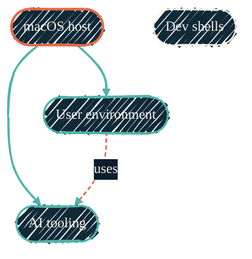

> Reproducible everything. `nix build` and walk away.

The four Nix repos are layered, not parallel. `nix-darwin` sits at the top and orchestrates the macOS system. `nix-home` defines the user environment via home-manager. `nix-ai` packages every AI coding tool — Claude, Gemini, Copilot, MLX, MCP servers. `nix-devenv` provides reusable project-level dev shells.

Every flake in the ecosystem pins the same `nixpkgs` / `nix-darwin` / `home-manager` release channel, kept in lockstep across repos so one machine never mixes generations.

## Ecosystem

{/* Shape: hierarchy. nix-darwin parent imports nix-home + nix-ai; nix-devenv parallel. */}
{/* Nodes: 4. Boundary crossings: 0. Aspect: ~3:2 TB. Pass. */}

`nix-darwin` (coral) is the system root. It imports `nix-home` and `nix-ai` (green). `nix-devenv` (ink) is a parallel concern — each project pulls it directly via `nix flake init`.

| Layer | Repo | What it owns |
| --- | --- | --- |
| **macOS system** | [macOS host](/nix/nix-darwin) | `environment.systemPackages`, sudoers, security, Touch ID, system-level config |
| **User environment** | [User environment](/nix/nix-home) | `home.packages`, `programs.*` for zsh, git, tmux, direnv, ssh, gh |
| **AI tooling** | [AI tooling](/nix/nix-ai) | Claude Code, Gemini, Copilot, MLX, MCP servers — declarative, version-pinned |
| **Per-project shells** | [Dev shells](/nix/nix-devenv) | Reusable `flake.nix` templates entered via `direnv` on `cd` |

## Package placement

The boundary between system, user, and project is intentional:

- `environment.systemPackages` (nix-darwin) — core bootstrap, macOS-only tools, GUI apps
- `home.packages` (nix-home) — user dev tools, linters, CLIs that follow `$HOME`
- AI packages (nix-ai) — Claude, Gemini, Copilot, MLX, MCP servers
- Project dev shells (nix-devenv) — language- or stack-specific tooling that should not pollute the global PATH

`programs.*` declarations follow the same boundary; home-manager merges both layers cleanly.

## Continuous integration

Nix CI runs through shared reusable workflows — `_nix-validate.yml` for `nix flake check` and `_nix-build.yml` for macOS builds — so every repo validates the same way. Caching uses the GitHub Actions cache (`actions/cache`) backed by the public `cache.nixos.org` binary cache.

These workflows do **not** use FlakeHub. FlakeHub's hosted binary cache no longer offers a useful free tier, so there is nothing to gain from it — and a FlakeHub-backed cache action fails CI outright when it cannot authenticate to `api.flakehub.com`. The Determinate Systems **Nix installer** (`determinate-nix-action`) and the Determinate Nix module stay in use: both are free and independent of the FlakeHub cache.

## Repos in this section

<CardGroup cols={2}>
  <Card title="nix-darwin" icon="apple" href="/nix/nix-darwin">
    macOS system config. Imports `nix-ai` and `nix-home`. The top-level entry point.
  </Card>
  <Card title="nix-ai" icon="bot" href="/nix/nix-ai">
    Every AI coding tool, packaged. Claude Code, Gemini CLI, Copilot, MLX, MCP servers.
  </Card>
  <Card title="nix-home" icon="house" href="/nix/nix-home">
    User dev environment via home-manager. Shell, editor, git, dev tools.
  </Card>
  <Card title="nix-devenv" icon="cube" href="/nix/nix-devenv">
    Reusable per-project dev shells. `nix flake init -t github:JacobPEvans/nix-devenv#mkshell`.
  </Card>
</CardGroup>

## Why four repos, not one

Each layer is independently useful. `nix-devenv` is consumed by every other repo in the portfolio via `nix flake init`. `nix-ai` is consumed by personal config and by team setups. Splitting them keeps the dependency graph clean and lets each layer iterate at its own pace.
