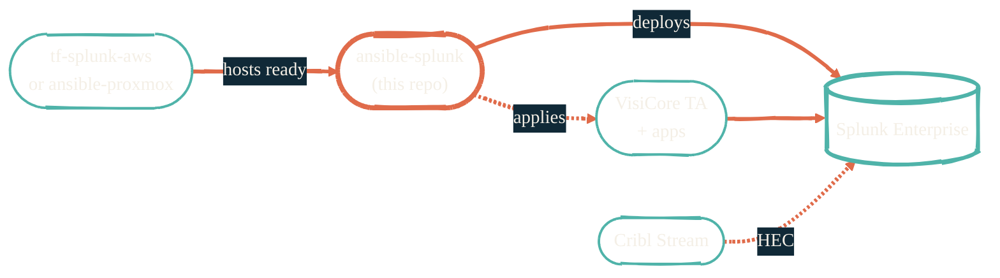

import { RepoMeta, RepoFit } from "/snippets/repo-summary.mdx";

> Splunk Enterprise, deployed the same way every time. Indexers, search heads, license, done.

<RepoMeta language="Python" status="active" lastActive="this week" repoUrl="https://github.com/JacobPEvans/ansible-splunk" />

`ansible-splunk` is the configuration tier for Splunk Enterprise. It deploys and configures a Splunk install onto hosts that `tf-splunk-aws` provisioned (or onto homelab hardware that `ansible-proxmox` configured), then maintains the install through ongoing playbook runs.

## What it does

- Installs Splunk Enterprise and applies a license
- Configures **indexes**, **HEC tokens**, and **storage tiering** (hot/warm/cold)
- Sets up indexer clustering and search head distribution where applicable
- Wires in conf bundles from the [`VisiCore_*`](https://github.com/JacobPEvans?tab=repositories&q=VisiCore) repos
- Runs idempotently — safe to re-run as a drift-correction tool

## How it fits

<RepoFit>
The configuration tier for Splunk. Provisioning lives elsewhere; this owns everything inside the Splunk install.
</RepoFit>

## Getting started

<Steps>
  <Step title="Confirm hosts are ready">
    Run `tf-splunk-aws` (cloud) or `ansible-proxmox` (homelab) first. Hosts need OS, storage, and network in place.
  </Step>
  <Step title="Clone and enter the dev shell">
    `git clone https://github.com/JacobPEvans/ansible-splunk && cd ansible-splunk && nix develop`
  </Step>
  <Step title="Provide Splunk license and HEC tokens via Doppler">
    `DOPPLER_TOKEN` resolves the Splunk license file and any pre-shared HEC tokens at run time. No secrets in git.
  </Step>
  <Step title="Run the playbook">
    `ansible-playbook -i inventory site.yml`. The first run installs Splunk; subsequent runs converge config drift.
  </Step>
</Steps>

## Related repos

<CardGroup cols={2}>
  <Card title="tf-splunk-aws" icon="aws" href="/observability/tf-splunk-aws">
    The AWS provisioner for Splunk hosts.
  </Card>
  <Card title="Observability overview" icon="chart-line" href="/observability/overview">
    Where this fits in the OTEL → Cribl → Splunk pipeline.
  </Card>
  <Card title="Data pipelines" icon="diagram-project" href="/architecture/data-pipelines">
    The traffic this Splunk install actually receives.
  </Card>
  <Card title="Source on GitHub" icon="github" href="https://github.com/JacobPEvans/ansible-splunk">
    Roles, inventory examples, full README.
  </Card>
</CardGroup>
