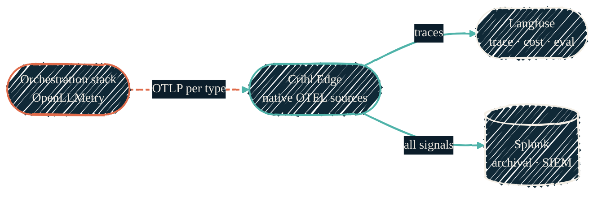

> If a model was called, there's a trace — and you can see what it cost.

The [AI-coding-tool pipeline](/observability/overview) traces the IDEs. This is
its sibling for the AI component tier: every component — including `dify`,
`langflow`, `agent-exec`, `hermes-agent`, and `open-webui` — now emits
OpenTelemetry for every LLM call, and the same Cribl Edge OTLP receiver routes
the spans. Cribl handles all fan-out to Langfuse and Splunk, leaving zero
direct-to-Splunk/Langfuse paths.

## Emitting traces — OpenLLMetry + OTEL GenAI

Apps are instrumented with [OpenLLMetry](https://github.com/traceloop/openllmetry)
(the Traceloop SDK), which wraps LLM providers, vector stores, and frameworks
(LangChain, CrewAI) and emits spans following OpenTelemetry's
[GenAI semantic conventions](https://opentelemetry.io/docs/specs/semconv/gen-ai/).
Those conventions matured in 2026, so framework-native spans and SDK-emitted
spans now line up on the same schema — prompt, completion, model, token counts,
latency, cost.

The spans leave the app over OTLP (gRPC `4317` / HTTP `4318`) pointed at the
collector, **not** at any one backend. Keeping the emit target on the pipeline —
not the trace store — is what lets the same telemetry reach more than one place.

## Cribl is the hub

A single collector tier owns ingest and fan-out. Cribl Edge runs **native
OpenTelemetry sources**, one per signal type on its own port, so it can route by
type without parsing payloads. From there it forks:

{/* Shape: fan-out. Apps -> Cribl -> two sinks. */}

- **Langfuse** gets the traces. It is the LLM-native view: trace waterfalls per
  request, token cost, prompt and completion inspection, plus datasets, evals,
  and prompt versioning.
- **Splunk** gets everything, for archival and correlation with the rest of the
  homelab's telemetry — the same indexer the AI-coding pipeline already feeds.

Apps never talk to a trace store directly, and they never reach across into the
monitoring tier — they emit to the collector, and the collector decides where it
goes. One ingest point, two sinks, no second collector to run.

## Why Langfuse

| Criterion | Langfuse |
| --- | --- |
| License | MIT — self-host with no feature gates |
| Ingestion | Native OTLP, GenAI-convention aware |
| Built for | LLM apps — traces, cost, evals, prompt management |
| Footprint | Web + worker + Postgres + ClickHouse + Redis + object storage |

[Laminar](https://laminar.sh/) (Apache-2.0) is the runner-up — lighter, tilted
toward long-running agent debugging. Arize Phoenix is capable but ships under the
Elastic License, which gates self-host use.

<Note>
Langfuse keeps its trace-of-record (relational + analytical) on durable local
storage; its blob store points at the homelab object store. Backend choices like
the vector store and model provider are made **per tool, per that tool's own
standard** — never by forcing a shared backend across unrelated stacks.
</Note>

## Where to go next

<CardGroup cols={2}>
  <Card title="AI orchestration stack" icon="diagram-project" href="/ai-development/ai-orchestration-stack">
    The tools whose calls this pipeline traces.
  </Card>
  <Card title="Observability overview" icon="chart-line" href="/observability/overview">
    The AI-coding-tool side of the same Cribl → Splunk spine.
  </Card>
  <Card title="ansible-proxmox-apps" icon="screwdriver-wrench" href="/infrastructure/repos/ansible-proxmox-apps">
    Deploys Langfuse and the Cribl OTEL sources.
  </Card>
  <Card title="Local LLM" icon="microchip" href="/local-llm/overview">
    The models being traced.
  </Card>
</CardGroup>
