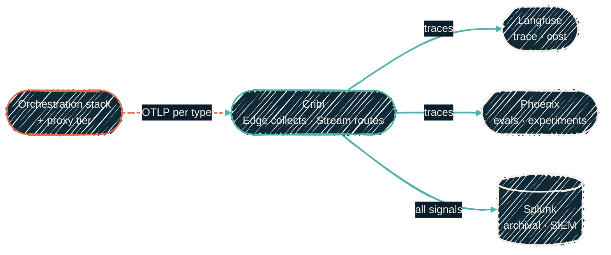

{/* projected from the authoring site; do not edit here */}
> If a model was called, there's a trace. You can see what it cost.

The [AI-coding-tool pipeline](/observability/overview) traces the IDEs. This is
its sibling for the AI component tier. Every component, including `dify`,
`langflow`, `agent-exec`, `hermes-agent`, and `open-webui`, now emits
OpenTelemetry for every LLM call. So does the proxy and router tier that
those components call through. Cribl Edge collects on the endpoint, Cribl Stream
tags and fans out, and the spans land in Langfuse, [Arize Phoenix](/observability/phoenix),
and Splunk. There are zero direct-to-backend paths.

## Emitting traces — OpenLLMetry + OTEL GenAI

Apps are instrumented with [OpenLLMetry](https://github.com/traceloop/openllmetry)
(the Traceloop SDK). It wraps LLM providers, vector stores, and frameworks
(LangChain, CrewAI). It emits spans following OpenTelemetry's
[GenAI semantic conventions](https://opentelemetry.io/docs/specs/semconv/gen-ai/).
Those conventions matured in 2026. Framework-native spans and SDK-emitted
spans now line up on the same schema: prompt, completion, model, token counts,
latency, cost.

The spans leave the app over OTLP (gRPC `4317` / HTTP `4318`) pointed at the
collector, **not** at any one backend. Keeping the emit target on the pipeline,
not the trace store, is what lets the same telemetry reach more than one place.

## Cribl is the hub

A single collector tier owns intake and fan-out. Cribl Edge runs **native
OpenTelemetry sources**, one per signal type on its own port, so it can route by
type without parsing payloads. Edge relays to Cribl Stream, which tags each span
with its producer and forks it in parallel:

{/*Shape: fan-out. Apps -> Cribl -> three sinks.*/}

```mermaid
%%{init:
  {'theme':'base','look':'handDrawn','themeVariables':{'fontFamily':'Geist','fontSize':'14px','primaryColor':'#102937','primaryTextColor':'#F4EFE6','primaryBorderColor':'#4FB3A9','lineColor':'#4FB3A9','secondaryColor':'#0B1D2A','tertiaryColor':'#1A2A38','clusterBkg':'rgba(79,179,169,0.08)','clusterBorder':'#4FB3A9'}}}%%
  flowchart LR
  Apps([Orchestration stack<br/>+ proxy tier])
  Cribl([Cribl<br/>Edge collects · Stream routes])
  LF([Langfuse<br/>trace · cost])
  PX([Phoenix<br/>evals · experiments])
  SP[(Splunk<br/>archival · SIEM)]

  Apps -->|OTLP per type| Cribl
  Cribl -->|traces| LF
  Cribl -->|traces| PX
  Cribl -->|all signals| SP

  classDef ai   fill:#102937,stroke:#E06B4A,stroke-width:2px,color:#F4EFE6;
  classDef hop  fill:#102937,stroke:#4FB3A9,stroke-width:2px,color:#F4EFE6;
  classDef sink fill:#102937,stroke:#F4EFE6,stroke-width:2px,color:#F4EFE6;

  class Apps ai
  class Cribl hop
  class LF,PX,SP sink

  click PX "/observability/phoenix" "Arize Phoenix: evals and experiments"

  linkStyle 0 stroke:#E06B4A,stroke-width:2px,stroke-dasharray:4 3;
  linkStyle 1,2,3 stroke:#4FB3A9,stroke-width:2px;
```

- **Langfuse** gets the traces. It is the LLM-native view: trace waterfalls per
  request, token cost, prompt and completion inspection, plus prompt versioning.
  It is the trace-of-record.
- **Phoenix** gets the same traces on its own pipeline leg. It is where a trace
  becomes a test case: datasets, experiments, LLM-as-judge evals, and a
  playground that replays a captured call. See [Arize Phoenix](/observability/phoenix).
- **Splunk** gets everything, for archival and correlation with the rest of the
  homelab's telemetry. It's the same indexer the AI-coding pipeline already feeds.

Apps never talk to a trace store directly, and they never reach across into the
monitoring tier. They emit to the collector, and the collector decides where it
goes. One intake point, three sinks, no second collector to run.

## Reaching the pipeline: subdomains, TLS, and who gets gated

Two rules govern how anything reaches a service in this stack, and both matter
for telemetry.

**Every service answers on its own subdomain over TLS.** A caller uses
`https://<app>.<subdomain>/` and nothing else. No caller targets a raw port,
whether human, agent, or collector. The port a service listens on is an
implementation detail of the host it runs on. A config that hardcodes the port
breaks the moment the service moves. Naming the subdomain instead means a move
costs a DNS record, not an edit in every producer.

**Single sign-on (SSO) gates humans, never ingestion.** The forward-auth layer sits in
front of the human-facing routes: dashboards, trace browsers, administrator consoles.
Machine telemetry must not sit behind an interactive login. A collector cannot
complete a browser redirect, and a pipeline that stalls on a login page drops
data silently rather than failing loudly.

You can tell the two apart by what an unauthenticated request gets back. Call an
ingestion path with no credentials and the answer is the receiving service's own
`401`. The service saw the request and rejected the credential. Call a
human-facing path the same way and the answer is a redirect to the login flow.
The request never reached the service at all. A `401` from the app is
the signal that ingestion is correctly excluded from the human gate.

## What the traces do not cover

Two limits are worth stating plainly, because a dashboard that looks complete
invites the wrong conclusion.

**In-process tracing is not available for every serving backend.** Some model
servers ship no OpenTelemetry integration at all. Calls to those backends are
still recorded. The proxy tier in front of them attributes the model, the token
counts, and the latency, but the span stops at the proxy boundary. You see that
the call happened and what it cost in time and tokens. You do not see inside the
server: no per-stage timing, no queue depth, no batching detail. Coverage of
calls is complete; coverage of internals is not.

**Per-call cost is only meaningful where a price exists.** Cost is computed from
a published per-token price for the model. A locally served model has no such
price, so its cost is reported as zero. That zero is a statement about billing,
not about resource use. The call still consumed power, memory, and time. Read cost
figures as "what a vendor invoiced," and never as "what this workload consumed."

## Why Langfuse

| Criterion | Langfuse |
| --- | --- |
| License | MIT, self-host with no feature gates |
| Ingestion | Native OTLP, GenAI-convention aware |
| Built for | LLM apps, traces, cost, evals, prompt management |
| Footprint | Web + worker + Postgres + ClickHouse + Redis + object storage |

[Laminar](https://laminar.sh/) (Apache-2.0) is the runner-up. It's lighter, tilted
toward long-running agent debugging. Arize Phoenix ships under the Elastic
License 2.0, which only forbids reselling it as a managed service. It runs here
as the [evals and experiments](/observability/phoenix) peer rather than as the
trace-of-record.

<Note>
Langfuse keeps its trace-of-record (relational + analytical) on durable local
storage; its blob store points at the homelab object store. Backend choices like
the vector store and model provider are made **per tool, per that tool's own
standard**. No shared backend gets forced across unrelated stacks.
</Note>

## Where to go next

<CardGroup cols={2}>
<Card
  title="AI orchestration stack"
  icon="diagram-project"
  href="/ai-development/ai-orchestration-stack">
  The tools whose calls this pipeline traces.
</Card>
<Card
  title="Observability overview"
  icon="chart-line"
  href="/observability/overview">
  The AI-coding-tool side of the same Cribl → Splunk spine.
</Card>
<Card
  title="ansible-proxmox-ai"
  icon="screwdriver-wrench"
  href="/infrastructure/repos/ansible-proxmox-ai">
  Deploys Langfuse and Phoenix. The Cribl OTEL sources they feed come from ansible-proxmox-apps.
</Card>
  <Card title="Local LLM" icon="microchip" href="/local-llm/overview">
  The models being traced.
</Card>
</CardGroup>
