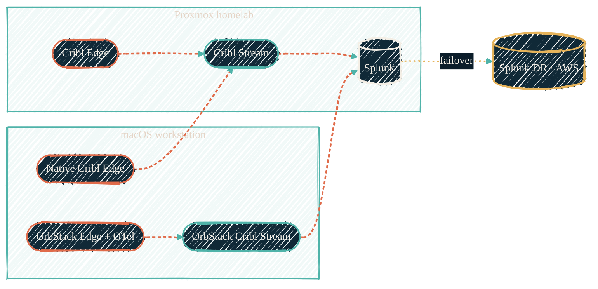

> One picture: every collector, what it collects, where it runs, what it forwards to.

The monitoring stack runs across four hosts: the homelab Proxmox cluster, the macOS workstation, the [OrbStack K8s cluster](/infrastructure/repos/orbstack-kubernetes) on that workstation, and the AWS-side Splunk install. Each tier picks the lowest-overhead path the host OS supports natively. This page maps every collector to a host and a destination.

{/* Shape: parallel convergence. Two host subgraphs; both Stream tiers land on Splunk; AWS is the failover. 7 nodes, ≤1 boundary per edge. */}

Every Edge feeds a Stream; only Stream reaches Splunk; the AWS tier is one routing-rule flip away. Detail per collector below.

## The collectors

| Collector | Where it runs | What it collects | Forwards to |
| --- | --- | --- | --- |
| `cribl-edge` (homelab) | LXC on Proxmox, deployed by [`ansible-proxmox-apps`](/infrastructure/repos/ansible-proxmox-apps) | HAProxy syslog/NetFlow, host telemetry from Proxmox guests | `cribl-stream` (homelab) |
| `cribl-stream` (homelab) | LXC on Proxmox, deployed by [`ansible-proxmox-apps`](/infrastructure/repos/ansible-proxmox-apps) | Edge events, ingest reduction, routing | Splunk HEC ([`ansible-splunk`](/observability/repos/ansible-splunk)) |
| `cribl-edge` (Mac native) | Native macOS Cribl Edge, **standalone** — nix-darwin GitOps, no Leader, no Cloud fleet enrollment | macOS unified logs, system metrics, thermal, powermetrics, battery via [`cc-edge-the-mac-pack`](/observability/repos/cc-edge-the-mac-pack); AI CLI / LLM stack / OpenBao audit log files (tcpjson 10311–10315, 10321–10323, 10331) | `cribl-stream` (homelab), tcpjson over Cribl S2S |
| `cribl-edge-standalone` (OrbStack) | StatefulSet in [`orbstack-kubernetes`](/infrastructure/repos/orbstack-kubernetes) `monitoring` namespace | AI tool telemetry — Claude Code (OTLP), Gemini Antigravity, VS Code | `cribl-stream-standalone` (OrbStack) |
| `cribl-edge-managed` (OrbStack) | StatefulSet in `orbstack-kubernetes` | Subset of telemetry tagged for Cribl Cloud | Cribl Cloud |
| `cribl-stream-standalone` (OrbStack) | StatefulSet in `orbstack-kubernetes` | Edge events + REST poll from `cc-stream-github-copilot-rest-io` | Splunk HEC |
| `otel-collector` (OrbStack) | StatefulSet in `orbstack-kubernetes` | OTLP from Claude Code SDK, Bifrost, any in-cluster OTLP source | `cribl-stream-standalone` (OrbStack) |

## The Edge → Stream → Splunk invariant

Across every tier, the architectural rule is the same: Edge collects, Stream routes, Splunk indexes. Edge does not talk directly to Splunk anywhere on this stack. Stream is the only component with Splunk egress. On the OrbStack cluster this is enforced by network policies that lock Edge egress to Stream on HEC port 8088 only; on the homelab Proxmox side the rule is operational (single Stream tier), reinforced by firewall rules in `tofu-proxmox/modules/firewall/`.

Two as-built details of that egress:

- **Edge → Stream rides Cribl S2S** as tcpjson on the dedicated `cribl_s2s` service port (a pipeline constant from the infrastructure repo, never hardcoded).
- **Stream → Splunk is one HEC output per index**, each with its own token. Tokens are *derived*, not distributed: UUIDv5 of `splunk-hec-<index>` in a shared private namespace, so Cribl and Splunk compute the same value independently. The namespace UUID is the only secret, and a leaked token scopes to one index. See the [full family/port/index map](/observability/overview#syslog-ingest-families).

## Per-tool Cribl Edge packs

The AI-coding-tool packs sit on top of the OrbStack cluster's `cribl-edge-standalone`:

| Pack | Collects from |
| --- | --- |
| [`cc-edge-claude-code-otel`](https://github.com/JacobPEvans/cc-edge-claude-code-otel) | Claude Code (OTEL hooks) |
| [`cc-edge-copilot-otel`](https://github.com/JacobPEvans/cc-edge-copilot-otel) | GitHub Copilot Chat (OTLP gRPC) |
| [`cc-edge-vscode-io`](https://github.com/JacobPEvans/cc-edge-vscode-io) | VS Code (logs + telemetry) |
| [`cc-edge-gemini-antigravity-io`](https://github.com/JacobPEvans/cc-edge-gemini-antigravity-io) | Gemini Antigravity |
| [`cc-edge-macos-system`](https://github.com/JacobPEvans/cc-edge-macos-system) | macOS-native system events (archived predecessor) |

The macOS host telemetry pack [`cc-edge-the-mac-pack`](/observability/repos/cc-edge-the-mac-pack) targets the **native macOS** Cribl Edge install (not the OrbStack-deployed one) — its exec inputs call macOS-only binaries that need host access, not a Linux container.

## REST collectors

| Pack | Polls | Hosted on |
| --- | --- | --- |
| [`cc-stream-github-copilot-rest-io`](https://github.com/JacobPEvans/cc-stream-github-copilot-rest-io) | GitHub Copilot usage metrics REST API (per-org, per-seat) | `cribl-stream-standalone` (OrbStack) |

REST collectors run on Stream rather than Edge because they're pull-based jobs against authenticated APIs — closer to the routing layer's responsibility than the host-side capture layer.

## OTel collectors

| Collector | Where | Role |
| --- | --- | --- |
| `otel-collector` (OrbStack) | StatefulSet in `orbstack-kubernetes` | OTLP gRPC/HTTP receiver (ports 4317/4318, NodePorts 30317/30318), forwards to `cribl-stream-standalone` |
| Bifrost gateway | StatefulSet in `orbstack-kubernetes` (`bifrost`) | Multi-provider AI gateway; emits OTLP that the OTel collector picks up |

Anything inside the OrbStack cluster that speaks OTLP gets pointed at the in-cluster OTel collector. Anything outside the cluster but on the same Mac (Claude Code, Gemini Antigravity, VS Code) talks to the OTel collector through the NodePort or hands off to the Cribl Edge standalone pack.

## Heartbeats

Four [healthchecks.io](https://healthchecks.io) CronJobs run in the OrbStack `monitoring` namespace as dead-man switches:

| CronJob | Pings when |
| --- | --- |
| `pipeline-heartbeat` | Cribl Stream is alive and routing |
| `heartbeat-splunk` | Splunk HEC accepts the test event |
| `heartbeat-edge` | Cribl Edge processes the test event |
| `heartbeat-otel` | OTel collector receives a test span |

A missed ping is the first signal of a broken pipeline — every other failure mode tends to be silent.

Heartbeats prove the pipeline is up; **per-index silence detectors** prove the data is flowing. Every Splunk index carries an alert that fires when the index receives no events within its expected cadence, so a dead sender, port, or token surfaces as "index went quiet" rather than a gap discovered at search time.

## Forwarding to AWS DR

The Splunk install behind `cribl-stream` is the homelab indexer. [`tf-splunk-aws`](/observability/repos/tf-splunk-aws) provisions the AWS-side DR footprint: same data shape, smaller indexer tier, ready to take a failover. Cribl Stream's output config can be flipped from the homelab Splunk to the AWS HEC endpoint via a routing-rule change; downstream AI-observability dashboards keep working because they target the same indexes regardless of which Splunk tier is live.

## See also

<CardGroup cols={2}>
  <Card title="Observability overview" icon="chart-line" href="/observability/overview">
    The OTEL → Cribl → Splunk pipeline, end to end.
  </Card>
  <Card title="orbstack-kubernetes" icon="cube" href="/infrastructure/repos/orbstack-kubernetes">
    The OrbStack K8s cluster running the macOS-side monitoring stack.
  </Card>
  <Card title="cc-edge-the-mac-pack" icon="apple" href="/observability/repos/cc-edge-the-mac-pack">
    The macOS host telemetry pack — what runs on the native Edge install.
  </Card>
  <Card title="ansible-splunk" icon="screwdriver-wrench" href="/observability/repos/ansible-splunk">
    The Splunk install everything routes into.
  </Card>
</CardGroup>
