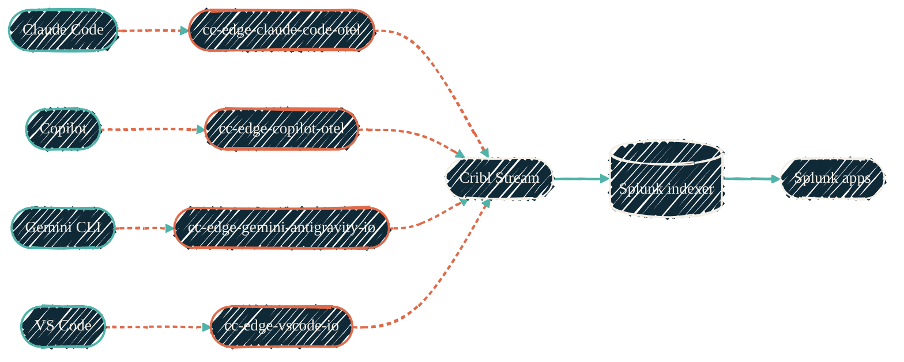

> If an AI agent touched code, there's a trace.

Every AI coding interaction emits OpenTelemetry — IDE events, model calls, token counts, latency, cost. The Cribl Edge tier collects and reshapes it. Cribl Stream routes it. Splunk indexes it. Purpose-built Splunk apps make it readable.

## AI telemetry pipeline

{/* Shape: parallel convergence (4 tools → 4 packs → Stream → Splunk → apps). */}
{/* Boundary crossings: 0. Total nodes: 11 (≤12). Aspect: ~3:1 LR. Pass. */}

Coral dashed edges are telemetry; solid green are the routing hops. Per-tool packs keep parsing isolated — a Copilot schema change doesn't break the Claude pipeline.

## Splunk apps

The AI-observability apps and TAs live under a separate organization at
[github.com/visicore](https://github.com/visicore). Two pieces matter on this site:

| Component | What it does |
| --- | --- |
| Dashboards (app) | Dashboard Studio v2. Cost, usage, performance per model, per project, per developer. |
| Technology add-on (TA) | Field aliases, CIM mappings, lookups, search-time transforms. The normalization layer. |

## Cribl Edge packs (collectors)

| Repo | Collects from |
| --- | --- |
| [cc-edge-claude-code-otel](https://github.com/JacobPEvans/cc-edge-claude-code-otel) | Claude Code (OTEL hooks) |
| [cc-edge-copilot-otel](https://github.com/JacobPEvans/cc-edge-copilot-otel) | GitHub Copilot Chat (OTLP gRPC) |
| [cc-edge-vscode-io](https://github.com/JacobPEvans/cc-edge-vscode-io) | VS Code (logs + telemetry) |
| [cc-edge-gemini-antigravity-io](https://github.com/JacobPEvans/cc-edge-gemini-antigravity-io) | Gemini Antigravity |
| [cc-edge-the-mac-pack-io](https://github.com/JacobPEvans/cc-edge-the-mac-pack-io) | macOS system health (auxiliary signal) |
| [cc-edge-macos-system](https://github.com/JacobPEvans/cc-edge-macos-system) | macOS-native system events |

## Cribl Stream collectors

| Repo | What it does |
| --- | --- |
| [cc-stream-github-copilot-rest-io](https://github.com/JacobPEvans/cc-stream-github-copilot-rest-io) | GitHub Copilot usage metrics via REST API. Per-org / per-seat usage data. |

## Why per-tool packs

Each AI coding tool emits slightly different telemetry shapes. Per-tool packs keep the parsing and enrichment isolated; a Copilot schema change shouldn't break the Claude pipeline. The shared CIM mapping in the TA is where the normalization happens.

## Where Splunk runs

<CardGroup cols={2}>
  <Card title="tf-splunk-aws" icon="aws" href="/observability/tf-splunk-aws">
    Terraform for the AWS-side Splunk footprint. VPC, KMS, EC2, IAM — DR-ready.
  </Card>
  <Card title="ansible-splunk" icon="screwdriver-wrench" href="/observability/ansible-splunk">
    The configuration tier. Splunk install, indexes, HEC tokens, storage tiering.
  </Card>
</CardGroup>

## Where to go next

<CardGroup cols={2}>
  <Card title="Mac Pack" icon="apple" href="/observability/cc-edge-the-mac-pack">
    The macOS host telemetry pack — unified logs, system metrics, power.
  </Card>
  <Card title="Monitoring agents" icon="chart-line" href="/observability/monitoring-agents">
    Cross-stack map of every collector and where it runs.
  </Card>
  <Card title="Data pipelines" icon="diagram-project" href="/architecture/data-pipelines">
    Log and NetFlow ingest — the non-AI side of the pipeline.
  </Card>
  <Card title="Configuration" icon="screwdriver-wrench" href="/configuration/overview">
    Ansible playbooks that deploy the Cribl tier this pipeline runs on.
  </Card>
</CardGroup>
