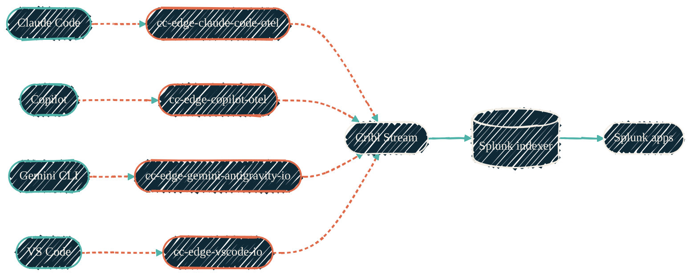

> If an AI agent touched code, there's a trace.

Every AI coding interaction emits OpenTelemetry — IDE events, model calls, token counts, latency, cost. The Cribl Edge tier collects and reshapes it. Cribl Stream routes it. Splunk indexes it. Purpose-built Splunk apps make it readable.

## AI telemetry pipeline

{/* Shape: parallel convergence (4 tools → 4 packs → Stream → Splunk → apps). */}
{/* Boundary crossings: 0. Total nodes: 11 (≤12). Aspect: ~3:1 LR. Pass. */}

Coral dashed edges are telemetry; solid green are the routing hops. Per-tool packs keep parsing isolated — a Copilot schema change doesn't break the Claude pipeline.

Diagram walkthroughs for every ingest path — syslog families, AI-CLI shipping, the LLM stack, OTLP dual-write, NetFlow, HEC fan-in — live on [Pipeline flows](/observability/pipeline-flows).

## Syslog ingest families

Syslog ingest is **one port per source family**, fronted by the ingress load balancers (HAProxy for TCP, nginx for UDP). Each family routes to its own Splunk index with a family sourcetype, so a misbehaving sender is isolated at the port and visible at the index.

| Family | Standard port | High port | Index | Sourcetype |
| --- | --- | --- | --- | --- |
| `unifi` | 514 | 1514 | `unifi` | `unifi` |
| `palo_alto` | 515 | — | `firewall` | `palo_alto` |
| `cisco_asa` | 516 | — | `firewall` | `cisco_asa` |
| `linux` | 517 | — | `os` | `linux` |
| `windows` | 518 | — | `os` | `windows` |
| `honeypot` | 519 | — | `honeypot` | `honeypot` |
| `unifi_fw` | 520 | — | `firewall` | `unifi_fw` |
| `macos` | 521 | — | `os` | `macos` |
| `dns_query` | 522 | — | `dns` | `dns_query` |
| `proxy` | 523 | — | `proxy` | `proxy` |

Port numbers are pipeline constants defined once in the infrastructure repo and surfaced to every consumer through the published inventory — no repo hardcodes them.

Two family notes:

- **Hypervisor firewall drops** ride the `linux` family: the node firewall
  logs every default-policy DROP to a file (never the journal), so each node's
  rsyslog tails that file with `imfile` and forwards it alongside the journal
  stream. Searchable as `index=os process=pve-firewall`.
- **The `macos` family (521) is intentionally unused.** BSD syslogd emits
  RFC3164 (no year, no timezone) and workstations deliberately keep local
  time, so a syslogd remote-forward can never be skew-safe. Macs ship through
  their local Cribl Edge instead (see below), whose sources carry absolute,
  TZ-qualified timestamps.

## Timestamps: UTC at the source

Every host except the workstation Macs runs **and logs** UTC — enforced by
configuration management, not assumed. This is doctrine, not preference: the
pipeline's config normalizer strips per-source timezone overrides on restart,
so a source that stamps local time cannot be corrected downstream. A skewed
source is fixed at the source. Skew is measured with index-time
(`eval skew=_indextime-_time`), because event-time windows silently miss
mis-stamped events instead of surfacing them.

## AI log ports (tcpjson)

AI-side logs skip syslog entirely: Cribl Edge tails the local log files and ships them as **tcpjson** over Cribl S2S to Cribl Stream, one port per source.

| Port range | Source |
| --- | --- |
| 10300 | Shared S2S — sources that stamp their index locally (Mac firewall unified-log, host metrics) |
| 10311–10315 | AI CLI logs (one port per CLI — Claude Code and friends) |
| 10321–10323 | Local LLM stack logs (gate, router, workers) |
| 10331 | OpenBao audit log |

The Mac firewall leg tails the unified log (application firewall, network
extension, packet filter subsystems) as ndjson via a launch daemon, and the
local Edge ships it with `index=firewall` stamped at the source — unified-log
timestamps carry a UTC offset, so a local-time workstation stays skew-safe.

Edge-to-Stream relay traffic itself rides Cribl S2S tcpjson on the dedicated `cribl_s2s` service port from the same pipeline constants.

## Per-index HEC outputs and derived tokens

Cribl Stream is the only component that talks to Splunk, and it does so through **one HEC output per index**, each with its own token. Tokens are never distributed: both sides derive the same value as a UUIDv5 of `splunk-hec-<index>` in a shared private namespace, so Cribl outputs and Splunk HEC inputs agree by construction. The namespace UUID is the only secret; a leaked token scopes to a single index.

Each index also has a **silence detector** — a per-index alert that fires when the index stops receiving events within its expected cadence. A broken port, token, or sender surfaces as "index went quiet" instead of a silent gap discovered weeks later. Detectors on structurally-empty indexes ship disabled (currently `netflow`, whose gateway never exports despite the receive chain being armed) — an alert that fires on every cycle only trains fatigue.

## Splunk apps

The AI-observability apps and TAs live under a separate organization at
[github.com/visicore](https://github.com/visicore). Two pieces matter on this site:

| Component | What it does |
| --- | --- |
| Dashboards (app) | Dashboard Studio v2. Cost, usage, performance per model, per project, per developer. |
| Technology add-on (TA) | Field aliases, CIM mappings, lookups, search-time transforms. The normalization layer. |

## Cribl Edge packs (collectors)

| Repo | Collects from |
| --- | --- |
| [cc-edge-claude-code-otel](https://github.com/JacobPEvans/cc-edge-claude-code-otel) | Claude Code (OTEL hooks) |
| [cc-edge-copilot-otel](https://github.com/JacobPEvans/cc-edge-copilot-otel) | GitHub Copilot Chat (OTLP gRPC) |
| [cc-edge-vscode-io](https://github.com/JacobPEvans/cc-edge-vscode-io) | VS Code (logs + telemetry) |
| [cc-edge-gemini-antigravity-io](https://github.com/JacobPEvans/cc-edge-gemini-antigravity-io) | Gemini Antigravity |
| [cc-edge-the-mac-pack-io](https://github.com/JacobPEvans/cc-edge-the-mac-pack-io) | macOS system health (auxiliary signal) |
| [cc-edge-macos-system](https://github.com/JacobPEvans/cc-edge-macos-system) | macOS-native system events |

## Cribl Stream collectors

| Repo | What it does |
| --- | --- |
| [cc-stream-github-copilot-rest-io](https://github.com/JacobPEvans/cc-stream-github-copilot-rest-io) | GitHub Copilot usage metrics via REST API. Per-org / per-seat usage data. |

## Why per-tool packs

Each AI coding tool emits slightly different telemetry shapes. Per-tool packs keep the parsing and enrichment isolated; a Copilot schema change shouldn't break the Claude pipeline. The shared CIM mapping in the TA is where the normalization happens.

## Where Splunk runs

<CardGroup cols={2}>
  <Card title="tf-splunk-aws" icon="aws" href="/observability/repos/tf-splunk-aws">
    OpenTofu for the AWS-side Splunk footprint. VPC, KMS, EC2, IAM — DR-ready.
  </Card>
  <Card title="ansible-splunk" icon="screwdriver-wrench" href="/observability/repos/ansible-splunk">
    The configuration tier. Splunk install, indexes, HEC tokens, storage tiering.
  </Card>
</CardGroup>

## Where to go next

<CardGroup cols={2}>
  <Card title="Mac Pack" icon="apple" href="/observability/repos/cc-edge-the-mac-pack">
    The macOS host telemetry pack — unified logs, system metrics, power.
  </Card>
  <Card title="Monitoring agents" icon="chart-line" href="/observability/monitoring-agents">
    Cross-stack map of every collector and where it runs.
  </Card>
  <Card title="Data pipelines" icon="diagram-project" href="/architecture/data-pipelines">
    Log and NetFlow ingest — the non-AI side of the pipeline.
  </Card>
  <Card title="Configuration" icon="screwdriver-wrench" href="/configuration/overview">
    Ansible playbooks that deploy the Cribl tier this pipeline runs on.
  </Card>
</CardGroup>
