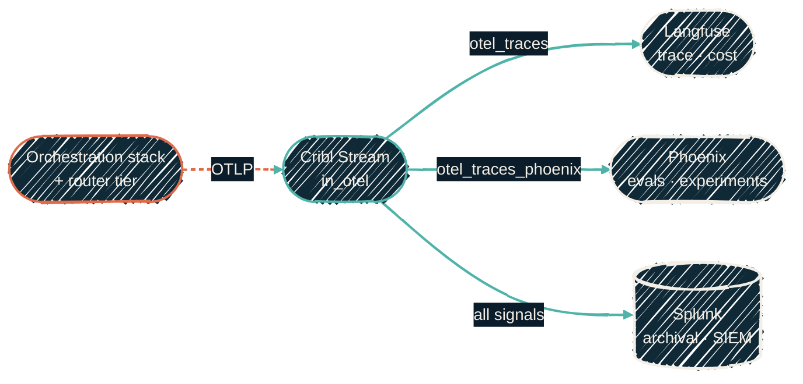

{/* projected from the authoring site; do not edit here */}
> Same spans, second viewer. Langfuse shows what a call cost; Phoenix lets you score it, replay it, and run experiments against it.

[LLM observability](/observability/llm-observability) sends every LLM trace through
Cribl Stream, which fans it out to Langfuse and Splunk. Phoenix is a third leg on
that same input. Nothing upstream changed: the apps still emit to the collector,
and the collector still decides where spans go.

## Why a second trace viewer

Langfuse and Phoenix overlap on tracing, but they lean in different directions.

| Need | Langfuse | Phoenix |
| --- | --- | --- |
| Trace waterfalls, token cost, prompt inspection | yes | yes |
| Prompt versioning | yes | yes |
| Datasets and versioned experiments | basic | first-class |
| LLM-as-judge evals with a built-in eval library | limited | first-class (`arize-phoenix-evals`) |
| Prompt playground that replays a captured call | no | yes |
| MCP endpoint so an agent can query its own traces | no | yes |

Phoenix is not a replacement. Langfuse stays the trace-of-record and keeps the
cost view. Phoenix is where you take a bad trace and turn it into a test case.

## Self-hosting and license

Arize sells a cloud product (Arize AX) that you cannot self-host. Phoenix is the
open server underneath it, and it self-hosts as one container plus Postgres.

| Item | Phoenix |
| --- | --- |
| License | [Elastic License 2.0](https://www.elastic.co/licensing/elastic-license) |
| What ELv2 forbids | Offering Phoenix to third parties as a managed service; circumventing license-key code; stripping notices |
| What it allows here | Internal use and modification, with no seat, trace, or feature limit. For anything beyond that, read the license text |
| License key | None. Nothing in the server is feature-gated |
| Ingestion | Native OTLP over HTTP and gRPC, OpenInference and OTel GenAI attributes as emitted |
| Auth | Local accounts, API keys, generic OIDC (Authelia here) |
| Metrics | Prometheus `/metrics`, scraped by the observability node |
| Footprint | `arizephoenix/phoenix` + Postgres |

For a homelab, ELv2 costs nothing. The clause to keep in mind is the
managed-service one, which applies if you offer your instance to other people.
This page is a summary, not legal advice.

<Note>
Why not Helicone? It is Apache 2.0 and unlimited too, but it is proxy-based.
It only sees traffic that passes through its own gateway or SDK, and it has
no OTLP intake. Cribl cannot fan out to it, so it would need every producer
re-pointed at a second front door. Its standalone gateway repository had no feature commits
after July 2025 and was relicensed to GPL-3 that November (checked September
2026). Phoenix fits the existing pipeline; Helicone would replace part of it.
</Note>

## Where it sits

{/*Shape: fan-out. Cribl Stream -> three sinks. Total nodes: 5.*/}

The Phoenix leg runs its own Cribl pipeline. It keeps the same guards as the
Langfuse leg: drop non-trace signals, drop plumbing spans, trim noise, and
redact credentials. It skips the Langfuse-specific attribute rewrites,
because Phoenix reads the emitted GenAI attributes as they are. Both
pipelines loop over the same lists in the Cribl role, so there is one place
to add a span name or a redaction pattern.

## Reaching it

Phoenix follows the [two rules](/observability/llm-observability#reaching-the-pipeline-subdomains-tls-and-who-gets-gated)
every service in this stack follows.

- **Humans** open `https://phoenix.<subdomain>/` and sign in through Authelia.
  Phoenix auto-creates a user on first SSO login, because Authelia already
  decides who may reach the app.
- **Cribl** POSTs to `/v1/traces` on the same host with a bearer API key minted
  in Phoenix. That path sits outside the Authelia gate, so an unauthenticated
  call gets Phoenix's own `401`, never a login redirect.

That API key is the one manual step. Phoenix mints it after first boot, and it
goes into OpenBao where the Cribl role reads it. Until it is seeded, the Cribl
converge fails loudly rather than rendering an empty credential.

## Where to go next

<CardGroup cols={2}>
<Card
  title="LLM observability"
  icon="microchip"
  href="/observability/llm-observability">
  The OTLP pipeline Phoenix hangs off.
</Card>
<Card
  title="Pipeline flows"
  icon="diagram-project"
  href="/observability/pipeline-flows">
  Every ingest leg, including the OTLP fan-out.
</Card>
<Card
  title="ansible-proxmox-ai"
  icon="screwdriver-wrench"
  href="/infrastructure/repos/ansible-proxmox-ai">
  Deploys Phoenix beside Langfuse.
</Card>
<Card
  title="AI orchestration stack"
  icon="diagram-project"
  href="/ai-development/ai-orchestration-stack">
  The tools whose calls both viewers trace.
</Card>
</CardGroup>
