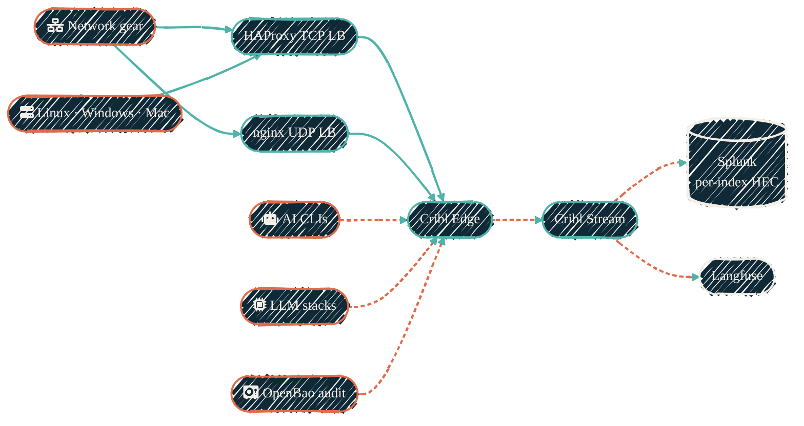
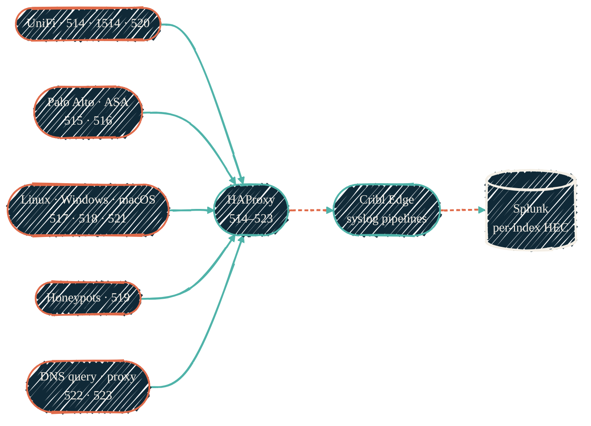
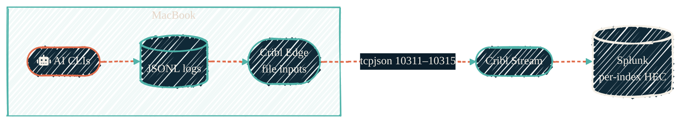
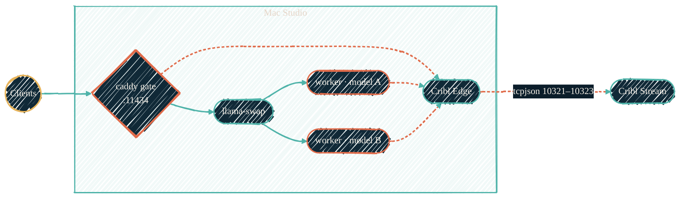
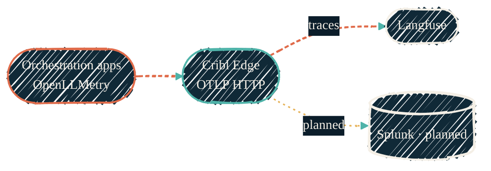
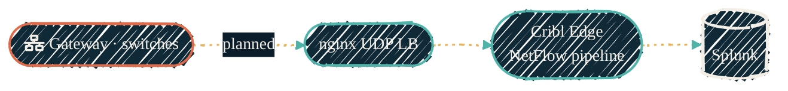
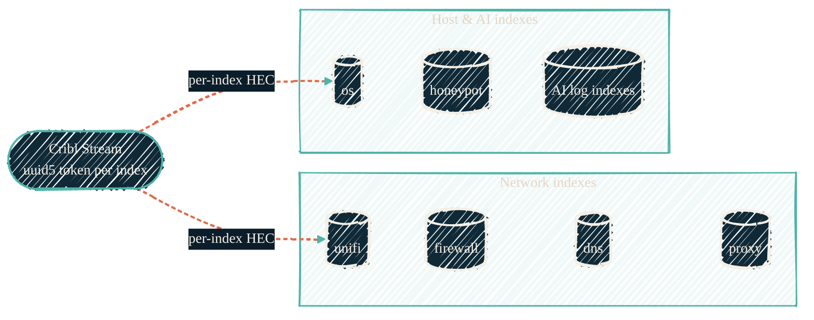
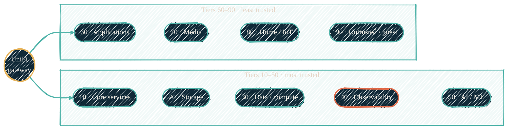

> One overview, six zooms. Every source, every port, every index — and which legs are live versus planned.

Every log and metric in this homelab converges on the same spine: sources reach an ingress load balancer or a local Cribl Edge, Cribl Stream routes, and Splunk indexes over per-index HEC. The diagrams below zoom into each ingest path. Flows that are not live yet carry a **planned** badge. The [family/port/index tables](#source--port--index-map) at the end cover every syslog family and AI log port.

## Monitoring overview

Five source groups, two ingress load balancers (HAProxy for TCP syslog, nginx for UDP), one Cribl Edge/Stream spine, two sinks: Splunk (per-index HEC) and Langfuse (OTLP traces).

{/* Shape: parallel convergence. Boundary crossings: 0 (no subgraphs). */}
{/* Ranks: 5 sources max. Total nodes: 11 (≤12). Aspect: ~2:1 LR. Pass. */}

Solid green edges are the network/ingress hops; dashed coral edges carry telemetry. Everything below zooms into one leg of this picture.

## Syslog families

Each syslog source family gets its own ingress port (514–523, plus the high port 1514 for UniFi), so a misbehaving sender is isolated at the port and each family routes to its own index. Ports come from the pipeline constants in the infrastructure repo — never hardcoded.

{/* Shape: parallel convergence. Boundary crossings: 0. */}
{/* Ranks: 5 sources max. Total nodes: 8 (≤12). Aspect: ~2.5:1 LR. Pass. */}

The full family → port → index → sourcetype table lives on the [observability overview](/observability/overview#syslog-ingest-families).

## AI-CLI log shipping

AI CLI logs never touch syslog. Each CLI writes local JSONL log files; the MacBook's standalone Cribl Edge tails them with file inputs and ships them as tcpjson (one port per CLI, 10311–10315) straight to Cribl Stream, which lands them in per-index HEC outputs.

{/* Shape: linear chain. Boundary crossings: 1 (Edge -> Stream). */}
{/* Ranks: ≤3 in subgraph. Total nodes: 5 (≤12). Aspect: ~3:1 LR. Pass. */}

## Mac Studio LLM stack

Local inference on the Mac Studio: clients hit the caddy gate on `:11434`, which fronts llama-swap, which spins model workers up and down. Logs and metrics from all three layers leave through the host's Cribl Edge on tcpjson ports 10321–10323.

{/* Shape: hierarchy with telemetry exit. Boundary crossings: ≤1 per edge. */}
{/* Ranks: ≤2 siblings. Subgraph: 5 nodes (cap). Total: 7 (≤12). Aspect: ~2:1 LR. Pass. */}

## OTLP dual-write

Orchestration apps emit OpenTelemetry to Cribl Edge's OTLP HTTP source — never to a backend directly. Edge fans out: traces to Langfuse (live), everything to Splunk (**planned** — the leg is wired but not yet enabled).

{/* Shape: parallel convergence (fan-out). Boundary crossings: 0. */}
{/* Ranks: ≤2. Total nodes: 4 (≤12). Aspect: ~3:1 LR. Pass. */}

## NetFlow *(planned — being revived)*

Flow records from the gateway and switches take the UDP side of the ingress tier. The whole path is **planned / being revived** — amber dotted end to end until it ships again.

{/* Shape: linear chain. Boundary crossings: 0. */}
{/* Ranks: 1 per column. Total nodes: 4 (≤12). Aspect: ~4:1 LR (short chain). Pass. */}

## HEC fan-in

Cribl Stream is the only component with Splunk egress, and it fans out into **one HEC output per index**. Every output carries its own token, derived as a UUIDv5 of `splunk-hec-\<index\>` in a shared private namespace — Cribl and Splunk compute the same token independently, and the namespace UUID is the only secret.

{/* Shape: hub and spokes (leaves chained with invisible links). Boundary crossings: 1 per real edge. */}
{/* Subgraphs: 4 + 3 nodes (≤5 each). Total nodes: 8 (≤12). Aspect: ~2:1 LR. Pass. */}

Every index also carries a [silence detector](/observability/overview#per-index-hec-outputs-and-derived-tokens) — an alert that fires when the index goes quiet.

## Source → port → index map

Every syslog family and every AI log port, in one table. Syslog rides the HAProxy TCP LB (UDP variants via nginx); AI log ports are tcpjson from Cribl Edge to Cribl Stream.

| Source | Family | Port(s) | Index |
| --- | --- | --- | --- |
| UniFi gear | `unifi` | 514 (std) / 1514 (high) | `unifi` |
| Palo Alto firewall | `palo_alto` | 515 | `firewall` |
| Cisco ASA | `cisco_asa` | 516 | `firewall` |
| Linux hosts | `linux` | 517 | `os` |
| Windows hosts | `windows` | 518 | `os` |
| Honeypots | `honeypot` | 519 | `honeypot` |
| UniFi firewall logs | `unifi_fw` | 520 | `firewall` |
| macOS hosts | `macos` | 521 | `os` |
| DNS query logs | `dns_query` | 522 | `dns` |
| Forward proxy | `proxy` | 523 | `proxy` |
| AI CLIs (one port per CLI) | `ai_log` | 10311–10315 | AI CLI log indexes |
| LLM stack (gate · router · workers) | `ai_log` | 10321–10323 | LLM stack log indexes |
| OpenBao | `ai_log` | 10331 | OpenBao audit index |

## The network underneath

The pipeline rides the trust-ordered VLAN tier model: VLAN tag = tier × 10, subnets follow the `192.168.\<vlan-tag\>.0/24` placeholder pattern (real subnets are injected at runtime, never committed). The observability tier (VLAN 40) hosts the ingress LBs, Cribl, and Splunk; every other tier is a log source.

{/* Shape: hub and spokes (tiers chained with invisible links). Boundary crossings: 1 per real edge. */}
{/* Subgraphs: 5 + 4 nodes (≤5 each). Total nodes: 10 (≤12). Aspect: ~2:1 LR. Pass. */}

The full VMID ↔ VLAN convention — how a guest's six-digit ID encodes its tier — is on [VMID & network tier model](/infrastructure/vmid-network-tiers).

## See also

<CardGroup cols={2}>
  <Card title="Observability overview" icon="chart-line" href="/observability/overview">
    The family/port/index tables and the AI telemetry pipeline.
  </Card>
  <Card title="Monitoring agents" icon="satellite-dish" href="/observability/monitoring-agents">
    Every collector, what it collects, where it runs.
  </Card>
  <Card title="LLM observability" icon="microchip" href="/observability/llm-observability">
    The OTLP → Langfuse + Splunk dual-write in depth.
  </Card>
  <Card title="Data pipelines" icon="diagram-project" href="/architecture/data-pipelines">
    The original log/NetFlow architecture page.
  </Card>
</CardGroup>
