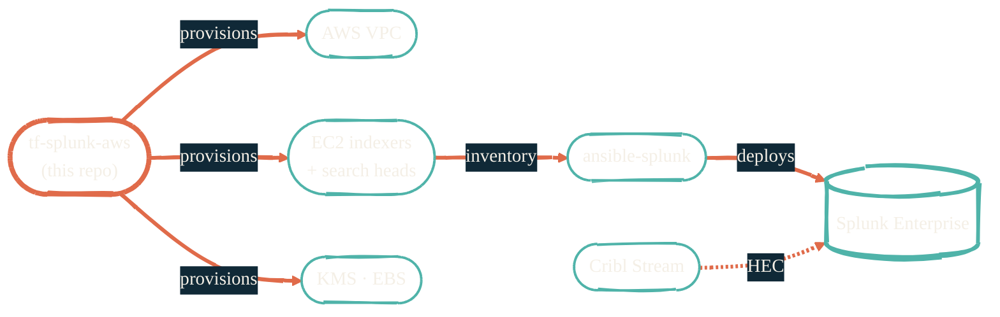

import { RepoMeta, RepoFit } from "/snippets/repo-summary.mdx";

> Splunk on AWS without the enterprise sticker shock. Smaller indexer tier, same data shape.

<RepoMeta language="HCL" status="active" lastActive="this week" repoUrl="https://github.com/JacobPEvans/tf-splunk-aws" />

`tf-splunk-aws` provisions a complete Splunk Enterprise footprint on AWS: VPC, subnets, security groups, KMS keys, IAM roles, EBS volumes, EC2 instances ready for the [`ansible-splunk`](/observability/ansible-splunk) role to land on. The shape is intentional — smaller, cost-optimized indexer tier suitable for DR or workload offload.

## What it does

- Builds an isolated VPC with public/private subnets, NAT, and VPC endpoints
- Provisions KMS-encrypted EBS volumes for hot, warm, and cold indexer tiers
- Defines IAM roles with least-privilege access for Splunk components
- Outputs an inventory that `ansible-splunk` consumes directly
- Wraps the [Terraform AWS Provider](https://registry.terraform.io/providers/hashicorp/aws/latest) with Terragrunt for per-env DRY-ing

## How it fits

<RepoFit>
The AWS infrastructure side of Splunk. Pair with `ansible-splunk` to actually run Splunk on what this provisions.
</RepoFit>

## Getting started

<Steps>
  <Step title="Clone and enter the dev shell">
    `git clone https://github.com/JacobPEvans/tf-splunk-aws && cd tf-splunk-aws && nix develop`
  </Step>
  <Step title="Provide AWS credentials">
    Doppler resolves `AWS_ACCESS_KEY_ID`, `AWS_SECRET_ACCESS_KEY`, and an explicit region per env. Never commit these.
  </Step>
  <Step title="Apply">
    `terragrunt run-all apply` from the chosen env folder. Review the plan; resources are tagged for cost tracking.
  </Step>
  <Step title="Hand off to Ansible">
    Outputs go to the inventory `ansible-splunk` reads. Configuration takes over from there.
  </Step>
</Steps>

## Related repos

<CardGroup cols={2}>
  <Card title="ansible-splunk" icon="screwdriver-wrench" href="/observability/ansible-splunk">
    Configures the Splunk Enterprise install on what this provisions.
  </Card>
  <Card title="Observability overview" icon="chart-line" href="/observability/overview">
    Where this fits in the OTEL → Cribl → Splunk pipeline.
  </Card>
  <Card title="terraform-aws" icon="aws" href="https://github.com/JacobPEvans/terraform-aws">
    The broader AWS DR footprint repo this complements.
  </Card>
  <Card title="Source on GitHub" icon="github" href="https://github.com/JacobPEvans/tf-splunk-aws">
    Modules, env folders, full README.
  </Card>
</CardGroup>
