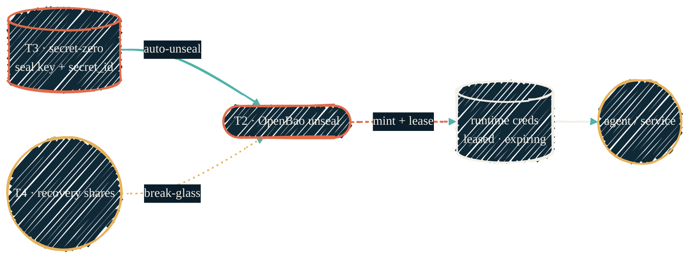
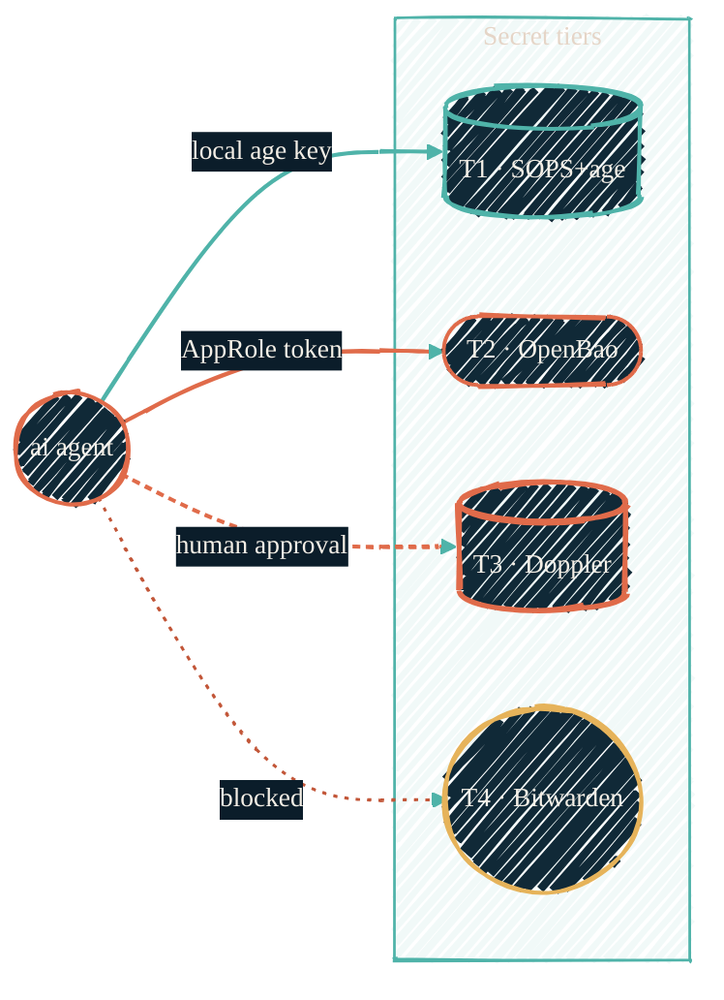
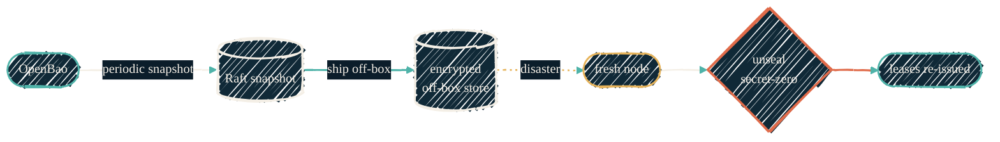

> Four tiers, one rule each. A tool earns its tier by *who* can read it and *how* — not by what it happens to store today.

Seven tools show up across this section, and on their own they read like a grab-bag. The organizing idea is a **four-tier model**: every secret lives in exactly one tier, and the tier — not the tool's feature list — decides whether an AI agent, a machine, or only a human can reach it. This page is the map; the per-tool pages are the detail.

## The four tiers

| Tier | Role | Canonical tool | Who reads it |
| --- | --- | --- | --- |
| **T1 — Repo-local** | Encrypted-at-rest config that travels *with* the code it configures | SOPS + age | AI and machines, via a path-gated local age key |
| **T2 — Runtime manager** | The self-hosted source of truth for live machine credentials, and the **primary AI/machine interface** | OpenBao | AI and machines, via AppRole / signed SSH cert — no human in the loop |
| **T3 — Strict cloud** | Cloud-hosted keys-to-the-kingdom; also holds *secret-zero* that bootstraps T2 | Doppler | Machines for a narrow set; AI only under **explicit, per-use human approval** |
| **T4 — Never-AI human** | Break-glass and crown jewels — recovery shares, master keys, account passwords | Bitwarden | Humans only, at a keyboard, with a second factor |

Two properties make the model hold:

- **The primary path is T2.** An always-on agent authenticates to the self-hosted runtime manager as itself (AppRole) and gets scoped, expiring credentials with zero interactive prompts. That is the default read path for automation — not the cloud tier, not the keychain.
- **Secret-zero lives one tier up.** T2 cannot bootstrap itself from nothing: its static seal key and the AppRole `secret_id` that agents use to authenticate are held in T3. T3 is therefore small, tightly scoped, and only AI-reachable under human approval. T4 holds the human-only recovery material that can rebuild everything if both T2 and T3 are lost.

## The tool matrix

Every tool this section documents, scored on the axes that decide its tier. "AI tier" is where the tool sits in the model above; several tools are transitional and are folding into T2.

| Tool | Self-hosted | Offline reads | Machine auth | RBAC granularity | Rotation | AI tier | Cost model |
| --- | --- | --- | --- | --- | --- | --- | --- |
| **SOPS + age** | Yes — files in git | Yes — local age key | age keypair | Per file / path | Manual re-encrypt | **T1** | Free (OSS) |
| **OpenBao** | Yes — homelab service | LAN-only (needs the service) | AppRole, SSH-CA cert, TLS cert | Fine — per-path policy × per-role | Native leases + scheduled rotation | **T2 — primary** | Free (MPL fork of Vault 1.14) |
| **Doppler** | No — SaaS | No | Service token | Project / config / env | Scheduled token rotation | **T3 — human-approved** | Free tier + paid seats |
| **Bitwarden** | No — SaaS (Vaultwarden self-host on roadmap) | No — needs unlock | None — human unlock only | Collections | Manual | **T4 — never-AI** | Free / paid |
| **macOS Keychain** | Yes — local, OS-backed | Yes | None — GUI / login unlock | Two DBs by unlock posture | Manual | Interactive convenience; automated reads retire to T2 | Free (OS) |
| **aws-vault** | Yes — local, keychain-backed | Yes — cached STS | MFA session | Per AWS profile | STS auto-expiry | Interactive convenience; automated STS retires to T2 | Free (OSS) |
| **BWS** | No — SaaS (Bitwarden Secrets Manager) | No | Access token | Per project | Manual | Programmatic AI tokens; folds into T2 / T3 | Free / paid |
| **Infisical** | Was self-hosted | — | Universal Auth (TTL, IP-bound) | Project / env | TTL on identities | **Decommissioning** — role splits into T2 (runtime) + T3 (cloud) | — |

Two rows are on their way out. **Infisical** was briefly the static-app-secrets backbone; that role collapses into T2 (runtime credentials) and T3 (cloud-shared keys), so it is being migrated out and decommissioned. **aws-vault** and the automated use of **macOS Keychain** are interactive-convenience tools whose *machine* paths move to T2's AWS secrets engine and token-file reads — the human at a laptop keeps them, headless agents do not.

## How the tiers bootstrap — root of trust to runtime creds

T2 is the primary interface, but it cannot start sealed-and-empty on its own. The automated path unseals it from secret-zero in T3; the human recovery shares in T4 are the break-glass fallback, never the routine path.

{/* Shape: parallel convergence. Two origins → OpenBao → creds → consumer. Ranks ≤3 wide. Boundary crossings: 0. Pass. */}

## An AI agent's read path, by tier

The same agent reaches different tiers by different means. T2 is the default and needs no human. T3 is reachable only when a human approves that specific keys-to-the-kingdom operation. T4 is structurally unreachable — there is no programmatic bridge to it at all.

{/* Shape: hub and spokes. 1 hub + 4 leaves in one subgraph. Each edge crosses 1 boundary. Pass. */}

## Rotation and disaster recovery

T2's value is only as good as its recoverability. Rotation is native — leases expire and re-issue on their own — and durability comes from periodic **Raft snapshots** shipped off-box, restorable onto a fresh node and unsealed from the same secret-zero the routine bootstrap uses.

{/* Shape: linear chain. 6 nodes, one timeline. Aspect ~3:1 LR. Pass. */}

## The runtime manager is also the lock authority

T2 does one more job the other tiers cannot: it is the **global flow-lease authority**. A single lease in its KV store (compare-and-set, so two writers cannot both win) gates every mutating flow — a tofu apply, an ansible run, an agent that changes infrastructure. The rule is credential-gating: **no lease, no credentials.** An agent that cannot take the lease cannot get the short-lived creds it would need to do the mutation, so serialization is enforced at the point where secrets are issued, not merely by convention. This pairs with the OpenTofu state lock described in the [deployment state contract](/infrastructure/deployment-state-contract#single-writer-locking--the-direction).

## See also

<CardGroup cols={2}>
  <Card title="OpenBao" icon="lock" href="/security/tools/openbao">
    The T2 runtime manager — AppRole auth, SSH CA, and the lease authority.
  </Card>
  <Card title="Doppler" icon="cloud" href="/security/tools/doppler">
    The T3 strict cloud tier and secret-zero holder.
  </Card>
  <Card title="Bitwarden vault" icon="shield-halved" href="/security/tools/bitwarden">
    The T4 never-AI human tier.
  </Card>
  <Card title="SOPS" icon="file-shield" href="/security/tools/sops">
    The T1 repo-local encrypted-config layer.
  </Card>
  <Card title="Agent secrets" icon="robot" href="/autonomous-agents/secrets">
    The headless read path — zero interactive prompts for always-on agents.
  </Card>
  <Card title="Security overview" icon="scale-balanced" href="/security/overview">
    Where the four-tier model sits in the whole secrets story.
  </Card>
</CardGroup>

For dryvist-internal specifics (host topology, policy paths, lease TTLs), see [`docs.dryvist.com`](https://docs.dryvist.com).
