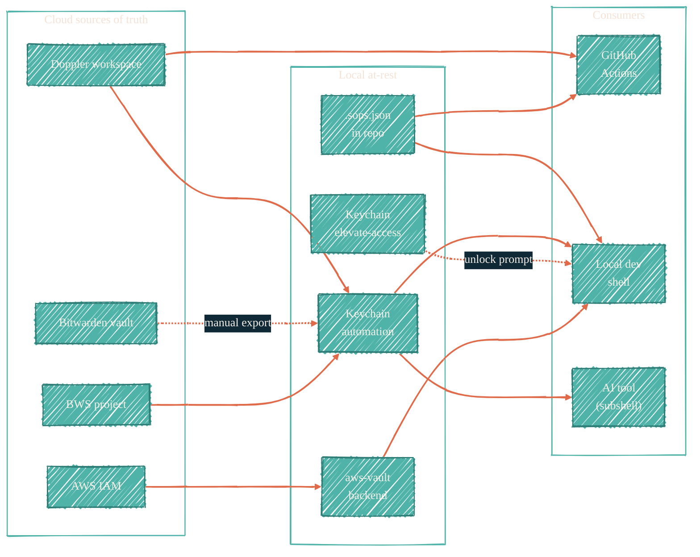
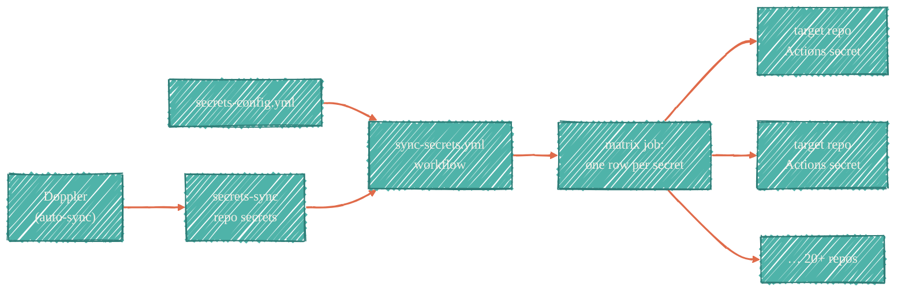

> Seven tools, four flows. Each flow earns its own diagram.

The tools page lists what each one does. This page shows how they connect. Read it once; then jump to the per-tool deep dives for the operational details.

## Tool topology

Every tool maps to one storage backend. Sources of truth on the left, consumers on the right.

Bitwarden's dotted line is intentional — it's never read programmatically. Anything that needs CI or AI access lives elsewhere.

## CI flow — Doppler to GitHub Actions secrets

`secrets-sync` is the distribution layer. Doppler holds the truth; `secrets-sync` fans it out to every target repo's GitHub Actions secrets.

Tier-2 infra secrets (database passwords, RunsOn license) skip `secrets-sync` and fetch from Doppler at workflow runtime via `dopplerhq/secrets-fetch-action`.

## Local-dev flow — aws-vault into Doppler into Terragrunt

The canonical chain for every Terraform root: AWS Vault opens an MFA session, Doppler injects the runtime config, Terragrunt runs.

One profile per Terraform root. Profile names match root names (`tf-proxmox`, `tf-runs-on`). MFA caches for the configured session TTL.

## AI-session flow — launchers and the disappearing env

The launcher wraps `claude` in a subshell. Inside the subshell, the token is exported; the moment `claude` exits, the subshell exits and the env reverts. The parent shell never sees the token.

```mermaid
%%{init: {'theme':'base','look':'handDrawn','themeVariables':{'primaryColor':'#4FB3A9','primaryTextColor':'#F4EFE6','primaryBorderColor':'#2F7E78','lineColor':'#E06B4A','secondaryColor':'#102937','tertiaryColor':'#0B1D2A','clusterBkg':'transparent','clusterBorder':'#4FB3A9','fontFamily':'Geist','fontSize':'15px'}}}%%
flowchart LR
  P0["parent shell<br/>no token"] -->|"gh-claude-restricted"| Sub["launcher subshell"]
  Sub -->|"security find-generic-password"| Kc["Keychain<br/>(automation)"]
  Kc -->|"GITHUB_TOKEN exported<br/>in subshell only"| Cl["claude process"]
  Cl -->|"exit"| Done["subshell exits"]
  Done -->|"env reverts"| P1["parent shell<br/>still no token"]

  linkStyle default stroke:#E06B4A,stroke-width:2px
```

The `elevate-access` keychain (PRIVATE, ADMIN) requires a user unlock prompt, so the AI cannot use it non-interactively. See [Local AI isolation](/security/local-ai-isolation) for the full proof.

## One-line flow summary

| Flow | Path |
| --- | --- |
| CI Tier 1 secret | Doppler → `secrets-sync` repo → matrix job → target repo Actions secret |
| CI Tier 2 secret (infra) | Doppler → `dopplerhq/secrets-fetch-action` at workflow runtime → env vars |
| Local Terraform | `aws-vault exec` → `doppler run` → `terragrunt plan` |
| Local AI session | `gh-claude-<tier>` launcher → subshell → keychain read → `exec claude` → exit erases env |
| At-rest encrypted config | `sops -e` → committed `.sops.json` → `sops -d` at CI/local boot |

## Where each flow is documented

- CI Tier 1: [secrets-sync](/security/secrets-sync)
- CI Tier 2: [doppler](/security/tools/doppler#runtime-fetch-via-github-actions)
- Local Terraform: [aws-vault](/security/tools/aws-vault) + [doppler](/security/tools/doppler)
- Local AI session: [local-ai-isolation](/security/local-ai-isolation) + [macos-keychain](/security/tools/macos-keychain)
- Encrypted config: [sops](/security/tools/sops)
