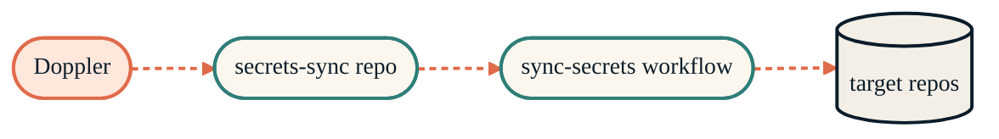
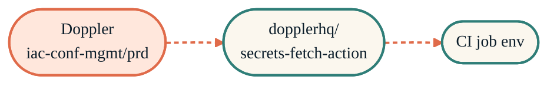
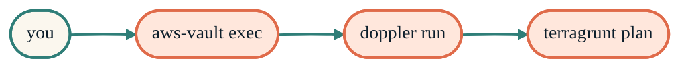

> Seven tools, four flows. Each flow is one row in the table — and one Steps block.

The tools page lists what each one does. This page shows how they connect. Read the table first; the Steps below it expand each flow.

## The flows at a glance

| Flow | Path |
| --- | --- |
| **CI Tier 1 secret** | Doppler → `secrets-sync` repo → matrix job → target repo Actions secret |
| **CI Tier 2 secret (infra)** | Doppler → `dopplerhq/secrets-fetch-action` at workflow runtime → env vars |
| **Local Terraform** | `aws-vault exec` → `doppler run` → `terragrunt plan` |
| **Local AI session** | `gh-claude-<tier>` launcher → subshell → keychain read → `exec claude` → exit erases env |
| **At-rest encrypted config** | `sops -e` → committed `.sops.json` → `sops -d` at CI/local boot |

## CI Tier 1 — Doppler distributes via secrets-sync

{/* Shape: linear chain. 4 nodes. Aspect: ~3:1 LR. */}



## CI Tier 2 — infra fetches at runtime

{/* Shape: linear chain. 3 nodes. */}



The high-sensitivity Doppler config (database passwords, RunsOn license, Qdrant keys) never sits in GitHub Actions secrets. The job fetches at runtime via the read-only service token distributed by Tier 1.

## Local-dev — aws-vault → doppler → terragrunt

{/* Shape: linear chain. 4 nodes. */}



```bash
aws-vault exec tf-proxmox -- doppler run -- terragrunt plan
```

Three nested subprocesses. Each layer injects only into the next; when `terragrunt` exits, the AWS session, the Doppler env, and the parent shell are all untouched.

## Local AI session — launcher subshell

See [Local AI isolation](/security/local-ai-isolation) for the diagram and the full four-layer proof. Short version: the launcher wraps `claude` in a subshell, reads the token from `automation.keychain-db`, exports `GITHUB_TOKEN`, then `exec claude`. When `claude` exits, the subshell exits — and the parent shell's `GITHUB_TOKEN` is still unset.

## Where each flow is documented

- **CI Tier 1**: [secrets-sync](/security/secrets-sync)
- **CI Tier 2**: [doppler](/security/tools/doppler#runtime-fetch-via-github-actions)
- **Local Terraform**: [aws-vault](/security/tools/aws-vault) + [doppler](/security/tools/doppler)
- **Local AI session**: [local-ai-isolation](/security/local-ai-isolation) + [macos-keychain](/security/tools/macos-keychain)
- **Encrypted config**: [sops](/security/tools/sops)
