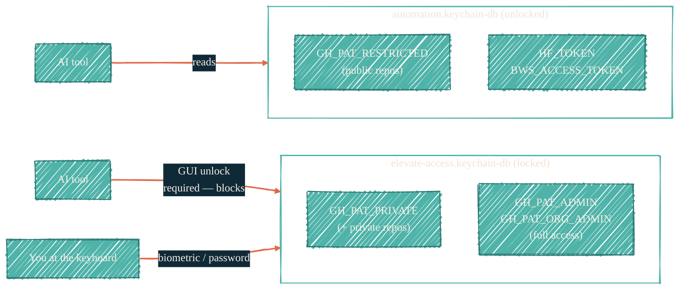
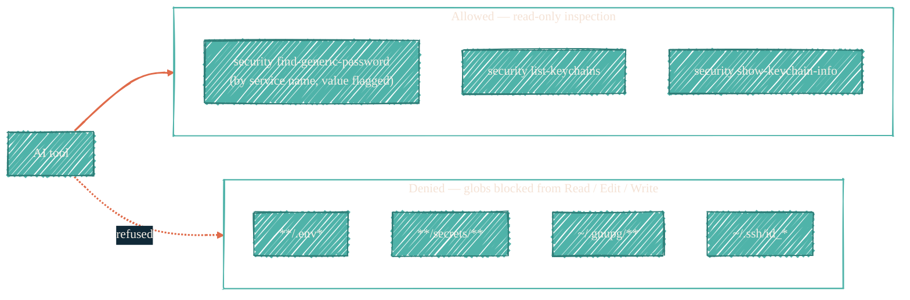

> Three layers of isolation. Each layer is sufficient on its own. Together, they make leakage structurally impossible.

This page is the proof, not just the claim. AI tools running on this workstation cannot read tokens from the locked keychain, cannot persist tokens to the parent shell, and cannot read the file paths where keys live at rest.

## Layer 1 — process scoping via subshells

Every AI launcher runs `claude` inside a subshell. The subshell exports `GITHUB_TOKEN`; when `claude` exits, the subshell exits, and the env reverts. The parent shell never sees the token.


The shell-startup file explicitly `unset GITHUB_TOKEN` at every login, so the parent shell starts clean even after an aborted session.

## The launcher banner (verbatim)

Every launcher prints this to stderr before calling `exec claude`. The banner lands in the AI's tool-output stream so it knows what it can and cannot do this session:

```text
[claude-launchers] custom authentication context is now active
  type:    github-token tier
  context: restricted
  scope:   this claude process only — the parent shell is unaffected

You now have the credentials and capabilities granted by this context.
Tools that auto-detect credentials from the environment (aws, gh, git,
terraform, kubectl, etc.) will pick them up automatically. Nothing
persists once claude exits; the parent shell's environment is untouched.
```

No secret material is ever printed. The banner names the *kind* of context, never the value.

## Layer 2 — keychain tier separation

Secrets live in two separate macOS keychain databases. Only the unlocked one (`automation.keychain-db`) is reachable by an automated `security find-generic-password` call. The other (`elevate-access.keychain-db`) is password-locked and prompts the GUI to unlock — which an AI cannot do.



`gh-claude-restricted` works non-interactively. `gh-claude-private` and `gh-claude-admin` exist for human use but will trigger an unlock prompt; an AI subprocess cannot satisfy it.

## Layer 3 — explicit allow / deny lists in Claude Code

The Claude Code permission system bakes a deny list into the build. Even if the previous two layers were bypassed, the harness refuses the file paths that would yield secret material.



The allow list lets the AI inspect *metadata* — "is there a keychain entry called `GH_PAT_ADMIN`?" — without ever returning the value. Reading the value still requires the launcher path, which goes through the subshell layer.

## Layer 4 — passwordless sudo, but only for `darwin-rebuild`

The `nix-darwin` configuration grants passwordless `sudo` exclusively for two paths: `/run/current-system/sw/bin/darwin-rebuild` and `/nix/var/nix/profiles/system/activate`. Both are declarative — they apply Nix store paths already built. No ad-hoc shell, no read access to anything else.

## What AI can and cannot do

| Capability | AI tool | Why |
| --- | --- | --- |
| Read PAT value from `automation` keychain | ✅ (only via launcher subshell) | Subshell scoping; value never reaches parent |
| Read PAT value from `elevate-access` keychain | ❌ | GUI unlock prompt; AI cannot respond |
| Modify keychain entries | ❌ | `security add-generic-password` not in allow list |
| Read `.env*` files | ❌ | Path glob denied |
| Read `~/.ssh/id_*` private keys | ❌ | Path glob denied |
| Read GPG keys | ❌ | `~/.gnupg/**` denied |
| Run `sudo` outside `darwin-rebuild` | ❌ | sudoers entry is path-restricted |
| Run `doppler run -- <cmd>` | ✅ | Doppler injection at subprocess boundary; same scoping rule as the launchers |

## Source files

For the literal Nix and shell sources behind each layer, see:

- [`nix-darwin/hosts/macbook-m4/gh-token-switching.zsh`](https://github.com/JacobPEvans/nix-darwin/blob/main/hosts/macbook-m4/gh-token-switching.zsh) — the three-tier keychain reader.
- [`nix-darwin/hosts/macbook-m4/claude-launchers.zsh`](https://github.com/JacobPEvans/nix-darwin/blob/main/hosts/macbook-m4/claude-launchers.zsh) — the subshell launchers and banner.
- [`nix-claude-code/data/permissions/allow.nix`](https://github.com/JacobPEvans/nix-claude-code/blob/main/data/permissions/allow.nix) — read-only `security` allow list.
- [`nix-claude-code/data/permissions/deny.nix`](https://github.com/JacobPEvans/nix-claude-code/blob/main/data/permissions/deny.nix) — file-path deny globs.
- [`nix-darwin/modules/darwin/security.nix`](https://github.com/JacobPEvans/nix-darwin/blob/main/modules/darwin/security.nix) — sudoers path restriction.

## See also

- [macOS Keychain](/security/tools/macos-keychain) — the tier model in detail.
- [Doppler](/security/tools/doppler) — for AI-readable CI secrets that *should* be present.
- [BWS](/security/tools/bws) — programmatic AI-token bridge that respects the same scoping rules.
