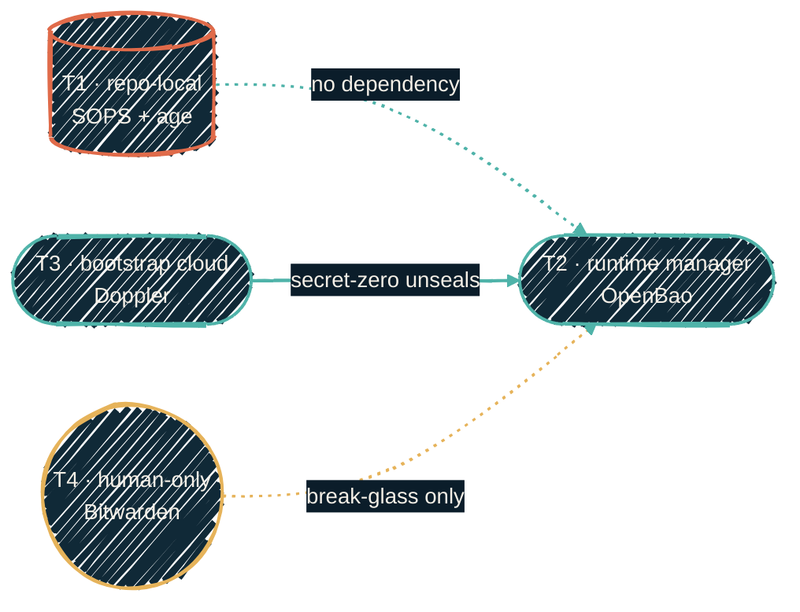

{/* projected from the authoring site; do not edit here */}
> Seven secrets tools, one job each. The boundary between AI-readable and human-only is structural, not policy.

This site is the single public source of truth for the secrets-management story. Each repo's `README.md` keeps only the literal commands its workflow needs; the narrative lives here.

## The four-tier model

Every secret lives in exactly one of four tiers, and the tier, not the tool, decides who can read
it and how. Lower tiers depend on higher ones: T2 is the daily interface, but T3 holds the
secret-zero that unseals it, and T4 is the human-only fallback if both fail.

{/*Shape: linear chain, T1..T4 by trust level. 4 nodes. Aspect: ~4:1 LR.*/}

The [tools comparison](/security/comparison) has the full matrix and the bootstrap, read-path,
and DR flows.

| Tier | Role | Tool | Who reads it |
| --- | --- | --- | --- |
| **T1: Repo-local** | Encrypted-at-rest config that travels with the code | SOPS + age | AI and machines, via a path-gated local age key |
| **T2: Runtime manager** | Self-hosted source of truth for live machine credentials and Terrakube dynamic provider credentials | OpenBao | AI and machines, via scoped native auth or signed SSH cert, with no human in the loop |
| **T3: Bootstrap cloud** | *Secret-zero* that bootstraps T2, plus the few values an external service consumes directly | Doppler | Machines for that narrow set; AI only under explicit, per-use human approval |
| **T4: Never-AI human** | Break-glass and crown jewels | Bitwarden | Humans only, at a keyboard, with a second factor |

The default automation path is T2: an always-on agent authenticates as itself and gets scoped,
expiring credentials with zero interactive prompts. `aws-vault` and automated `macOS Keychain` reads
are interactive-convenience paths whose machine side folds into T2.

## The boundary that matters

| AI-readable (CI + dev) | Human-only |
| --- | --- |
| OpenBao (T2, primary), Doppler (T3, human-approved, secret-zero only), SOPS in-repo, BWS via bridge | Bitwarden vault (T4), the human-only keychain |

## Which tool for which secret

| Tool | Use it for | Deep dive |
| --- | --- | --- |
| **Doppler** | Secret-zero for T2, and the values a hosted service consumes directly: the credentials pushed to GitHub Actions and the licence keys remote CI needs | [doppler](/security/tools/doppler) |
| **macOS Keychain** | Human-only break-glass material and login convenience. No automation tier, and no credential an engine can mint | [macos-keychain](/security/tools/macos-keychain) |
| **AWS Vault** | AWS credentials per OpenTofu root (one profile per root) | [aws-vault](/security/tools/aws-vault) |
| **Mozilla SOPS** | Encrypted OpenTofu / Ansible vars committed to git; initial-bootstrap passwords; internal topology | [sops](/security/tools/sops) |
| **Bitwarden vault** | SSH keys, recovery codes, age-key escrow, account passwords: AI tools never reach this | [bitwarden](/security/tools/bitwarden) |
| **BWS** | Programmatic AI tokens that cannot use the shared `AI_TOKEN` convention, fetched via the Python bridge | [bws](/security/tools/bws) |
| **OpenBao** | The T2 runtime manager: primary AI/machine credential interface, Terrakube dynamic credentials, and SSH CA for automation | [openbao](/security/tools/openbao) |

## What this section covers

<CardGroup cols={2}>
<Card
  title="Tools comparison"
  icon="table-cells"
  href="/security/comparison">
  The four-tier model in full — the tool matrix and the bootstrap, read-path, and DR flows.
</Card>
<Card
  title="Golden laws"
  icon="scale-balanced"
  href="/security/golden-laws">
  The fifteen non-negotiables. Every other page is just an implementation of one of these.
</Card>
<Card
  title="SSH access"
  icon="terminal"
  href="/security/ssh-access">
  The access ladder — certificate-first, why host-key checks are never disabled, and the shape of a break-glass path.
</Card>
<Card
  title="How it fits together"
  icon="diagram-project"
  href="/security/how-it-fits-together">
  Multi-diagram tour of every secret flow — CI, local dev, AI sessions.
</Card>
<Card
  title="secrets-sync architecture"
  icon="rotate"
  href="/security/secrets-sync">
  How Tier 1 secrets reach 20+ GitHub repos through one workflow.
</Card>
<Card
  title="Local AI isolation"
  icon="shield-halved"
  href="/security/local-ai-isolation">
  Why AI tools structurally cannot view protected token values.
</Card>
<Card
  title="Scrubbed values"
  icon="eye-slash"
  href="/security/scrubbed-values">
  Canonical placeholders for IPs, domains, usernames, and tokens in every committed file.
</Card>
</CardGroup>

Internal specifics — workspace names, account IDs, and topology — stay in the private
operational knowledge base and are out of scope for this public site.
