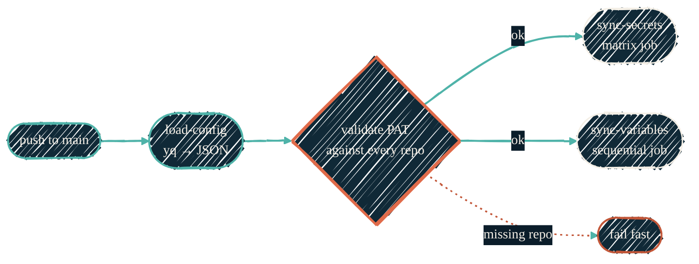

> One YAML file. One workflow. Twenty-plus repos in sync.

[`JacobPEvans/secrets-sync`](https://github.com/JacobPEvans/secrets-sync) is the distribution layer. Doppler holds the source-of-truth values; `secrets-sync` fans them out to every target repo's GitHub Actions secrets and variables. It is intentionally not a vault: it never stores plaintext at rest and never logs values.

## Workflow internals

{/* Shape: parallel convergence. Push → load-config → gate → 2 sync jobs. */}
{/* 6 nodes. Boundary crossings: 0. Aspect: ~3:1 LR. Pass. */}



`load-config` reads `secrets-config.yml` and emits two JSON arrays (`secrets`, `variables`). The fail-fast gate is the most important defence: if the PAT cannot reach any repo named in the config, the run terminates before writing anywhere.

## Repo groupings via YAML anchors

The config uses YAML anchors so each repo joins a group exactly once; secrets reference the group, not the repo list.

| Anchor | Approx. size | Secret kinds it carries |
| --- | --- | --- |
| `_all_repos` | ~23 repos | Broadly-shared (SSH signing key, Slack webhooks, App key) |
| `_github_app_repos` | ~20 repos | GitHub App private key and client secret |
| `_infra_repos` | 2 repos | Doppler service token for runtime fetch |
| `_ai_model_repos` | 5 repos | AI model configuration variables |
| `_claude_bot_repos` | 2 repos | `jacobpevans-claude` App key |
| `_doppler_variable_repos` | 1 repo | Doppler project + config pointers |
| `_runson_repos` | 1 repo | RunsOn healthcheck variables |

Anchors are append-only in practice: a repo joins a group by adding it to the anchor's list, not by referencing it from a single secret. The two-level structure (anchor → secret) keeps the config DRY and reviewable.

## Adding a secret — the high-level path

1. Add the secret value to Doppler (or directly to `secrets-sync` repo if it is not a Doppler-managed value).
2. Add an entry under `secrets:` in `secrets-config.yml`, referencing the appropriate anchor for `repositories:`.
3. Open a PR. CODEOWNERS (you) approves; branch protection requires it.
4. Merge to `main`. The workflow runs and syncs.

For the literal commands (PAT setup, `gh secret set`, dry-run flag, fork-friendly forking), see the [secrets-sync README](https://github.com/JacobPEvans/secrets-sync#readme). That is the operational runbook; this page is the architecture.

## Source / alias semantics

Secrets can have a `source:` field separate from `name:`. When set, the workflow reads the value from `secrets[source]` and writes it to target repos under `name`. This is how a single Doppler-held secret can be distributed under different names per target repo without renaming it in Doppler.

```yaml
- name: GH_APP_PRIVATE_KEY              # what target repos see
  source: GH_ACTION_JACOBPEVANS_PRIVATE_KEY  # what lives in secrets-sync
  repositories: *github_app_repos
```

## Rotation cadence — best practice

- `GH_PAT_SECRETS_SYNC_ACTION` (the PAT the workflow uses): **90 days**, aligned with GitHub's fine-grained PAT default.
- Doppler service tokens (the `DOPPLER_TOKEN` distributed to infra repos): **90 days**, aligned with PAT.
- GitHub App private keys: **annually** or on suspected compromise.
- SSH signing keys: **on key rotation**, which is rare.

Each rotation updates a single value in Doppler (or `secrets-sync` repo secrets) and triggers a fresh workflow run. Target repos pick up the new value automatically.

## What `secrets-sync` is not

- Not a vault. Values are written, never queried by the workflow.
- Not a CI runtime fetcher — Tier 2 infra secrets use `dopplerhq/secrets-fetch-action` at workflow runtime instead.
- Not a label / branch-protection / metadata manager — that is [`dryvist/.github-tofu`](https://github.com/dryvist/.github-tofu).
- Not a bootstrap tool. New repos must already exist; the workflow validates and writes.

## See also

- [Doppler](/security/tools/doppler) — the upstream source of truth for most Tier 1 secrets.
- [macOS Keychain](/security/tools/macos-keychain) — where the `GH_PAT_SECRETS_SYNC_ACTION` token lives locally during initial setup.
- [How it fits together](/security/how-it-fits-together) — flow diagrams placing `secrets-sync` in the larger picture.
