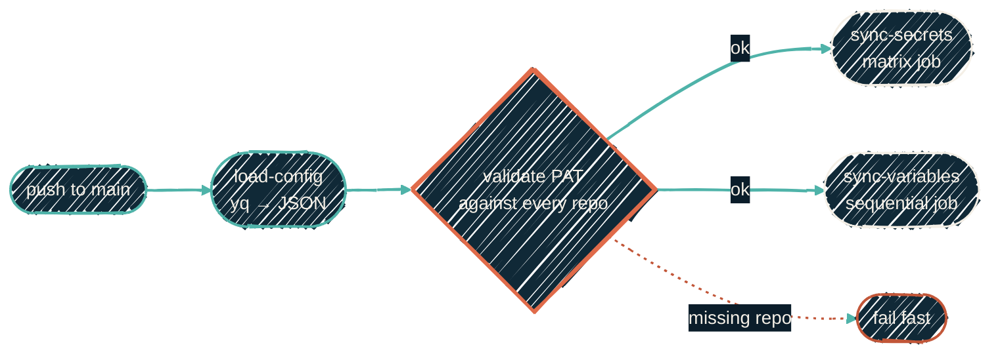

{/* projected from the authoring site; do not edit here */}
> One YAML file. One workflow. Every target repo in sync.

[`JacobPEvans/secrets-sync`](https://github.com/JacobPEvans/secrets-sync) is the distribution layer.
It configures repository secrets and variables and never logs values.

## Configuration changes

Changes to `secrets-config.yml` require CODEOWNERS review.

## Workflow internals

{/*Shape: parallel convergence. Push → load-config → gate → 2 sync jobs. */}
{/* 6 nodes. Boundary crossings: 0. Aspect: ~3:1 LR. Pass.*/}


```mermaid
%%{init:
  {'theme':'base','look':'handDrawn','themeVariables':{'fontFamily':'Geist','fontSize':'14px','primaryColor':'#102937','primaryTextColor':'#F4EFE6','primaryBorderColor':'#4FB3A9','lineColor':'#4FB3A9','secondaryColor':'#0B1D2A','tertiaryColor':'#1A2A38','clusterBkg':'rgba(79,179,169,0.08)','clusterBorder':'#4FB3A9'}}}%%
  flowchart LR
  Push([push to main])
  Load([load-config<br/>yq → JSON])
  Gate{validate PAT<br/>against every repo}
  Sec([sync-secrets<br/>matrix job])
  Vars([sync-variables<br/>sequential job])
  Fail([fail fast])

  Push --> Load --> Gate
  Gate -->|ok| Sec
  Gate -->|ok| Vars
  Gate -->|missing repo| Fail

  classDef trigger fill:#102937,stroke:#4FB3A9,stroke-width:2px,color:#F4EFE6;
  classDef gate    fill:#102937,stroke:#E06B4A,stroke-width:2.5px,color:#F4EFE6;
  classDef job     fill:#102937,stroke:#F4EFE6,stroke-width:1.5px,color:#F4EFE6;
  classDef abort   fill:#102937,stroke:#C25638,stroke-width:2px,color:#F4EFE6;

  class Push,Load trigger
  class Gate gate
  class Sec,Vars job
  class Fail abort

  linkStyle 0,1,2,3 stroke:#4FB3A9,stroke-width:2px;
  linkStyle 4 stroke:#C25638,stroke-width:1.5px,stroke-dasharray:2 4;
```

`load-config` reads `secrets-config.yml` and emits two JSON arrays (`secrets`, `variables`). The
fail-fast gate is the most important defence. If the PAT cannot reach any repo named in the config,
the run terminates before writing anywhere.

## Repo groupings via YAML anchors

The config uses YAML anchors so each repo joins a group exactly once; secrets reference the group, not the repo list.

| Anchor | Approx. size | Secret kinds it carries |
| --- | --- | --- |
| `_all_repos` | ~23 repos | Broadly shared (SSH signing key, Slack webhooks, App key) |
| `_github_app_repos` | ~20 repos | GitHub App private key and client secret |
| `_infra_repos` | 2 repos | `DOPPLER_TOKEN` |
| `_ai_model_repos` | 5 repos | AI model configuration variables |
| `_claude_bot_repos` | 2 repos | `jacobpevans-claude` App key |
| `_doppler_variable_repos` | 1 repo | Doppler project + config pointers |
| `_runson_repos` | 1 repo | RunsOn healthcheck variables |

Anchors are append-only in practice. A repo joins a group by adding it to the anchor's list, not by
referencing it from a single secret. The two-level structure (anchor → secret) keeps the config DRY
and reviewable.

## Adding a secret — the high-level path

1. Add an entry under `secrets:` in `secrets-config.yml`, referencing the appropriate anchor for `repositories:`.
2. Open a PR. CODEOWNERS approves; branch protection requires it.

## Source / alias semantics

Secrets can have a `source:` field separate from `name:`. When set, the workflow reads the value
from `secrets[source]` and writes it to target repos under `name`.

```yaml
- name: GH_APP_PRIVATE_KEY              # what target repos see
  source: GH_ACTION_JACOBPEVANS_PRIVATE_KEY  # what lives in secrets-sync
  repositories: *github_app_repos
```

## Best-practice rotation cadence

- `GH_PAT_SECRETS_SYNC_ACTION` (the PAT the workflow uses): **90 days**, aligned with GitHub's fine-grained PAT default.
- `DOPPLER_TOKEN`: **90 days**, aligned with PAT.
- GitHub App private keys: **annually** or on suspected compromise.
- SSH signing keys: **on key rotation**, which is rare.

## What `secrets-sync` is not

- Not a vault. Values are written, never queried by the workflow.
- Not a label / branch-protection / metadata manager: that is [`dryvist/tofu-github`](https://github.com/dryvist/tofu-github).
- Not a bootstrap tool. New repos must already exist; the workflow validates and writes.

## See also

- [Doppler](/security/tools/doppler): cloud configuration.
- [GitHub access](/autonomous-agents/github-access): access policy.
- [How it fits together](/security/how-it-fits-together): configuration responsibilities.
