> Anything an AI must never see lives here, and only here.

## What goes in the Bitwarden vault

- SSH private keys (full plaintext, not just shapes).
- Age private keys (the master keys for every SOPS-encrypted file).
- Recovery codes for every account (GitHub, AWS, Bitwarden itself, Doppler, the registrar).
- Account passwords for services without OIDC integration.
- TOTP seeds for MFA-protected accounts.
- Encrypted backup exports of every other secrets store.

## What does not go here

- Anything that flows into a workflow programmatically. CI cannot read Bitwarden; Bitwarden is not for CI. Use Doppler or `secrets-sync` instead.
- Programmatic AI tokens. Use [BWS](/security/tools/bws) — a sister product, separate vault — for those.

## The "AI never touches" boundary

```mermaid
%%{init: {'theme':'base','look':'handDrawn','themeVariables':{'primaryColor':'#4FB3A9','primaryTextColor':'#F4EFE6','primaryBorderColor':'#2F7E78','lineColor':'#E06B4A','secondaryColor':'#102937','tertiaryColor':'#0B1D2A','clusterBkg':'transparent','clusterBorder':'#4FB3A9','fontFamily':'Geist','fontSize':'15px'}}}%%
flowchart LR
  subgraph BW["Bitwarden vault (cloud)"]
    direction TB
    SSH["SSH private keys"]
    Age["age private keys"]
    Recov["recovery codes"]
    Pwd["account passwords"]
    TOTP["TOTP seeds"]
  end
  subgraph Human["Human-mediated exports only"]
    direction TB
    Agent["ssh-agent<br/>(after biometric unlock)"]
    Sops["~/.config/sops/age/keys.txt<br/>(manual escrow restore)"]
    Login["browser login<br/>(autofill)"]
  end
  Human2["You at keyboard<br/>(master password + MFA)"] --> BW
  BW -.->|"manual<br/>export"| Human
  AI["AI tool"] -.->|"unreachable"| BW

  linkStyle default stroke:#E06B4A,stroke-width:2px
```

There is no CLI integration, no MCP server, no programmatic bridge. Reaching the vault requires the master password plus a second factor at the keyboard. AI tools cannot satisfy either gate.

## Workflow patterns

### SSH key checkout

1. Open Bitwarden (browser, native app, or `bw unlock`).
2. Copy the private key to `~/.ssh/id_ed25519_<name>`.
3. Load into the agent: `ssh-add --apple-use-keychain ~/.ssh/id_ed25519_<name>`.
4. The key file is sensitive but path-denied to AI tools (`~/.ssh/id_*` is on the Claude Code deny list).

### Age key escrow restore

1. Unlock Bitwarden.
2. Reveal the age key secure note.
3. Paste into `~/.config/sops/age/keys.txt`.
4. `chmod 600 ~/.config/sops/age/keys.txt`.

That is the only path to restore a SOPS-encrypted repo after a workstation wipe.

### Recovery-code restore

1. Unlock Bitwarden.
2. Read the relevant service's recovery codes.
3. Use one at the service's recovery prompt; the rest stay in the vault, one-use-per-code.
4. Generate a fresh set after each use and replace the vault entry.

## Best practices

- One Bitwarden organization (or paid Personal vault) — collections instead of multiple orgs to avoid invite-revoke churn.
- TOTP enabled on Bitwarden itself; recovery codes for the recovery codes are printed and stored offline.
- Master password is unique, length-driven (passphrase preferred), and stored only in human memory plus the offline print.
- Vault export quarterly: encrypted `.json` to a secondary location (encrypted disk, USB, or alternate cloud). Test the restore annually.
- Use a hardware key (FIDO2) as the second factor where Bitwarden supports it.

## What about a self-hosted Bitwarden?

Vaultwarden (the self-hosted alternative) is on the homelab roadmap. Until then, the canonical vault is the Bitwarden-hosted cloud — auditable, US-region, with their published security posture. The homelab move is a defense-in-depth posture change, not a "this is broken" fix.

## See also

- [BWS](/security/tools/bws) — the Bitwarden product an AI bridge does interact with.
- [SOPS](/security/tools/sops) — the consumer of age-keys escrowed here.
- [Local AI isolation](/security/local-ai-isolation) — the path-deny list that blocks SSH-key file reads even after a manual export.
