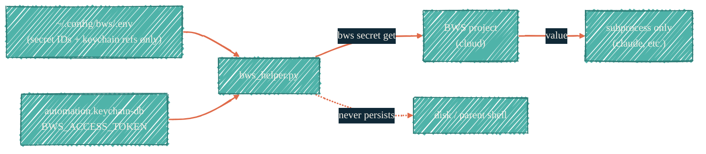

> BWS is a separate Bitwarden product from the vault. It exists for the values that need to flow into a tool — without ever sitting on disk in plaintext.

## What BWS is — and what it isn't

BWS (Bitwarden Secrets Manager) is the programmatic-access cousin of the Bitwarden vault. Different product, different storage tier, different access path. Values in BWS are reachable by a service account; values in the [Bitwarden vault](/security/tools/bitwarden) are not.

The local pattern uses BWS as a bridge: a Python helper fetches the BWS access token from the macOS Keychain (never from disk), uses it to call `bws secret get`, and returns a value to a caller — typically a launcher script for an AI tool that needs an OAuth token.

## Why we use it (alongside Doppler)

Doppler is the canonical home for AI provider keys. BWS shows up when:

- An OAuth token is issued by a provider that doesn't fit cleanly into Doppler's config-injection model (e.g. `CLAUDE_CODE_OAUTH_TOKEN` for a session-bound credential).
- A token must be fetchable by a local script outside any CI context.
- The team wants a Bitwarden-managed audit log for AI credentials, not just a Doppler audit log.

If both Doppler and BWS would work for a given secret, prefer Doppler. BWS is the second answer.

## The bridge pattern



The two non-secret pieces (config file + secret IDs) live on disk. The one secret piece (the BWS access token) lives in the keychain. The retrieved value never reaches the parent shell or any file — it goes straight into the subprocess that requested it.

## Config shape

```bash
# ~/.config/bws/.env  — committed to ~/.config dotfiles only with secret-ID placeholders
BWS_KEYCHAIN_SERVICE=<keychain-service-name>
BWS_KEYCHAIN_ACCOUNT=ai-cli-coder
BWS_SECRET_CLAUDE_CODE_OAUTH_TOKEN=<bws-secret-uuid-or-name>
```

Three rules for the `.env`:

1. The file contains *references*, not values. Secret IDs are not secrets.
2. The BWS access token itself is in the keychain, fetched at runtime — never inlined here.
3. The file is gitignored at the dotfiles level. Even with references-only, no advantage to sharing it.

## The Python helper

[`bws_helper.py`](https://github.com/JacobPEvans/nix-ai/blob/main/modules/claude/bws_helper.py) does three things:

1. `load_env()` — reads the `~/.config/bws/.env` for secret IDs and keychain refs.
2. `get_bws_token()` — calls `security find-generic-password` (allowed read-only by Claude Code) to fetch the BWS access token from `automation.keychain-db`.
3. `get_secret(name)` — calls `bws secret get` and returns the value to the caller.

Every step keeps secrets in process memory, never disk. Callers should pipe the value directly into a child process's env, never echo it.

## Best practices

- Treat the BWS access token like any other automation-tier credential: 90-day rotation, automation keychain only.
- Use BWS only for AI-specific tokens. Long-term plan: as Doppler matures coverage of these cases, BWS shrinks.
- Audit: enable BWS access logging in Bitwarden's web console. Review on every rotation.
- Never echo `get_secret()` output to stdout for debugging. Use a tracer that masks values by length.

## Status

The helper is currently shipped on the `nix-ai` feature branch (`feat/export-default-overlay`). The pattern is local-dev-only; it has not yet been generalized to a `nix-ai` overlay other developers consume. When the overlay lands, this page gets updated with the version line and import path.

## See also

- [Bitwarden vault](/security/tools/bitwarden) — the human-only sibling product. Not interchangeable with BWS.
- [Doppler](/security/tools/doppler) — preferred for AI provider keys where it fits.
- [macOS Keychain](/security/tools/macos-keychain) — where the BWS access token actually lives.
- [Local AI isolation](/security/local-ai-isolation) — the subprocess-scoping guarantee that lets BWS bridge values into a claude session safely.
